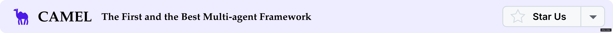
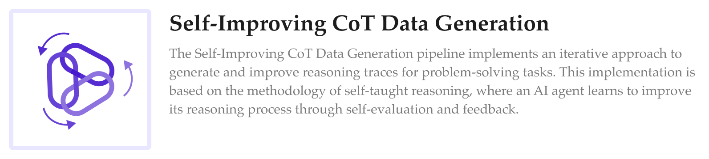
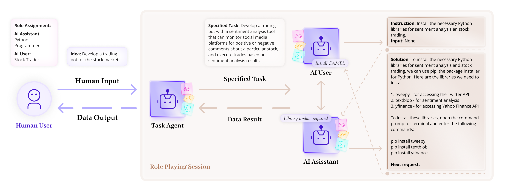
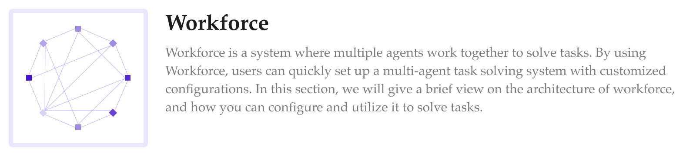
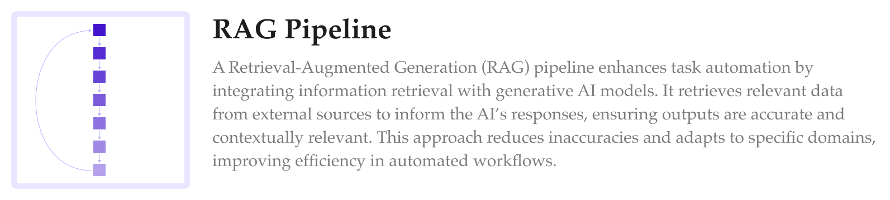
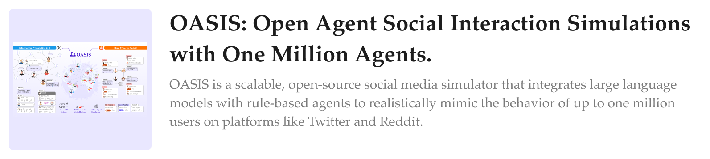
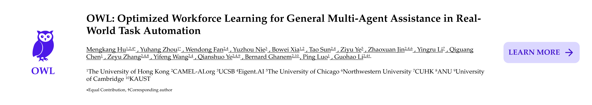
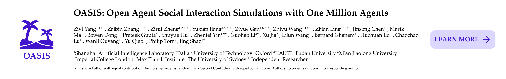
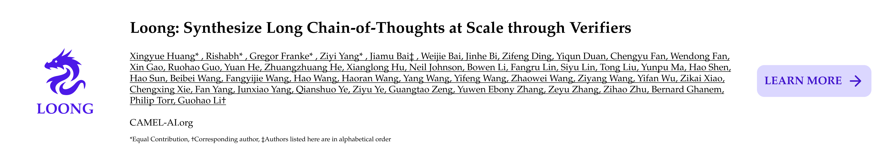
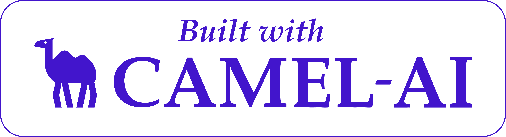

<div align="center">
  <a href="https://www.camel-ai.org/">
    
  </a>
</div>

</br>

<div align="center">

[![Documentation][docs-image]][docs-url]
[![Discord][discord-image]][discord-url]
[![X][x-image]][x-url]
[![Reddit][reddit-image]][reddit-url]
[![Wechat][wechat-image]][wechat-url]
[![Hugging Face][huggingface-image]][huggingface-url]
[![Star][star-image]][star-url]
[![Package License][package-license-image]][package-license-url]
[![PyPI Download][package-download-image]][package-download-url]
[![][join-us-image]][join-us]

<a href="https://trendshift.io/repositories/649" target="_blank"></a>

[English](README.md) |
[简体中文](README.zh.md) |
[日本語](README.ja.md)

</div>


<hr>

<div align="center">
<h4 align="center">

[Community](https://github.com/camel-ai/camel#community) |
[Installation](https://github.com/camel-ai/camel#installation) |
[Examples](https://github.com/camel-ai/camel/tree/HEAD/examples) |
[Paper](https://arxiv.org/abs/2303.17760) |
[Citation](https://github.com/camel-ai/camel#citation) |
[Contributing](https://github.com/camel-ai/camel#contributing-to-camel-) |
[CAMEL-AI](https://www.camel-ai.org/)

</h4>

<p style="line-height: 1.5; text-align: center;"> 🐫 CAMELは、エージェントのスケーリング法則を発見することに専念するオープンソースコミュニティです。エージェントを大規模に研究することで、その行動、能力、潜在的なリスクについて貴重な洞察が得られると信じています。この分野の研究を促進するため、様々なタイプのエージェント、タスク、プロンプト、モデル、シミュレーション環境を実装・サポートしています。</p>


<br>


エージェントのスケーリング法則を見つけるために、私たち（[*Discord*](https://discord.camel-ai.org/) または [*WeChat*](https://ghli.org/camel/wechat.png)）と共に境界を押し広げましょう。

🌟 GitHubでCAMELにスターを付けると、新しいリリースの通知が即座に受け取れます。

</div>

<div align="center">
    
  </a>
</div>

<br>

[![][image-join-us]][join-us]

<details>
<summary><kbd>目次</kbd></summary>

<br/>

- [CAMELフレームワーク設計原則](#camelフレームワーク設計原則)
- [なぜ研究にCAMELを使うのか？](#なぜ研究にcamelを使うのか)
- [CAMELで何が構築できるか？](#camelで何が構築できるか)
  - [データ生成](#1-データ生成)
  - [タスク自動化](#2-タスク自動化)
  - [世界シミュレーション](#3-世界シミュレーション)
- [クイックスタート](#クイックスタート)
  - [ChatAgentから始める](#chatagentから始める)
  - [ヘルプを求める](#ヘルプを求める)
- [技術スタック](#技術スタック)
- [研究](#研究)
- [合成データセット](#合成データセット)
- [クックブック（ユースケース）](#クックブックユースケース)
  - [基本コンセプト](#1-基本コンセプト)
  - [高度な機能](#2-高度な機能)
  - [モデルトレーニング & データ生成](#3-モデルトレーニング--データ生成)
  - [マルチエージェントシステム & アプリケーション](#4-マルチエージェントシステム--アプリケーション)
  - [データ処理](#5-データ処理)
- [実世界のユースケース](#実世界のユースケース)
- [🧱 CAMELで構築（実世界の製品 & 研究）](#-camelで構築実世界の製品--研究)
  - [研究プロジェクト](#研究プロジェクト)
  - [製品プロジェクト](#製品プロジェクト)
- [🗓️ イベント](#️-イベント)
- [CAMELへの貢献](#camelへの貢献)
- [コミュニティ & コンタクト](#コミュニティ--コンタクト)
- [引用](#引用)
- [謝辞](#謝辞)
- [ライセンス](#ライセンス)

####

<br/>

</details>


## CAMELフレームワーク設計原則

<h3>🧬 進化可能性</h3 >

フレームワークは、データを生成し環境と相互作用することで、マルチエージェントシステムが継続的に進化することを可能にします。この進化は、検証可能な報酬による強化学習または教師あり学習によって駆動されます。

<h3>📈 スケーラビリティ</h3>

フレームワークは、数百万のエージェントを持つシステムをサポートするよう設計されており、大規模な協調、通信、リソース管理を効率的に行います。

<h3>💾 ステートフルネス</h3>

エージェントはステートフルメモリを維持し、環境との多段階の相互作用を実行し、洗練されたタスクを効率的に処理することを可能にします。

<h3>📖 コード・アズ・プロンプト</h3>

すべてのコード行とコメントは、エージェントへのプロンプトとして機能します。コードは明確で読みやすく書かれるべきで、人間とエージェントの両方が効果的に解釈できるようにする必要があります。

<br>

## なぜ研究にCAMELを使うのか？

私たちは、マルチエージェントシステムの最前線研究を進める100人以上の研究者で構成される、コミュニティ主導の研究集団です。世界中の研究者が以下の理由でCAMELを研究に選択しています。

<table style="width: 100%;">
  <tr>
    <td align="left"></td>
    <td align="left"></td>
    <td align="left"></td>
  </tr>
  <tr>
    <td align="left">✅</td>
    <td align="left" style="font-weight: bold;">大規模エージェントシステム</td>
    <td align="left">複雑なマルチエージェント環境での創発的行動とスケーリング法則を研究するために、最大100万のエージェントをシミュレートします。</td>
  </tr>
  <tr>
    <td align="left">✅</td>
    <td align="left" style="font-weight: bold;">動的通信</td>
    <td align="left">エージェント間のリアルタイム相互作用を可能にし、複雑なタスクに取り組むためのシームレスな協力を促進します。</td>
  </tr>
  <tr>
    <td align="left">✅</td>
    <td align="left" style="font-weight: bold;">ステートフルメモリ</td>
    <td align="left">エージェントに履歴コンテキストを保持して活用する能力を装備し、長期間の相互作用における意思決定を改善します。</td>
  </tr>
  <tr>
    <td align="left">✅</td>
    <td align="left" style="font-weight: bold;">複数のベンチマークのサポート</td>
    <td align="left">標準化されたベンチマークを利用してエージェントのパフォーマンスを厳格に評価し、再現性と信頼性の高い比較を保証します。</td>
  </tr>
  <tr>
    <td align="left">✅</td>
    <td align="left" style="font-weight: bold;">異なるエージェントタイプのサポート</td>
    <td align="left">様々なエージェントの役割、タスク、モデル、環境を扱い、学際的な実験と多様な研究応用をサポートします。</td>
  </tr>
  <tr>
    <td align="left">✅</td>
    <td align="left" style="font-weight: bold;">データ生成とツール統合</td>
    <td align="left">大規模で構造化されたデータセットの作成を自動化し、複数のツールとシームレスに統合することで、合成データ生成と研究ワークフローを効率化します。</td>
  </tr>
</table>

<br>

## CAMELで何が構築できるか？


### 1. データ生成

<div align="center">
  <a href="https://github.com/camel-ai/camel/blob/master/camel/datagen/cot_datagen.py">
    
  </a>
</div>

<div align="center">
  <a href="https://github.com/camel-ai/camel/tree/master/camel/datagen/self_instruct">
    
  </a>
</div>

<div align="center">
  <a href="https://github.com/camel-ai/camel/tree/master/camel/datagen/source2synth">
    
  </a>
</div>

<div align="center">
  <a href="https://github.com/camel-ai/camel/blob/master/camel/datagen/self_improving_cot.py">
    
  </a>
</div>

### 2. タスク自動化

<div align="center">
  <a href="https://github.com/camel-ai/camel/blob/master/camel/societies/role_playing.py">
    
  </a>
</div>

<div align="center">
  <a href="https://github.com/camel-ai/camel/tree/master/camel/societies/workforce">
    
  </a>
</div>

<div align="center">
  <a href="https://docs.camel-ai.org/cookbooks/advanced_features/agents_with_rag">
    
  </a>
</div>


### 3. 世界シミュレーション

<div align="center">
  <a href="https://github.com/camel-ai/oasis">
    
  </a>
</div>

<br>

## クイックスタート

CAMELのインストールは、PyPIで利用可能なため非常に簡単です。ターミナルを開いて以下を実行するだけです：

```bash
pip install camel-ai
```

### ChatAgentから始める

この例では、CAMELフレームワークを使用して`ChatAgent`を作成し、DuckDuckGoを使用して検索クエリを実行する方法を示します。

1. **ツールパッケージをインストール：**

  ```bash
  pip install 'camel-ai[web_tools]'
  ```

2. **OpenAI APIキーを設定：**

  ```bash
  export OPENAI_API_KEY='your_openai_api_key'
  ```

   または、`.env`ファイルを使用：

   ```bash
   cp .env.example .env
   # .envファイルを編集してキーを追加
   ```

3. **以下のPythonコードを実行：**

  ```python
  from camel.models import ModelFactory
  from camel.types import ModelPlatformType, ModelType
  from camel.agents import ChatAgent
  from camel.toolkits import SearchToolkit

  model = ModelFactory.create(
    model_platform=ModelPlatformType.OPENAI,
    model_type=ModelType.GPT_4O,
    model_config_dict={"temperature": 0.0},
  )

  search_tool = SearchToolkit().search_duckduckgo

  agent = ChatAgent(model=model, tools=[search_tool])

  response_1 = agent.step("CAMEL-AIとは何ですか？")
  print(response_1.msgs[0].content)
  # CAMEL-AIは最初のLLM（大規模言語モデル）マルチエージェントフレームワークであり、
  # エージェントのスケーリング法則を発見することに焦点を当てたオープンソースコミュニティです。
  # ...

  response_2 = agent.step("CAMELフレームワークのGitHubリンクは何ですか？")
  print(response_2.msgs[0].content)
  # CAMELフレームワークのGitHubリンクは
  # [https://github.com/camel-ai/camel](https://github.com/camel-ai/camel)です。
  ```


より詳細な手順と追加の設定オプションについては、[インストールセクション](https://github.com/camel-ai/camel/blob/master/docs/get_started/installation.md)をご確認ください。

実行後、[docs.camel-ai.org](https://docs.camel-ai.org)でCAMEL技術スタックとクックブックを探索し、強力なマルチエージェントシステムを構築できます。

私たちは、Pythonプログラマーとストックトレーダーとしてロールプレイする2つのChatGPTエージェント間の会話を示す[](https://colab.research.google.com/drive/1AzP33O8rnMW__7ocWJhVBXjKziJXPtim?usp=sharing)デモを提供しています。株式市場用の取引ボットの開発に協力しています。

さまざまなタイプのエージェント、その役割、およびそれらのアプリケーションを探索してください。

- **[初めてのエージェントを作成](https://docs.camel-ai.org/cookbooks/basic_concepts/create_your_first_agent)**
- **[初めてのエージェント社会を作成](https://docs.camel-ai.org/cookbooks/basic_concepts/create_your_first_agents_society)**
- **[具現化されたエージェント](https://docs.camel-ai.org/cookbooks/advanced_features/embodied_agents)**
- **[批評エージェント](https://docs.camel-ai.org/cookbooks/advanced_features/critic_agents_and_tree_search)**

### ヘルプを求める

CAMELのセットアップで問題が発生した場合は、[CAMEL discord](https://discord.camel-ai.org/)でお気軽にお問い合わせください。

<br>

## 技術スタック

<div align="center">
  <a href="https://docs.camel-ai.org">
    
  </a>
</div>

### キーモジュール
CAMEL-AIエージェントと社会を構築、運用、強化するためのコアコンポーネントとユーティリティ。

| モジュール | 説明 |
|:---|:---|
| **[エージェント](https://docs.camel-ai.org/key_modules/agents)** | 自律運用のためのコアエージェントアーキテクチャと動作。 |
| **[エージェント社会](https://docs.camel-ai.org/key_modules/society)** | マルチエージェントシステムと協力の構築と管理のためのコンポーネント。 |
| **[データ生成](https://docs.camel-ai.org/key_modules/datagen)** | 合成データの作成と拡張のためのツールと方法。 |
| **[モデル](https://docs.camel-ai.org/key_modules/models)** | エージェントインテリジェンスのためのモデルアーキテクチャとカスタマイズオプション。 |
| **[ツール](https://docs.camel-ai.org/key_modules/tools)** | 専門的なエージェントタスクのためのツール統合。 |
| **[メモリ](https://docs.camel-ai.org/key_modules/memory)** | エージェント状態管理のためのメモリストレージと検索メカニズム。 |
| **[ストレージ](https://docs.camel-ai.org/key_modules/storages)** | エージェントデータと状態のための永続的なストレージソリューション。 |
| **[ベンチマーク](https://github.com/camel-ai/camel/tree/master/camel/benchmarks)** | パフォーマンス評価とテストフレームワーク。 |
| **[インタープリタ](https://docs.camel-ai.org/key_modules/interpreters)** | コードとコマンドの解釈機能。 |
| **[データローダー](https://docs.camel-ai.org/key_modules/loaders)** | データ取り込みと前処理ツール。 |
| **[リトリーバー](https://docs.camel-ai.org/key_modules/retrievers)** | 知識検索とRAGコンポーネント。 |
| **[ランタイム](https://github.com/camel-ai/camel/tree/master/camel/runtime)** | 実行環境とプロセス管理。 |
| **[ヒューマン・イン・ザ・ループ](https://docs.camel-ai.org/cookbooks/advanced_features/agents_with_human_in_loop_and_tool_approval)** | 人間による監視と介入のための対話型コンポーネント。 |
---

## 研究

私たちは、これらのエージェントを大規模に研究することで、その行動、能力、潜在的なリスクについて貴重な洞察が得られると信じています。

**私たちの研究プロジェクトを探索する：**

<div align="center">
  <a href="https://github.com/camel-ai/owl">
    
  </a>
</div>

<div align="center">
  <a href="https://oasis.camel-ai.org/">
    
  </a>
</div>

<div align="center">
  <a href="https://crab.camel-ai.org/">
    
  </a>
</div>

<div align="center">
  <a href="https://github.com/camel-ai/loong">
    
  </a>
</div>

<div align="center">
  <a href="https://agent-trust.camel-ai.org/">
    
  </a>
</div>

<div align="center">
  <a href="https://emos-project.github.io/">
    
  </a>
</div>

>### 私たちと一緒に研究しませんか
>
>CAMELをあなたのインパクトのある研究に使用することを心から歓迎します。
>
> 厳格な研究には時間とリソースが必要です。私たちは、マルチエージェントシステムの最前線の研究を探求する100人以上の研究者からなるコミュニティ主導の研究集団です。私たちの進行中のプロジェクトに参加するか、私たちと新しいアイデアをテストしてください。詳細については[メールでお問い合わせ](mailto:camel-ai@eigent.ai)ください。
>
><div align="center">
>    
></div>

<br>

## 合成データセット

### 1. バックエンドとして様々なLLMを活用

詳細については、[`モデルドキュメント`](https://docs.camel-ai.org/key_modules/models#)をご覧ください。

> **データ（Hugging Faceでホスト）**

| データセット        | チャット形式                                                                                         | インストラクション形式                                                                                               | チャット形式（翻訳済み）                                                                   |
|----------------|-----------------------------------------------------------------------------------------------------|------------------------------------------------------------------------------------------------------------------|--------------------------------------------------------------------------------------------|
| **AI Society** | [チャット形式](https://huggingface.co/datasets/camel-ai/ai_society/blob/main/ai_society_chat.tar.gz) | [インストラクション形式](https://huggingface.co/datasets/camel-ai/ai_society/blob/main/ai_society_instructions.json) | [チャット形式（翻訳済み）](https://huggingface.co/datasets/camel-ai/ai_society_translated) |
| **Code**       | [チャット形式](https://huggingface.co/datasets/camel-ai/code/blob/main/code_chat.tar.gz)             | [インストラクション形式](https://huggingface.co/datasets/camel-ai/code/blob/main/code_instructions.json)             | x                                                                                          |
| **Math**       | [チャット形式](https://huggingface.co/datasets/camel-ai/math)                                        | x                                                                                                                | x                                                                                          |
| **Physics**    | [チャット形式](https://huggingface.co/datasets/camel-ai/physics)                                     | x                                                                                                                | x                                                                                          |
| **Chemistry**  | [チャット形式](https://huggingface.co/datasets/camel-ai/chemistry)                                   | x                                                                                                                | x                                                                                          |
| **Biology**    | [チャット形式](https://huggingface.co/datasets/camel-ai/biology)                                     | x                                                                                                                | x                                                                                          |

### 2. インストラクションとタスクの可視化

| データセット          | インストラクション                                                                                                         | タスク                                                                                                         |
|------------------|----------------------------------------------------------------------------------------------------------------------|---------------------------------------------------------------------------------------------------------------|
| **AI Society**   | [インストラクション](https://atlas.nomic.ai/map/3a559a06-87d0-4476-a879-962656242452/db961915-b254-48e8-8e5c-917f827b74c6) | [タスク](https://atlas.nomic.ai/map/cb96f41b-a6fd-4fe4-ac40-08e101714483/ae06156c-a572-46e9-8345-ebe18586d02b) |
| **Code**         | [インストラクション](https://atlas.nomic.ai/map/902d6ccb-0bbb-4294-83a8-1c7d2dae03c8/ace2e146-e49f-41db-a1f4-25a2c4be2457) | [タスク](https://atlas.nomic.ai/map/efc38617-9180-490a-8630-43a05b35d22d/2576addf-a133-45d5-89a9-6b067b6652dd) |
| **Misalignment** | [インストラクション](https://atlas.nomic.ai/map/5c491035-a26e-4a05-9593-82ffb2c3ab40/2bd98896-894e-4807-9ed8-a203ccb14d5e) | [タスク](https://atlas.nomic.ai/map/abc357dd-9c04-4913-9541-63e259d7ac1f/825139a4-af66-427c-9d0e-f36b5492ab3f) |

<br>

## クックブック（ユースケース）
CAMEL-AIエージェントと社会で特定の機能を実装するための実用的なガイドとチュートリアル。

### 1. 基本コンセプト
| クックブック | 説明 |
|:---|:---|
| **[初めてのエージェントを作成](https://docs.camel-ai.org/cookbooks/basic_concepts/create_your_first_agent)** | 最初のエージェントを構築するためのステップバイステップガイド。 |
| **[初めてのエージェント社会を作成](https://docs.camel-ai.org/cookbooks/basic_concepts/create_your_first_agents_society)** | 協力的なエージェント社会を構築する方法を学びます。 |
| **[メッセージクックブック](https://docs.camel-ai.org/cookbooks/basic_concepts/agents_message)** | エージェントでのメッセージ処理のベストプラクティス。 |

### 2. 高度な機能
| クックブック | 説明 |
|:---|:---|
| **[ツールクックブック](https://docs.camel-ai.org/cookbooks/advanced_features/agents_with_tools)** | 強化された機能のためのツール統合。 |
| **[メモリクックブック](https://docs.camel-ai.org/cookbooks/advanced_features/agents_with_memory)** | エージェントでのメモリシステムの実装。 |
| **[RAGクックブック](https://docs.camel-ai.org/cookbooks/advanced_features/agents_with_rag)** | 検索拡張生成のレシピ。 |
| **[グラフRAGクックブック](https://docs.camel-ai.org/cookbooks/advanced_features/agents_with_graph_rag)** | RAGでの知識グラフの活用。 |
| **[AgentOpsでCAMELエージェントを追跡](https://docs.camel-ai.org/cookbooks/advanced_features/agents_tracking)** | 運用でのエージェントの追跡と管理のためのツール。 |

### 3. モデルトレーニング & データ生成
| クックブック | 説明 |
|:---|:---|
| **[CAMELでのデータ生成とUnslothでのファインチューニング](https://docs.camel-ai.org/cookbooks/data_generation/sft_data_generation_and_unsloth_finetuning_Qwen2_5_7B)** | CAMELでデータを生成し、Unslothで効果的にモデルをファインチューニングする方法を学びます。 |
| **[実関数呼び出しとHermes形式でのデータ生成](https://docs.camel-ai.org/cookbooks/data_generation/data_gen_with_real_function_calls_and_hermes_format)** | 実関数呼び出しとHermes形式でデータを生成する方法を探索します。 |
| **[CoTデータ生成とHuggingfaceへのデータアップロード](https://docs.camel-ai.org/cookbooks/data_generation/distill_math_reasoning_data_from_deepseek_r1)** | CAMELでCoTデータを生成し、Huggingfaceにシームレスにアップロードする方法を発見します。 |
| **[CoTデータ生成とUnsolthでのSFT Qwen](https://docs.camel-ai.org/cookbooks/data_generation/cot_data_gen_sft_qwen_unsolth_upload_huggingface)** | CAMELとUnsolthでCoTデータを生成してSFT Qwenを使用し、データとモデルをHuggingfaceにシームレスにアップロードする方法を発見します。 |

### 4. マルチエージェントシステム & アプリケーション
| クックブック | 説明 |
|:---|:---|
| **[レポート & 知識グラフ生成のためのロールプレイングスクレーパー](https://docs.camel-ai.org/cookbooks/applications/roleplaying_scraper)** | データスクレイピングとレポート作成のためのロールプレイングエージェントを作成します。 |
| **[Workforceでハッカソン審査委員会を作成](https://docs.camel-ai.org/cookbooks/multi_agent_society/workforce_judge_committee)** | 協力的な審査のためのエージェントチームを構築します。 |
| **[動的知識グラフロールプレイング：動的で時間的に認識する知識グラフを持つマルチエージェントシステム](https://docs.camel-ai.org/cookbooks/applications/dyamic_knowledge_graph)** | 金融アプリケーション向けの動的で時間的に認識する知識グラフを構築します。マルチエージェントシステムを使用して、金融レポート、ニュース記事、研究論文を処理し、トレーダーがデータを分析し、関係を特定し、市場の洞察を明らかにするのを支援します。システムは、データの整合性を確保し、金融意思決定のためのグラフ構造を最適化するために、多様でオプションの要素ノードの重複排除技術も活用します。 |
| **[Agentic RAGを使用したカスタマーサービスDiscordボット](https://docs.camel-ai.org/cookbooks/applications/customer_service_Discord_bot_using_SambaNova_with_agentic_RAG)** | Agentic RAGを使用してDiscord用の堅牢なカスタマーサービスボットを構築する方法を学びます。 |
| **[ローカルモデルを使用したカスタマーサービスDiscordボット](https://docs.camel-ai.org/cookbooks/applications/customer_service_Discord_bot_using_local_model_with_agentic_RAG)** | ローカル展開をサポートするAgentic RAGを使用してDiscord用の堅牢なカスタマーサービスボットを構築する方法を学びます。 |

### 5. データ処理
| クックブック | 説明 |
|:---|:---|
| **[ビデオ分析](https://docs.camel-ai.org/cookbooks/data_processing/video_analysis)** | ビデオデータ分析におけるエージェントの技術。 |
| **[Firecrawlを使用してウェブサイトからデータを取得する3つの方法](https://docs.camel-ai.org/cookbooks/data_processing/ingest_data_from_websites_with_Firecrawl)** | Firecrawlを使用してウェブサイトからデータを抽出および処理する3つの方法を探索します。 |
| **[PDFで動作するAIエージェントを作成](https://docs.camel-ai.org/cookbooks/data_processing/agent_with_chunkr_for_pdf_parsing)** | ChunkrとMistral AIを使用してPDFで動作するAIエージェントを作成する方法を学びます。 |

<br>

## 実世界のユースケース

CAMELのマルチエージェントフレームワークがインフラ自動化、生産性ワークフロー、検索拡張会話、インテリジェントなドキュメント/ビデオ分析、協力的研究にわたって実際のビジネス価値を実現する実世界のユースケース。

### 1 インフラ自動化

| ユースケース                                                      | 説明                                                  |
| :----------------------------------------------------------- | :----------------------------------------------------------- |
| **[ACI MCP](https://github.com/camel-ai/camel/tree/master/examples/usecases/aci_mcp)** | CAMELのマルチエージェントフレームワークがインフラ自動化、生産性ワークフロー、検索拡張会話、インテリジェントなドキュメント/ビデオ分析、協力的研究にわたって実際のビジネス価値を実現する実世界のユースケース。 |
| **[Cloudflare MCP CAMEL](https://github.com/camel-ai/camel/tree/master/examples/usecases/cloudfare_mcp_camel)** | インテリジェントエージェントがCloudflareリソースを動的に管理し、スケーラブルで効率的なクラウドセキュリティとパフォーマンスチューニングを可能にします。 |

### 2 生産性 & ビジネスワークフロー

| ユースケース                                                      | 説明                                                  |
| :----------------------------------------------------------- | :----------------------------------------------------------- |
| **[Airbnb MCP](https://github.com/camel-ai/camel/tree/master/examples/usecases/airbnb_mcp)** | Airbnbのリスティングとホスト運用を最適化および管理するためのエージェントを調整します。 |
| **[PPTXツールキットユースケース](https://github.com/camel-ai/camel/tree/master/examples/usecases/pptx_toolkit_usecase)** | PowerPointドキュメントを分析し、マルチエージェント協力を通じて構造化された洞察を抽出します。 |

### 3 検索拡張マルチエージェントチャット

| ユースケース                                                      | 説明                                                  |
| :----------------------------------------------------------- | :----------------------------------------------------------- |
| **[GitHubとチャット](https://github.com/camel-ai/camel/tree/master/examples/usecases/chat_with_github)** | RAGスタイルのワークフローを活用するCAMELエージェントを通じてGitHubコードベースをクエリして理解し、開発者のオンボーディングとコードベースナビゲーションを加速します。 |
| **[YouTubeとチャット](https://github.com/camel-ai/camel/tree/master/examples/usecases/chat_with_youtube)** | 会話型エージェントがビデオの転写を抽出して要約し、コンテンツの理解と再利用を高速化します。 |

### 4 ビデオ & ドキュメントインテリジェンス

| ユースケース                                                      | 説明                                                  |
| :----------------------------------------------------------- | :----------------------------------------------------------- |
| **[YouTube OCR](https://github.com/camel-ai/camel/tree/master/examples/usecases/youtube_ocr)** | エージェントがビデオスクリーンショットでOCRを実行してビジュアルコンテンツを要約し、メディア監視とコンプライアンスをサポートします。 |
| **[Mistral OCR](https://github.com/camel-ai/camel/tree/master/examples/usecases/mistral_OCR)** | CAMELエージェントがMistralでOCRを使用してドキュメントを分析し、ドキュメント理解ワークフローの手動作業を削減します。 |

### 5 研究 & 協力

| ユースケース                                                      | 説明                                                  |
| :----------------------------------------------------------- | :----------------------------------------------------------- |
| **[マルチエージェント研究アシスタント](https://github.com/camel-ai/camel/tree/master/examples/usecases/multi_agent_research_assistant)** | 文献レビューで協力する研究エージェントのチームをシミュレートし、探索的分析とレポート作成の効率を向上させます。 |

<br>

## 🧱 CAMELで構築（実世界の製品 & 研究）
<div align="left">
  <a href="https://www.camel-ai.org/">
    
  </a>
</div>

### 研究プロジェクト

| 名前 | 説明 |
|:---|:---|
| **[ChatDev](https://github.com/OpenBMB/ChatDev/tree/main/camel)** | ソフトウェア開発のための通信エージェント |
| **[Paper2Poster](https://github.com/Paper2Poster/Paper2Poster)** | 科学論文からのマルチモーダルポスター自動化 |

### 製品プロジェクト

| 名前 | 説明 |
|:---|:---|
| **[Eigent](https://www.eigent.ai/)** | 世界初のマルチエージェントワークフォース |
| **[EigentBot](https://bot.eigent.ai/)** | 1つのEigentBot、すべてのコードの答え |
| **[Matrix](https://matrix.eigent.ai/)** | ソーシャルメディアシミュレーション |
| **[AI Geometric](https://www.linkedin.com/posts/aigeometric_ai-interviewpreparation-careerdevelopment-activity-7261428422516555776-MtaK/?utm_source=share&utm_medium=member_desktop&rcm=ACoAAChHluEB9xRwkjiJ6VSAzqM2Y-U4NI2sKGY)** | AI搭載インタビューコパイロット |
| **[Log10](https://github.com/log10-io/log10/blob/main/src/log10/agents/camel.py)** | AI精度、提供済み |


## 🗓️ イベント

私たちは以下を含むコミュニティイベントに積極的に関与しています：

- 🎙️ **コミュニティミーティング** — CAMELチームとの毎週のバーチャル同期
- 🏆 **コンペティション** — CAMELが主催するハッカソン、バウンティタスク、コーディングチャレンジ
- 🤝 **ボランティア活動** — 貢献、ドキュメント作成、メンタリング
- 🌍 **アンバサダープログラム** — あなたの大学や地元の技術グループでCAMELを代表する

> CAMELイベントを主催または参加したいですか？[Discord](https://discord.com/invite/CNcNpquyDc)に参加するか、[アンバサダープログラム](https://www.camel-ai.org/ambassador)の一員になりましょう。


## CAMELへの貢献

> コードを貢献したい方は、私たちのオープンソースイニシアチブへの貢献に感謝します。スムーズなコラボレーションの旅を始めるために、[貢献ガイドライン](https://github.com/camel-ai/camel/blob/master/CONTRIBUTING.md)をご確認ください。🚀
>
> また、CAMELをソーシャルメディア、イベント、カンファレンスで共有することで、CAMELの成長を支援していただくことも歓迎します。あなたのサポートが大きな違いを生みます！

## コントリビューター

<a href="https://github.com/camel-ai/camel/graphs/contributors">
  
</a>

[contrib.rocks](https://contrib.rocks)で作成。

<br>

## コミュニティ & コンタクト
詳細については camel-ai@eigent.ai までお問い合わせください

- **GitHubイシュー：** バグを報告し、機能をリクエストし、開発を追跡します。[イシューを提出](https://github.com/camel-ai/camel/issues)

- **Discord：** リアルタイムサポートを受け、コミュニティとチャットし、最新情報を入手します。[参加する](https://discord.camel-ai.org/)

- **X (Twitter)：** 更新、AIの洞察、重要な発表をフォローします。[フォローする](https://x.com/CamelAIOrg)

- **アンバサダープロジェクト：** CAMEL-AIを擁護し、イベントを主催し、コンテンツを貢献します。[詳細を見る](https://www.camel-ai.org/community)

- **WeChatコミュニティ：** 下のQRコードをスキャンしてWeChatコミュニティに参加してください。

  <div align="center">
    
  </div>


<br>

## 引用
```
@inproceedings{li2023camel,
  title={CAMEL: Communicative Agents for "Mind" Exploration of Large Language Model Society},
  author={Li, Guohao and Hammoud, Hasan Abed Al Kader and Itani, Hani and Khizbullin, Dmitrii and Ghanem, Bernard},
  booktitle={Thirty-seventh Conference on Neural Information Processing Systems},
  year={2023}
}
```

## 謝辞
データセット探索ツール（Atlas）への拡張アクセスを提供してくださった[Nomic AI](https://home.nomic.ai/)に特別な感謝を申し上げます。

また、プロジェクトの初期ロゴをデザインしてくださったHaya Hammoud氏にも感謝いたします。

私たちは、エージェントを構築、比較、カスタマイズするための他の作品から素晴らしい研究アイデアを実装しました。これらのモジュールを使用する場合は、元の作品を引用してください：
- `TaskCreationAgent`、`TaskPrioritizationAgent`、`BabyAGI`：*Nakajima et al.*から：[Task-Driven Autonomous Agent](https://yoheinakajima.com/task-driven-autonomous-agent-utilizing-gpt-4-pinecone-and-langchain-for-diverse-applications/)。[[例](https://github.com/camel-ai/camel/blob/master/examples/ai_society/babyagi_playing.py)]

- `PersonaHub`：*Tao Ge et al.*から：[Scaling Synthetic Data Creation with 1,000,000,000 Personas](https://arxiv.org/pdf/2406.20094)。[[例](https://github.com/camel-ai/camel/blob/master/examples/personas/personas_generation.py)]

- `Self-Instruct`：*Yizhong Wang et al.*から：[SELF-INSTRUCT: Aligning Language Models with Self-Generated Instructions](https://arxiv.org/pdf/2212.10560)。[[例](https://github.com/camel-ai/camel/blob/master/examples/datagen/self_instruct/self_instruct.py)]


## ライセンス

ソースコードはApache 2.0でライセンスされています。

<br>

[docs-image]: https://img.shields.io/badge/Documentation-EB3ECC
[docs-url]: https://camel-ai.github.io/camel/index
[star-image]: https://img.shields.io/github/stars/camel-ai/camel?label=stars&logo=github&color=brightgreen
[star-url]: https://github.com/camel-ai/camel/stargazers
[package-license-image]: https://img.shields.io/badge/License-Apache_2.0-blue.svg
[package-license-url]: https://github.com/camel-ai/camel/blob/master/licenses/LICENSE
[package-download-image]: https://img.shields.io/pypi/dm/camel-ai

[colab-url]: https://colab.research.google.com/drive/1AzP33O8rnMW__7ocWJhVBXjKziJXPtim?usp=sharing
[colab-image]: https://colab.research.google.com/assets/colab-badge.svg
[huggingface-url]: https://huggingface.co/camel-ai
[huggingface-image]: https://img.shields.io/badge/%F0%9F%A4%97%20Hugging%20Face-CAMEL--AI-ffc107?color=ffc107&logoColor=white
[discord-url]: https://discord.camel-ai.org/
[discord-image]: https://img.shields.io/discord/1082486657678311454?logo=discord&labelColor=%20%235462eb&logoColor=%20%23f5f5f5&color=%20%235462eb
[wechat-url]: https://ghli.org/camel/wechat.png
[wechat-image]: https://img.shields.io/badge/WeChat-CamelAIOrg-brightgreen?logo=wechat&logoColor=white
[x-url]: https://x.com/CamelAIOrg
[x-image]: https://img.shields.io/twitter/follow/CamelAIOrg?style=social
[twitter-image]: https://img.shields.io/twitter/follow/CamelAIOrg?style=social&color=brightgreen&logo=twitter
[reddit-url]: https://www.reddit.com/r/CamelAI/
[reddit-image]: https://img.shields.io/reddit/subreddit-subscribers/CamelAI?style=plastic&logo=reddit&label=r%2FCAMEL&labelColor=white
[ambassador-url]: https://www.camel-ai.org/community
[package-download-url]: https://pypi.org/project/camel-ai
[join-us]:https://eigent-ai.notion.site/eigent-ai-careers
[join-us-image]:https://img.shields.io/badge/Join%20Us-yellow?style=plastic
[image-join-us]: https://camel-ai.github.io/camel_asset/graphics/join_us.png