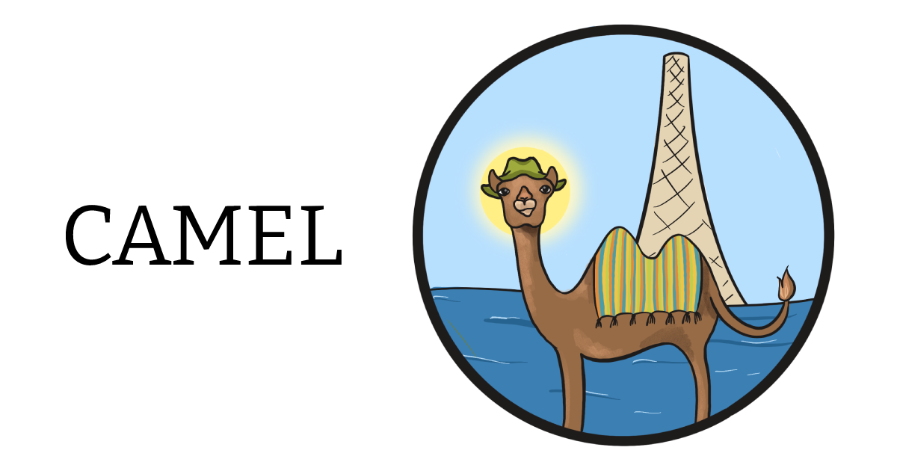
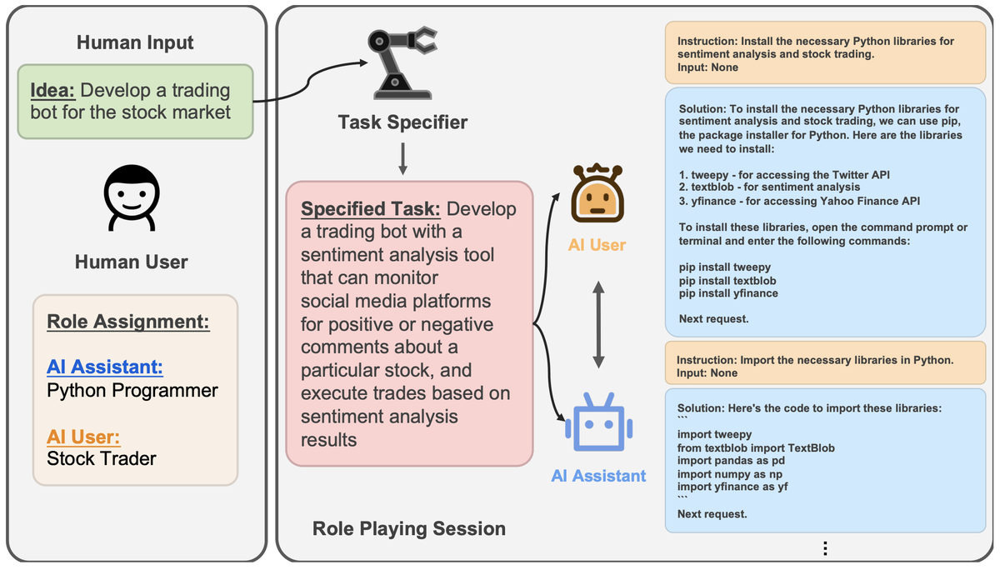

[](https://colab.research.google.com/drive/1AzP33O8rnMW__7ocWJhVBXjKziJXPtim?usp=sharing)
<a href="https://huggingface.co/camel-ai"></a>
# CAMEL: Communicative Agents for “Mind” Exploration of Large Scale Language Model Society

## [[Project Website]](https://www.camel-ai.org/) [[Preprint]](https://ghli.org/camel.pdf)

<p align="center">
  
</p>

## Overview
The rapid advancement of conversational and chat-based language models has led to remarkable progress in complex task-solving. However, their success heavily relies on human input to guide the conversation, which can be challenging and time-consuming. This paper explores the potential of building scalable techniques to facilitate autonomous cooperation among communicative agents and provide insight into their "cognitive" processes. To address the challenges of achieving autonomous cooperation, we propose a novel communicative agent framework named *role-playing*. Our approach involves using *inception prompting* to guide chat agents toward task completion while maintaining consistency with human intentions. We showcase how role-playing can be used to generate conversational data for studying the behaviors and capabilities of chat agents, providing a valuable resource for investigating conversational language models. Our contributions include introducing a novel communicative agent framework, offering a scalable approach for studying the cooperative behaviors and capabilities of multi-agent systems, and open-sourcing our library to support research on communicative agents and beyond. The GitHub repository of this project is made publicly available on: https://github.com/lightaime/camel.

## Try it yourself
We provide a [](https://colab.research.google.com/drive/1AzP33O8rnMW__7ocWJhVBXjKziJXPtim?usp=sharing) demo showcasing a conversation between two ChatGPT agents playing roles as a python programmer and a stock trader collaborating on developing a trading bot for stock market.

<p align="center">
  
</p>

## Environment Setup
Install `CAMEL` from source with conda:
```
# create a conda virtual environment
conda create --name camel python=3.10
# actiavte camel conda environment
conda activate camel
# clone github repo
git clone https://github.com/lightaime/camel.git
# change directory into project directory
cd camel
# install camel from source
pre-commit install
pip install -e .
```
## Example
You can find a list of tasks for different set of assistant and user role pairs [here](https://drive.google.com/file/d/194PPaSTBR07m-PzjS-Ty6KlPLdFIPQDd/view?usp=share_link)

Run the `role_playing.py` script.
```
# export your OpenAI API key
export OPENAI_API_KEY=<insert your OpenAI API key>
# You can change the role pair and initial prompt in role_playing.py
python examples/ai_society/role_playing.py
```

## Data (Hosted on Hugging Face)
**AI Society:**
* [Chat format](https://huggingface.co/datasets/camel-ai/ai_society/blob/main/ai_society_chat.tar.gz)
* [Instruction format](https://huggingface.co/datasets/camel-ai/ai_society/blob/main/ai_society_instructions.json)

**Code:**
* [Chat format](https://huggingface.co/datasets/camel-ai/code/blob/main/code_chat.tar.gz)
* [Instruction format](https://huggingface.co/datasets/camel-ai/code/blob/main/code_instructions.json)

## Visualizations of Instructions and Tasks

**AI Society:**
* [Instructions](https://atlas.nomic.ai/map/3a559a06-87d0-4476-a879-962656242452/db961915-b254-48e8-8e5c-917f827b74c6)
* [Tasks](https://atlas.nomic.ai/map/cb96f41b-a6fd-4fe4-ac40-08e101714483/ae06156c-a572-46e9-8345-ebe18586d02b)

**Code:**
* [Instructions](https://atlas.nomic.ai/map/902d6ccb-0bbb-4294-83a8-1c7d2dae03c8/ace2e146-e49f-41db-a1f4-25a2c4be2457)
* [Tasks](https://atlas.nomic.ai/map/efc38617-9180-490a-8630-43a05b35d22d/2576addf-a133-45d5-89a9-6b067b6652dd)


## News
- Released AI Society and Code dataset (April 2, 2023)
- Initial release of `CAMEL` python library (March 21, 2023)

## Citation
```
@misc{camel,
  author = {Guohao Li, Hasan Abed Al Kader Hammoud, Hani Itani, Dmitrii Khizbullin, Bernard Ghanem},
  title = {CAMEL: Communicative Agents for “Mind” Exploration of Large Scale Language Model Society},
  year = {2023},
  journal={arXiv preprint},
}
```
## Acknowledgement
Special thanks to [Nomic AI](https://home.nomic.ai/) for giving us extended access to their data set exploration tool (Atlas).

We would also like to thank Haya Hammoud for designing the logo of our project. 

## License

The intended purpose and licensing of CAMEL is solely for research use.

The source code is licensed under Apache 2.0.

The datasets are licensed under CC BY NC 4.0, which permits only non-commercial usage. It is advised that any models trained using the dataset should not be utilized for anything other than research purposes.

## Contact
For more information please contact [Guohao Li](https://ghli.org/), [Hasan Abed Al Kader Hammoud](https://cemse.kaust.edu.sa/ece/people/person/hasan-abed-al-kader-hammoud), [Hani Itani](https://github.com/HaniItani).
