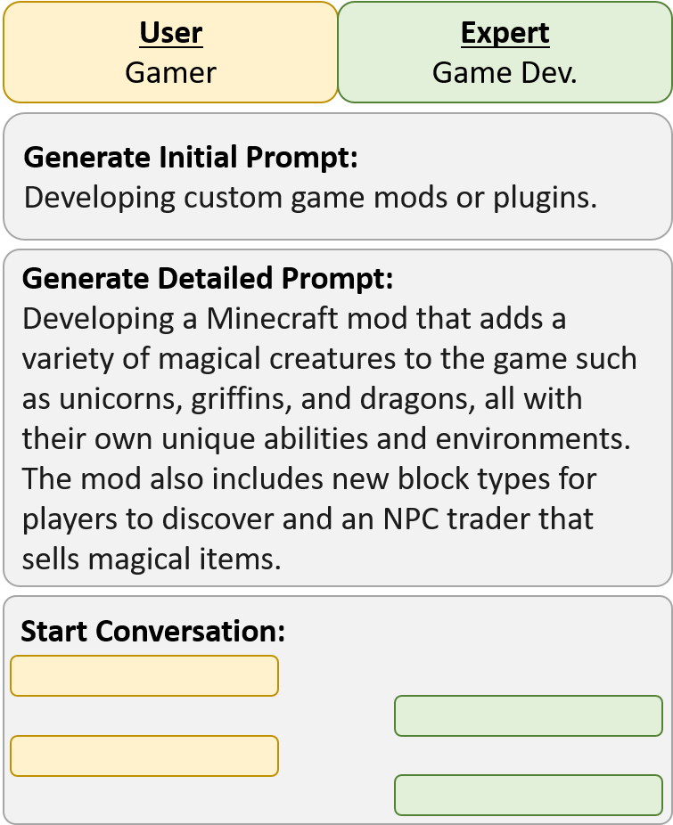

# CAMEL: Communicative Agents for Mind Extraction from Large Scale Language Model Society

<p align="center">
  
</p>

## Overview
The objective of this project is to study how an AI society would function, behave, and interact through communication. This project provides easy and flexible framework for two or more communicating agents. It enables simulating a conversation between agents playing different roles, such as a user seeking help on a particular task, and a domain expert eager to provide assistance. The tasks that agents will collaborate on could vary from complex problem-solving to creative story generation. 

Overall, this project has the potential to open up new possibilities for collaboration between machines. By simulating communication between agents, we can gain insights into how AI could function in society and identify areas for improvement. Ultimately, this research could have far-reaching implications for the development of intelligent systems and the future of AI.

## Try it yourself
We provide a Google Collab demo showcasing a conversation between two ChatGPT agents impersonationg a gamer as a user and a game developer as a domain expert collaborating on interesting tasks.


<p align="center">
  
</p>

## Environment Setup
Install `CAMEL` using conda environment:
```
# create a conda virtual environment
conda create --name camel python=3.10
# actiavte camel conda environment
conda activate camel
# install camel pip package
pip install camel
```

Install `CAMEL` from source with conda:
```
# create a conda virtual environment
conda create --name camel python=3.10
# actiavte camel conda environment
conda activate camel
# clone github repo
git clone https://github.com/lightaime/camel.git
# change directory into project directory
cd camel
# install camel from source
pre-commit install
pip install -e .
```
## News
- Initial release of `CAMEL` python library (March 21, 2023)

## Citation
```
@misc{camel,
  author = {Guohao Li, Hasan Abed Al Kader Hammoud, Hani Itani, Bernard Ghanem},
  title = {CAMEL: Communicative Agents for Mind Extraction from Large Scale Language Model Society},
  year = {2023},
  publisher = {GitHub},
  journal = {GitHub repository},
  howpublished = {\url{https://github.com/lightaime/camel.git}},
}
```
## Acknowledgement
We would like to thank Haya Hammoud for designing the logo of our project.

## License
MIT License

## Contact
For more information please contact [Guohao Li](https://ghli.org/), [Hasan Abed Al Kader Hammoud](https://cemse.kaust.edu.sa/ece/people/person/hasan-abed-al-kader-hammoud), [Hani Itani](https://github.com/HaniItani)