<div align="center">
  <a href="https://www.camel-ai.org/">
    
  </a>
</div>

</br>

<div align="center">

[![Documentation][docs-image]][docs-url]
[![Discord][discord-image]][discord-url]
[![X][x-image]][x-url]
[![Reddit][reddit-image]][reddit-url]
[![Wechat][wechat-image]][wechat-url]
[![Hugging Face][huggingface-image]][huggingface-url]
[![Star][star-image]][star-url]
[![Package License][package-license-image]][package-license-url]
[![PyPI Download][package-download-image]][package-download-url]
[![][join-us-image]][join-us]

<a href="https://trendshift.io/repositories/649" target="_blank"></a>

[English](README.md) |
[简体中文](README.zh.md) |
[日本語](README.ja.md)

</div>


<hr>

<div align="center">
<h4 align="center">

[Community](https://github.com/camel-ai/camel#community) |
[Installation](https://github.com/camel-ai/camel#installation) |
[Examples](https://github.com/camel-ai/camel/tree/HEAD/examples) |
[Paper](https://arxiv.org/abs/2303.17760) |
[Citation](https://github.com/camel-ai/camel#citation) |
[Contributing](https://github.com/camel-ai/camel#contributing-to-camel-) |
[CAMEL-AI](https://www.camel-ai.org/)

</h4>

<p style="line-height: 1.5; text-align: center;"> 🐫 CAMEL 是一个开源社区，致力于探索智能体的规模化规律。我们相信，在大规模条件下研究这些智能体，可以为其行为、能力以及潜在风险提供宝贵的洞见。为了推动该领域的研究，我们实现并支持多种类型的智能体、任务、提示词、模型和模拟环境。</p>


<br>


加入我们（[*Discord*](https://discord.camel-ai.org/) 或 [*微信*](https://ghli.org/camel/wechat.png)），一起突破智能体规模化规律研究的边界。

🌟 在 GitHub 上为 CAMEL 点亮 Star，第一时间获取最新发布信息。


</div>

<div align="center">
    
  </a>
</div>

<br>

[![][image-join-us]][join-us]


## CAMEL 框架设计原则

<h3>🧬 可进化性</h3>

该框架使多智能体系统能够通过生成数据和与环境交互不断进化。这种进化可以由带有可验证奖励的强化学习或监督学习驱动。

<h3>📈 可扩展性</h3>

该框架旨在支持拥有数百万智能体的系统，确保在大规模下实现高效的协作、通信和资源管理。

<h3>💾 有状态性</h3>

智能体保持有状态的记忆，使其能够与环境进行多步交互，并高效应对复杂任务。

<h3>📖 代码即提示</h3>

每一行代码和注释都可以作为智能体的提示。代码应当书写清晰、易读，确保人类和智能体都能有效理解。

<br>

## 为什么在研究中选择 CAMEL？

我们是一个由社区驱动的研究团体，汇聚了 100 多位研究人员，致力于推动多智能体系统的前沿研究。
全球各地的研究者选择在研究中使用 CAMEL，基于以下原因。

<table style="width: 100%;">
  <tr>
    <td align="left"></td>
    <td align="left"></td>
    <td align="left"></td>
  </tr>
  <tr>
    <td align="left">✅</td>
    <td align="left" style="font-weight: bold;">大规模智能体系统</td>
    <td align="left">可模拟多达 100 万个智能体，用于研究复杂多智能体环境中的涌现行为和规模规律。</td>
  </tr>
  <tr>
    <td align="left">✅</td>
    <td align="left" style="font-weight: bold;">动态通信</td>
    <td align="left">支持智能体之间的实时交互，促进无缝协作以应对复杂任务。</td>
  </tr>
  <tr>
    <td align="left">✅</td>
    <td align="left" style="font-weight: bold;">有状态记忆</td>
    <td align="left">赋予智能体保留和利用历史上下文的能力，从而在长期交互中提升决策质量。</td>
  </tr>
  <tr>
    <td align="left">✅</td>
    <td align="left" style="font-weight: bold;">支持多种基准测试</td>
    <td align="left">利用标准化基准严格评估智能体性能，确保结果的可复现性和可靠比较。</td>
  </tr>
  <tr>
    <td align="left">✅</td>
    <td align="left" style="font-weight: bold;">支持多类型智能体</td>
    <td align="left">可使用多种角色、任务、模型和环境，支持跨学科实验与多样化研究应用。</td>
  </tr>
  <tr>
    <td align="left">✅</td>
    <td align="left" style="font-weight: bold;">数据生成与工具集成</td>
    <td align="left">自动化生成大规模结构化数据集，并与多种工具无缝集成，加速合成数据生成和研究流程。</td>
  </tr>
</table>

<br>

## 你可以用 CAMEL 做什么?


### 1. 数据生成

<div align="center">
  <a href="https://github.com/camel-ai/camel/blob/master/camel/datagen/cot_datagen.py">
    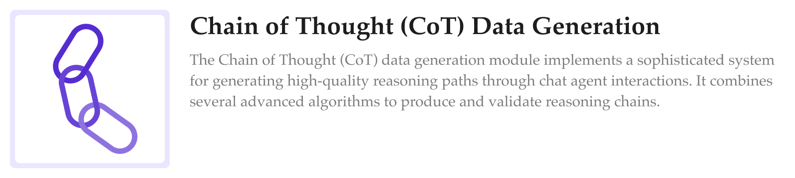
  </a>
</div>

<div align="center">
  <a href="https://github.com/camel-ai/camel/tree/master/camel/datagen/self_instruct">
    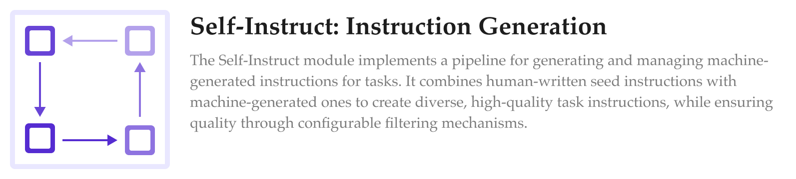
  </a>
</div>

<div align="center">
  <a href="https://github.com/camel-ai/camel/tree/master/camel/datagen/source2synth">
    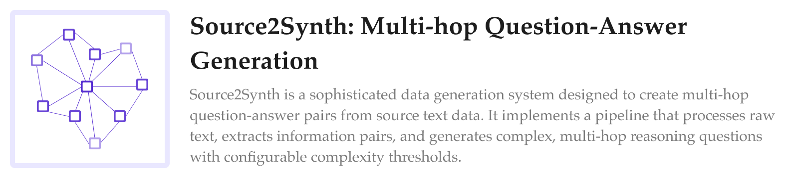
  </a>
</div>

<div align="center">
  <a href="https://github.com/camel-ai/camel/blob/master/camel/datagen/self_improving_cot.py">
    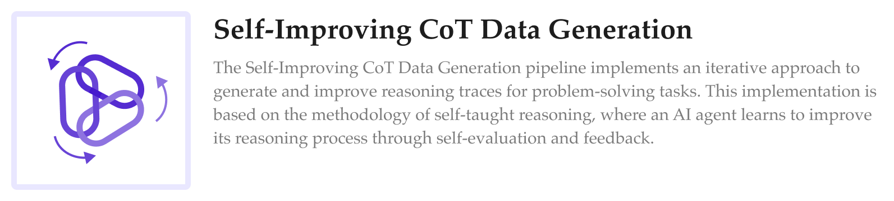
  </a>
</div>

### 2. 任务自动化

<div align="center">
  <a href="https://github.com/camel-ai/camel/blob/master/camel/societies/role_playing.py">
    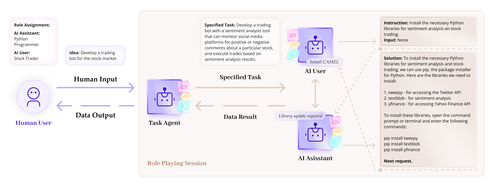
  </a>
</div>

<div align="center">
  <a href="https://github.com/camel-ai/camel/tree/master/camel/societies/workforce">
    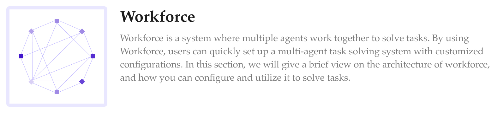
  </a>
</div>

<div align="center">
  <a href="https://docs.camel-ai.org/cookbooks/advanced_features/agents_with_rag">
    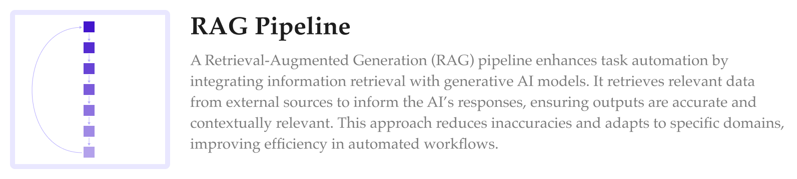
  </a>
</div>


### 3. 世界模拟

<div align="center">
  <a href="https://github.com/camel-ai/oasis">
    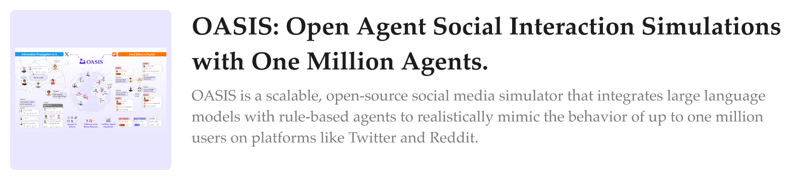
  </a>
</div>

<br>

## 快速开始

安装 CAMEL 非常简单，因为它已在 PyPI 上提供。只需打开终端并运行：

```bash
pip install camel-ai
```

### 从 ChatAgent 入手

本示例演示如何使用 CAMEL 框架创建一个 `ChatAgent`，并使用 DuckDuckGo 执行搜索查询。

1. **安装 tools 包：**

  ```bash
  pip install 'camel-ai[web_tools]'
  ```

2. **设置你的 OpenAI API key:**

  ```bash
  export OPENAI_API_KEY='your_openai_api_key'
  ```

3. **运行以下 Python 代码:**

  ```python
  from camel.models import ModelFactory
  from camel.types import ModelPlatformType, ModelType
  from camel.agents import ChatAgent
  from camel.toolkits import SearchToolkit

  model = ModelFactory.create(
    model_platform=ModelPlatformType.OPENAI,
    model_type=ModelType.GPT_4O,
    model_config_dict={"temperature": 0.0},
  )

  search_tool = SearchToolkit().search_duckduckgo

  agent = ChatAgent(model=model, tools=[search_tool])

  response_1 = agent.step("What is CAMEL-AI?")
  print(response_1.msgs[0].content)
  # CAMEL-AI is the first LLM (Large Language Model) multi-agent framework
  # and an open-source community focused on finding the scaling laws of agents.
  # ...

  response_2 = agent.step("What is the Github link to CAMEL framework?")
  print(response_2.msgs[0].content)
  # The GitHub link to the CAMEL framework is
  # [https://github.com/camel-ai/camel](https://github.com/camel-ai/camel).
  ```

4. **（可选）开启模型请求/响应日志：**

  ```bash
  export CAMEL_MODEL_LOG_ENABLED=true
  export CAMEL_MODEL_LOG_MODEL_CONFIG_ENABLED=true
  export CAMEL_LOG_DIR=camel_logs
  ```

  - `CAMEL_MODEL_LOG_ENABLED`：开启请求/响应 JSON 日志。
  - `CAMEL_MODEL_LOG_MODEL_CONFIG_ENABLED`：控制是否记录
    `request.model_config_dict`。未设置时，默认跟
    `CAMEL_MODEL_LOG_ENABLED` 保持一致。
  - `CAMEL_LOG_DIR`：日志输出目录（默认：`camel_logs`）。
  - 日志以 UTF-8 JSON 写入，中文、日文、阿拉伯语等多语言内容可读，
    不会出现大量 Unicode 转义字符。

有关更详细的说明和其他配置选项，请参阅[安装部分](https://github.com/camel-ai/camel/blob/master/docs/get_started/installation.md)。

运行之后，您可以访问 [docs.camel-ai.org](https://docs.camel-ai.org) 探索我们的 CAMEL 技术栈和操作手册，构建强大的多智能体系统。

我们提供了一个 [](https://colab.research.google.com/drive/1AzP33O8rnMW__7ocWJhVBXjKziJXPtim?usp=sharing) 演示，展示了两个 ChatGPT 智能体之间的对话：他们分别扮演 Python 程序员和股票交易员的角色，共同合作开发股票交易机器人。

探索不同类型的智能体、它们的角色以及应用场景。

- **[创建你的第一个 Agent](https://docs.camel-ai.org/cookbooks/basic_concepts/create_your_first_agent)**
- **[创建你的第一个 Agent 社区](https://docs.camel-ai.org/cookbooks/basic_concepts/create_your_first_agents_society)**
- **[具身智能体](https://docs.camel-ai.org/cookbooks/advanced_features/embodied_agents)**
- **[评审智能体](https://docs.camel-ai.org/cookbooks/advanced_features/critic_agents_and_tree_search)**

### 寻求帮助

如果在设置 CAMEL 时遇到任何问题，请通过 [CAMEL Discord](https://discord.camel-ai.org/) 与我们联系。

<br>

## 技术栈

<div align="center">
  <a href="https://docs.camel-ai.org">
    
  </a>
</div>

### 关键模块

用于构建、运行和增强 CAMEL-AI 智能体及智能体社会的核心组件和工具。

| 模块                                                                                                                              | 描述                   |
| :------------------------------------------------------------------------------------------------------------------------------ | :------------------- |
| **[Agents](https://docs.camel-ai.org/key_modules/agents)**                                                                 | 核心智能体架构与行为，用于自主运行。   |
| **[Agent Societies](https://docs.camel-ai.org/key_modules/society)**                                                       | 构建和管理多智能体系统及协作的组件。   |
| **[Data Generation](https://docs.camel-ai.org/key_modules/datagen)**                                                       | 合成数据创建与增强的工具和方法。     |
| **[Models](https://docs.camel-ai.org/key_modules/models)**                                                                 | 智能体模型架构及定制选项。        |
| **[Tools](https://docs.camel-ai.org/key_modules/tools)**                                                                   | 用于智能体专用任务的工具集成。      |
| **[Memory](https://docs.camel-ai.org/key_modules/memory)**                                                                 | 智能体状态管理的记忆存储与检索机制。   |
| **[Storage](https://docs.camel-ai.org/key_modules/storages)**                                                              | 智能体数据和状态的持久化存储方案。    |
| **[Benchmarks](https://github.com/camel-ai/camel/tree/master/camel/benchmarks)**                                                | 性能评估与测试框架。           |
| **[Interpreters](https://docs.camel-ai.org/key_modules/interpreters)**                                                     | 代码与指令解释能力。           |
| **[Data Loaders](https://docs.camel-ai.org/key_modules/loaders)**                                                          | 数据导入与预处理工具。          |
| **[Retrievers](https://docs.camel-ai.org/key_modules/retrievers)**                                                         | 知识检索与 RAG（检索增强生成）组件。 |
| **[Runtime](https://github.com/camel-ai/camel/tree/master/camel/runtime)**                                                      | 执行环境与进程管理。           |
| **[Human-in-the-Loop](https://docs.camel-ai.org/cookbooks/advanced_features/agents_with_human_in_loop_and_tool_approval)** | 支持人工监督与干预的交互组件。      |
---

## 研究

我们认为，对这些智能体进行大规模研究可以深入了解它们的行为、能力及潜在风险。

**探索我们的研究项目：**

<div align="center">
  <a href="https://crab.camel-ai.org/">
    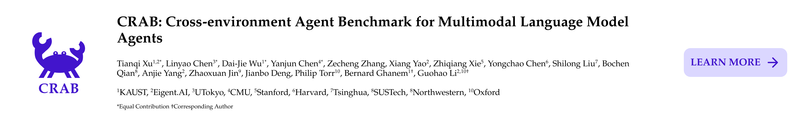
  </a>
</div>

<div align="center">
  <a href="https://agent-trust.camel-ai.org/">
    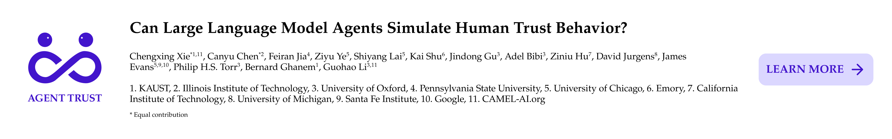
  </a>
</div>

<div align="center">
  <a href="https://oasis.camel-ai.org/">
    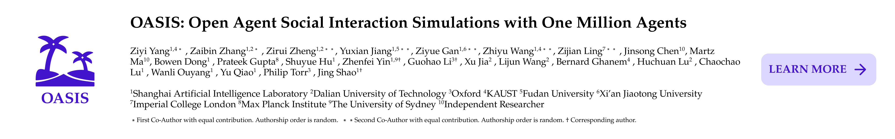
  </a>
</div>

<div align="center">
  <a href="https://emos-project.github.io/">
    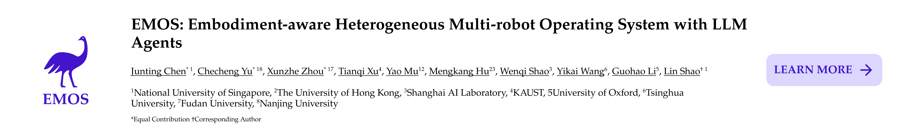
  </a>
</div>

> ### 与我们共同研究
>
> 我们诚挚地邀请您使用 CAMEL 开展有影响力的研究。
>
> 严谨的研究需要时间和资源。我们是一个由社区驱动的研究团队，拥有 100 多名研究人员，致力于探索多智能体系统的前沿研究。加入我们正在进行的项目或与我们一起测试新想法，[通过邮箱联系我们](mailto:camel-ai@eigent.ai) 获取更多信息。
>
><div align="center">
>    
></div>

<br>

## 合成数据集

### 1. 使用多种 LLM 作为后端

更多详情请参阅我们的 [`模型文档`](https://docs.camel-ai.org/key_modules/models#)。

> **数据（托管于 Hugging Face）**

| 数据集            | 聊天格式                                                                                         | 指令格式                                                                                               | 聊天格式（翻译版）                                                                   |
| -------------- | -------------------------------------------------------------------------------------------- | -------------------------------------------------------------------------------------------------- | --------------------------------------------------------------------------- |
| **AI Society** | [聊天格式](https://huggingface.co/datasets/camel-ai/ai_society/blob/main/ai_society_chat.tar.gz) | [指令格式](https://huggingface.co/datasets/camel-ai/ai_society/blob/main/ai_society_instructions.json) | [聊天格式（翻译版）](https://huggingface.co/datasets/camel-ai/ai_society_translated) |
| **Code**       | [聊天格式](https://huggingface.co/datasets/camel-ai/code/blob/main/code_chat.tar.gz)             | [指令格式](https://huggingface.co/datasets/camel-ai/code/blob/main/code_instructions.json)             | x                                                                           |
| **Math**       | [聊天格式](https://huggingface.co/datasets/camel-ai/math)                                        | x                                                                                                  | x                                                                           |
| **Physics**    | [聊天格式](https://huggingface.co/datasets/camel-ai/physics)                                     | x                                                                                                  | x                                                                           |
| **Chemistry**  | [聊天格式](https://huggingface.co/datasets/camel-ai/chemistry)                                   | x                                                                                                  | x                                                                           |
| **Biology**    | [聊天格式](https://huggingface.co/datasets/camel-ai/biology)                                     | x                                                                                                  | x                                                                           |

### 2. 指令与任务可视化

| 数据集              | 指令                                                                                                         | 任务                                                                                                         |
| ---------------- | ---------------------------------------------------------------------------------------------------------- | ---------------------------------------------------------------------------------------------------------- |
| **AI Society**   | [指令](https://atlas.nomic.ai/map/3a559a06-87d0-4476-a879-962656242452/db961915-b254-48e8-8e5c-917f827b74c6) | [任务](https://atlas.nomic.ai/map/cb96f41b-a6fd-4fe4-ac40-08e101714483/ae06156c-a572-46e9-8345-ebe18586d02b) |
| **Code**         | [指令](https://atlas.nomic.ai/map/902d6ccb-0bbb-4294-83a8-1c7d2dae03c8/ace2e146-e49f-41db-a1f4-25a2c4be2457) | [任务](https://atlas.nomic.ai/map/efc38617-9180-490a-8630-43a05b35d22d/2576addf-a133-45d5-89a9-6b067b6652dd) |
| **Misalignment** | [指令](https://atlas.nomic.ai/map/5c491035-a26e-4a05-9593-82ffb2c3ab40/2bd98896-894e-4807-9ed8-a203ccb14d5e) | [任务](https://atlas.nomic.ai/map/abc357dd-9c04-4913-9541-63e259d7ac1f/825139a4-af66-427c-9d0e-f36b5492ab3f) |

<br>

## 使用手册（Cookbooks）

提供关于在 CAMEL-AI 智能体及智能体社会中实现特定功能的实用指南与教程。

### 1. 基础概念

| 手册                                                                                                           | 描述             |
| :----------------------------------------------------------------------------------------------------------- | :------------- |
| **[创建您的第一个智能体](https://docs.camel-ai.org/cookbooks/basic_concepts/create_your_first_agent)**            | 构建第一个智能体的逐步指南。 |
| **[创建您的第一个智能体社会](https://docs.camel-ai.org/cookbooks/basic_concepts/create_your_first_agents_society)** | 学习构建协作型智能体社会。  |
| **[消息手册](https://docs.camel-ai.org/cookbooks/basic_concepts/agents_message)**                           | 智能体消息处理的最佳实践。  |

### 2. 高级功能

| 手册                                                                                                         | 描述                |
| :--------------------------------------------------------------------------------------------------------- | :---------------- |
| **[工具手册](https://docs.camel-ai.org/cookbooks/advanced_features/agents_with_tools)**                   | 集成工具以增强功能。        |
| **[记忆手册](https://docs.camel-ai.org/cookbooks/advanced_features/agents_with_memory)**                  | 在智能体中实现记忆系统。      |
| **[RAG 手册](https://docs.camel-ai.org/cookbooks/advanced_features/agents_with_rag)**                   | 检索增强生成（RAG）的操作指南。 |
| **[图谱 RAG 手册](https://docs.camel-ai.org/cookbooks/advanced_features/agents_with_graph_rag)**          | 利用知识图谱实现 RAG。     |
| **[使用 AgentOps 跟踪 CAMEL 智能体](https://docs.camel-ai.org/cookbooks/advanced_features/agents_tracking)** | 管理与跟踪智能体操作的工具。    |

### 3. 模型训练与数据生成

| 手册                                                                                                                                                    | 描述                                                                      |
| :---------------------------------------------------------------------------------------------------------------------------------------------------- | :---------------------------------------------------------------------- |
| **[使用 CAMEL 生成数据并用 Unsloth 微调](https://docs.camel-ai.org/cookbooks/data_generation/sft_data_generation_and_unsloth_finetuning_Qwen2_5_7B)**      | 学习如何使用 CAMEL 生成数据，并用 Unsloth 高效微调模型。                                    |
| **[使用真实函数调用与 Hermes 格式生成数据](https://docs.camel-ai.org/cookbooks/data_generation/data_gen_with_real_function_calls_and_hermes_format)**           | 探索如何通过真实函数调用和 Hermes 格式生成数据。                                            |
| **[CoT 数据生成并上传至 Huggingface](https://docs.camel-ai.org/cookbooks/data_generation/distill_math_reasoning_data_from_deepseek_r1)**                 | 学习如何生成 CoT 数据并无缝上传到 Huggingface。                                        |
| **[使用 CAMEL 和 Unsolth 生成 CoT 数据并微调 Qwen](https://docs.camel-ai.org/cookbooks/data_generation/cot_data_gen_sft_qwen_unsolth_upload_huggingface)** | 探索如何使用 CAMEL 生成 CoT 数据，并结合 Unsolth 对 Qwen 进行微调，同时将数据和模型上传至 Huggingface。 |

### 4. 多智能体系统与应用

| 手册                                                                                                                                                         | 描述                                                                     |
| :--------------------------------------------------------------------------------------------------------------------------------------------------------- | :--------------------------------------------------------------------- |
| **[报告与知识图谱生成的角色扮演爬虫](https://docs.camel-ai.org/cookbooks/applications/roleplaying_scraper)**                                                          | 创建角色扮演智能体进行数据爬取与报告生成。                                                  |
| **[使用 Workforce 构建黑客松评审委员会](https://docs.camel-ai.org/cookbooks/multi_agent_society/workforce_judge_committee)**                                      | 构建协作评审团队的智能体系统。                                                        |
| **[动态知识图谱角色扮演：多智能体系统](https://docs.camel-ai.org/cookbooks/applications/dyamic_knowledge_graph)**                                                      | 构建动态、时序感知的金融知识图谱，处理财报、新闻与论文，帮助交易员分析数据、识别关系并发现市场洞察，同时通过多样化元素节点去重优化图谱结构。 |
| **[使用 Agentic RAG 构建 Discord 客服机器人](https://docs.camel-ai.org/cookbooks/applications/customer_service_Discord_bot_using_SambaNova_with_agentic_RAG)** | 学习如何使用 Agentic RAG 构建强大的 Discord 客服机器人。                                |
| **[使用本地模型构建 Discord 客服机器人](https://docs.camel-ai.org/cookbooks/applications/customer_service_Discord_bot_using_local_model_with_agentic_RAG)**        | 学习如何使用支持本地部署的 Agentic RAG 构建 Discord 客服机器人。                            |

### 5. 数据处理

| 手册                                                                                                                                 | 描述                                         |
| :--------------------------------------------------------------------------------------------------------------------------------- | :----------------------------------------- |
| **[视频分析](https://docs.camel-ai.org/cookbooks/data_processing/video_analysis)**                                                | 智能体在视频数据分析中的技术与方法。                         |
| **[使用 Firecrawl 从网站获取数据的三种方法](https://docs.camel-ai.org/cookbooks/data_processing/ingest_data_from_websites_with_Firecrawl)** | 探索通过 Firecrawl 从网站提取和处理数据的三种方法。            |
| **[创建可处理 PDF 的 AI 智能体](https://docs.camel-ai.org/cookbooks/data_processing/agent_with_chunkr_for_pdf_parsing)**               | 学习如何使用 Chunkr 和 Mistral AI 创建可处理 PDF 的智能体。 |

<br>

## 真实场景应用

展示 CAMEL 多智能体框架在基础设施自动化、生产力工作流程、检索增强对话、智能文档/视频分析以及协作研究中创造实际商业价值的案例。

### 1 基础设施自动化

| 用例                                                                                                              | 描述                                                                   |
| :-------------------------------------------------------------------------------------------------------------- | :------------------------------------------------------------------- |
| **[ACI MCP](https://github.com/camel-ai/camel/tree/master/examples/usecases/aci_mcp)**                          | 展示 CAMEL 多智能体框架在基础设施自动化、生产力工作流程、检索增强对话、智能文档/视频分析及协作研究中创造实际商业价值的真实案例。 |
| **[Cloudflare MCP CAMEL](https://github.com/camel-ai/camel/tree/master/examples/usecases/cloudfare_mcp_camel)** | 智能体动态管理 Cloudflare 资源，实现可扩展且高效的云安全与性能优化。                             |

### 2 生产力与业务工作流程

| 用例                                                                                                                            | 描述                                |
| :---------------------------------------------------------------------------------------------------------------------------- | :-------------------------------- |
| **[Airbnb MCP](https://github.com/camel-ai/camel/tree/master/examples/usecases/airbnb_mcp)**                                  | 协调智能体优化和管理 Airbnb 房源及房东运营。        |
| **[PPTX 工具包用例 (PPTX Toolkit Usecase)](https://github.com/camel-ai/camel/tree/master/examples/usecases/pptx_toolkit_usecase)** | 通过多智能体协作分析 PowerPoint 文档并提取结构化洞见。 |

### 3 检索增强多智能体聊天

| 用例                                                                                                                        | 描述                                                     |
| :------------------------------------------------------------------------------------------------------------------------ | :----------------------------------------------------- |
| **[与 GitHub 聊天 (Chat with GitHub)](https://github.com/camel-ai/camel/tree/master/examples/usecases/chat_with_github)**    | 通过 CAMEL 智能体利用 RAG 风格工作流查询和理解 GitHub 代码库，加速开发者入职和代码导航。 |
| **[与 YouTube 聊天 (Chat with YouTube)](https://github.com/camel-ai/camel/tree/master/examples/usecases/chat_with_youtube)** | 会话智能体提取并总结视频字幕，加快内容理解和再利用。                             |

### 4 视频与文档智能

| 用例                                                                                             | 描述                                                |
| :--------------------------------------------------------------------------------------------- | :------------------------------------------------ |
| **[YouTube OCR](https://github.com/camel-ai/camel/tree/master/examples/usecases/youtube_ocr)** | 智能体对视频截图进行 OCR 识别，概括视觉内容，支持媒体监控和合规检查。             |
| **[Mistral OCR](https://github.com/camel-ai/camel/tree/master/examples/usecases/mistral_OCR)** | CAMEL 智能体结合 Mistral 进行文档 OCR 分析，减少文档理解工作流程中的人工操作。 |

### 5 研究与协作

| 用例                                                                                                                                              | 描述                                     |
| :---------------------------------------------------------------------------------------------------------------------------------------------- | :------------------------------------- |
| **[多智能体研究助手 (Multi-Agent Research Assistant)](https://github.com/camel-ai/camel/tree/master/examples/usecases/multi_agent_research_assistant)** | 模拟一支由研究智能体组成的团队协作进行文献综述，提高探索性分析和报告的效率。 |

<br>

## 🗓️ 活动

我们积极参与各类社区活动，包括：

* 🎙️ **社区会议** — 每周与 CAMEL 团队的线上同步
* 🏆 **竞赛** — CAMEL 主办的黑客松、悬赏任务和编程挑战
* 🤝 **志愿者活动** — 贡献代码、文档整理及导师指导
* 🌍 **大使项目** — 在您的大学或本地技术团体中代表 CAMEL

> 想要主办或参与 CAMEL 活动？加入我们的 [Discord](https://discord.com/invite/CNcNpquyDc)，或成为 [大使计划](https://www.camel-ai.org/ambassador) 的一员。


## 为 CAMEL 做贡献

> 对于希望贡献代码的朋友，我们非常感谢您对我们开源项目的支持。请花一点时间阅读我们的 [贡献指南](https://github.com/camel-ai/camel/blob/master/CONTRIBUTING.md)，以便顺利开始合作之旅。🚀
>
> 我们也欢迎您通过社交媒体、活动或会议分享 CAMEL，帮助其成长。您的支持将产生巨大的影响！

## 贡献者

<a href="https://github.com/camel-ai/camel/graphs/contributors">
  
</a>

使用 [contrib.rocks](https://contrib.rocks) 制作。

<br>

## 致谢

特别感谢 [Nomic AI](https://home.nomic.ai/) 为我们提供了其数据集探索工具（Atlas）的扩展访问权限。

我们还要感谢 Haya Hammoud 设计了我们项目的初始徽标。

我们实现了来自其他研究工作的优秀创意，供您构建、比较和定制智能体。如果您使用了其中的任何模块，请务必引用原始作品：
- `TaskCreationAgent` and `TaskPrioritizationAgent` from *Nakajima et al.*: [Task-Driven Autonomous Agent](https://yoheinakajima.com/task-driven-autonomous-agent-utilizing-gpt-4-pinecone-and-langchain-for-diverse-applications/).

- `PersonaHub` from *Tao Ge et al.*: [Scaling Synthetic Data Creation with 1,000,000,000 Personas](https://arxiv.org/pdf/2406.20094). [[Example](https://github.com/camel-ai/camel/blob/master/examples/personas/personas_generation.py)]

- `Self-Instruct` from *Yizhong Wang et al.*: [SELF-INSTRUCT: Aligning Language Models with Self-Generated Instructions](https://arxiv.org/pdf/2212.10560). [[Example](https://github.com/camel-ai/camel/blob/master/examples/datagen/self_instruct/self_instruct.py)]

## 许可协议

该源码遵循 Apache 2.0 许可证。

## 引用
```
@inproceedings{li2023camel,
  title={CAMEL: Communicative Agents for "Mind" Exploration of Large Language Model Society},
  author={Li, Guohao and Hammoud, Hasan Abed Al Kader and Itani, Hani and Khizbullin, Dmitrii and Ghanem, Bernard},
  booktitle={Thirty-seventh Conference on Neural Information Processing Systems},
  year={2023}
}
```

这是一个如何引用我们工作的示例：
```
We use the CAMEL framework \cite{li2023camel} to develop the agents used in our experiments.
```

## 社区与联系方式

如需更多信息，请联系：[camel-ai@eigent.ai](mailto:camel-ai@eigent.ai)

* **GitHub Issues：** 报告 bug、提交功能请求以及跟踪开发进度。[提交 Issue](https://github.com/camel-ai/camel/issues)
* **Discord：** 获取实时支持，与社区交流，并保持最新动态。[加入我们](https://discord.camel-ai.org/)
* **X（Twitter）：** 获取更新、AI 见解和重要公告。[关注我们](https://x.com/CamelAIOrg)
* **大使项目（Ambassador Project）：** 推广 CAMEL-AI、举办活动并贡献内容。[了解更多](https://www.camel-ai.org/community)
* **微信社区：** 扫描下方二维码加入我们的微信社区。

  <div align="center">
    
  </div>


<br>

[docs-image]: https://img.shields.io/badge/Documentation-EB3ECC
[docs-url]: https://camel-ai.github.io/camel/index
[star-image]: https://img.shields.io/github/stars/camel-ai/camel?label=stars&logo=github&color=brightgreen
[star-url]: https://github.com/camel-ai/camel/stargazers
[package-license-image]: https://img.shields.io/badge/License-Apache_2.0-blue.svg
[package-license-url]: https://github.com/camel-ai/camel/blob/master/licenses/LICENSE
[package-download-image]: https://img.shields.io/pypi/dm/camel-ai

[colab-url]: https://colab.research.google.com/drive/1AzP33O8rnMW__7ocWJhVBXjKziJXPtim?usp=sharing
[colab-image]: https://colab.research.google.com/assets/colab-badge.svg
[huggingface-url]: https://huggingface.co/camel-ai
[huggingface-image]: https://img.shields.io/badge/%F0%9F%A4%97%20Hugging%20Face-CAMEL--AI-ffc107?color=ffc107&logoColor=white
[discord-url]: https://discord.camel-ai.org/
[discord-image]: https://img.shields.io/discord/1082486657678311454?logo=discord&labelColor=%20%235462eb&logoColor=%20%23f5f5f5&color=%20%235462eb
[wechat-url]: https://ghli.org/camel/wechat.png
[wechat-image]: https://img.shields.io/badge/WeChat-CamelAIOrg-brightgreen?logo=wechat&logoColor=white
[x-url]: https://x.com/CamelAIOrg
[x-image]: https://img.shields.io/twitter/follow/CamelAIOrg?style=social
[twitter-image]: https://img.shields.io/twitter/follow/CamelAIOrg?style=social&color=brightgreen&logo=twitter
[reddit-url]: https://www.reddit.com/r/CamelAI/
[reddit-image]: https://img.shields.io/reddit/subreddit-subscribers/CamelAI?style=plastic&logo=reddit&label=r%2FCAMEL&labelColor=white
[ambassador-url]: https://www.camel-ai.org/community
[package-download-url]: https://pypi.org/project/camel-ai
[join-us]:https://eigent-ai.notion.site/eigent-ai-careers
[join-us-image]:https://img.shields.io/badge/Join%20Us-yellow?style=plastic
[image-join-us]: https://camel-ai.github.io/camel_asset/graphics/join_us.png
