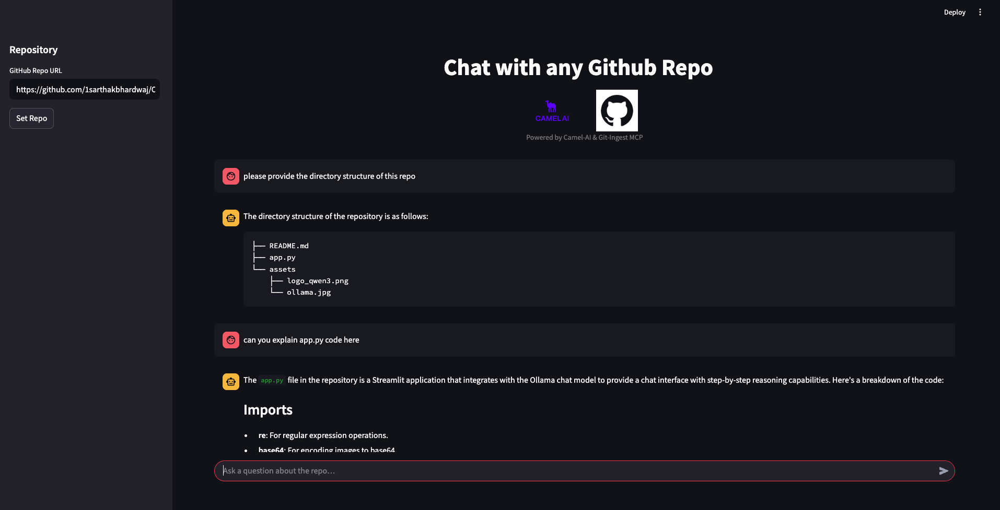

# 🤖 GitHub Repo Chat Explorer

A Streamlit-based chat interface powered by **CAMEL-AI** and **MCP (Model Context Protocol)** that lets you conversationally explore any GitHub repository. Ask questions like "How many files?", "Show me the README contents", or follow-up queries—all in context of the chosen repo.

---

## ✨ Features

- **Interactive Chat UI**: Chat with your repository using Streamlit's chat components.
- **Dynamic Context**: Set or change the GitHub repo URL in the sidebar to switch contexts on the fly.
- **Session Memory**: Keeps your question-answer history until you change the repo.
- **Agent-Powered**: Under the hood, a `ChatAgent` + MCPToolkit fetches and processes repo data.

---

## 📸 Screenshot



_A conversation where the user asks about the repo structure and README file._

---

## 📋 Prerequisites

- Python >=3.10,<3.13
- Node.js & npm (for MCP server plugin)
- OpenAI API key in `.env`:
  ```bash
  export OPENAI_API_KEY="your_key_here"
  ```

---

## 🛠️ Installation

1. **Clone the repo**

   ```bash
   git clone https://github.com/your-org/your-repo.git
   cd your-repo/owl/community_usecase/gitingest
   ```

2. **Python environment**

   ```bash
   python -m venv venv
   source venv/bin/activate      # macOS/Linux
   venv\\Scripts\\activate     # Windows
   pip install -r requirements.txt
   ```

3. **Install MCP plugin**

   ```bash
   npm install -g @openbnb/mcp-server-git
   ```

---

## ⚙️ Configuration

- **.env**: Create in project root:
  ```ini
  OPENAI_API_KEY=your_key_here
  ```
- **mcp_servers_config.json**: Next to `app.py`:
  ```json
  {
    "mcpServers": {
      "gitingest": {
        "command": "npx",
        "args": ["-y", "@openbnb/mcp-server-git"]
      }
    }
  }
  ```

---

## 🚀 Running the App

```bash
streamlit run app.py
```  
Set the repo in the sidebar, then start chatting!

---

## 🔧 Customization

- Tweak system prompts in `st.chat_message` calls.
- Adjust temperature or model type in `ModelFactory.create`.
- Style the UI via CSS in the header section.

---

## 📂 Project Structure

```
Gitingest/
├── assets/
│   ├── logo_camel_ai.png
│   ├── logo_github.png
│   └── screenshot_chat.png
├── mcp_servers_config.json
├── app.py              # Main Streamlit chat app
├── requirements.txt    # Python dependencies
└── .env                # Env vars


*Happy repo chatting!*  
````
