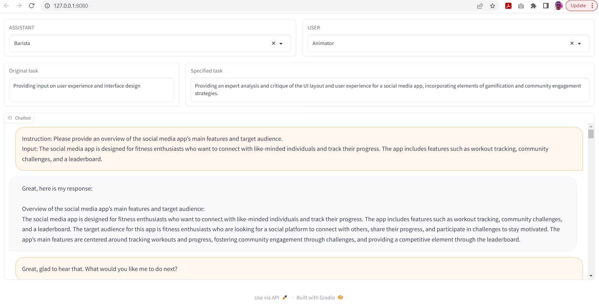

# Data Explorer tool to browse Camel dataset

## How to run Gradio web UI
1. Put jsons into `data_explorer/DATA/`
2. Add `pip install gradio`
3. in `data_explorer` run `gradio data_explorer.py`
4. `localhost:8080` will open
5. Have fun

