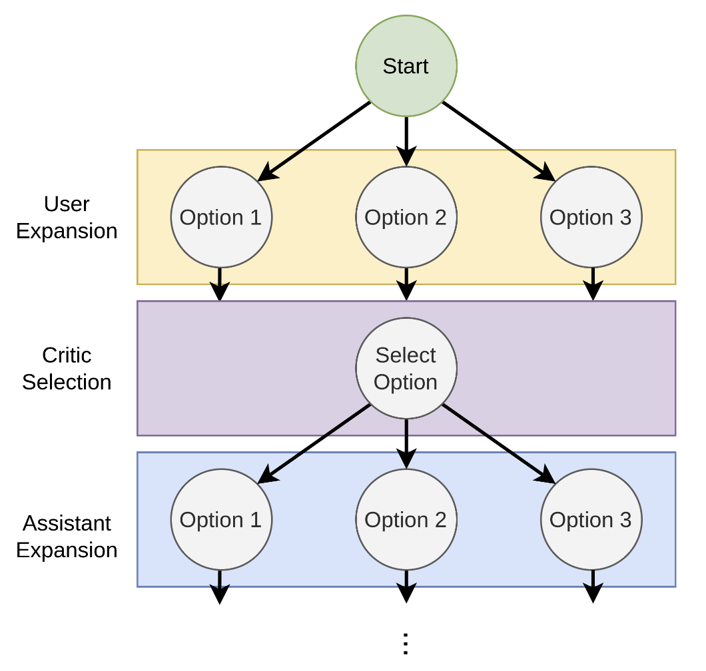

You can also check this cookbook in Colab [here](https://colab.research.google.com/drive/1A2id3IyP1tSQXmtLsaY9-zyowSRzTaxk?usp=sharing)

<div class="align-center">
<div className="flex justify-center items-center gap-4 mb-8">
  <a href="https://www.camel-ai.org/">
    
  </a>
  <a href="https://discord.camel-ai.org">
    
  </a>
</div>
⭐ <i>Star us on [*Github*](https://github.com/camel-ai/camel), join our [*Discord*](https://discord.camel-ai.org) or follow our [*X*](https://x.com/camelaiorg)</i>
</div>

## Philosophical Bits

*What magical trick makes us intelligent? The trick is that there is no trick. The power of intelligence stems from our vast diversity, not from any single, perfect principle.*

Marvin Minsky, The Society of Mind, p. 308

In this section, we will take a spite of the task-oriented `RolePlaying()` class. We design this in an instruction-following manner. The essence is that to solve a complex task, you can enable two communicative agents collaboratively working together step by step to reach solutions. The main concepts include:

- **Task**: a task can be as simple as an idea, initialized by an inception prompt.
- **AI User**: the agent who is expected to provide instructions.
- **AI Assistant**: the agent who is expected to respond with solutions that fulfill the instructions.

> **Prerequisite**: We assume that you have read the section on [intro to role-playing](https://colab.research.google.com/drive/1cmWPxXEsyMbmjPhD2bWfHuhd_Uz6FaJQ?usp=sharing).

How do agents accomplish hard tasks? While reasoning can naturally emerge from next-token-prediction pretraining, it is still difficult for agents to solve complex tasks which require lots of intermediate steps. To tackle this issue, tree search is a simple and effective framework.

A typical tree search includes node expansion and node selection. In the [March 2023 paper](https://arxiv.org/abs/2303.17760), CAMEL introduces a heuristic tree search approach with critic in the loop, where the expansion and selection are presented below:



To put it simply, a critic agent is a helper agent in the role-playing session, capable of selecting proposals and providing informative verbal feedback to the role-playing agents.

## Quick Start

### 🕹 Step 0: Preparations

```python
%pip install "camel-ai==0.2.16"

from camel.agents import CriticAgent
from camel.generators import SystemMessageGenerator as sys_msg_gen
from camel.messages import BaseMessage as bm
from camel.types import RoleType
```

### Setting Up API Keys

You'll need to set up your API keys for OpenAI.

```python
import os
from getpass import getpass

# Prompt for the API key securely
openai_api_key = getpass('Enter your API key: ')
os.environ["OPENAI_API_KEY"] = openai_api_key
```

### 🕹 Step 1: Configure the Specifications for Critic Agents

```python
# Set the role name and the task
critic_role = 'a picky critic'

# Create the meta_dict and the role_tuple
meta_dict = dict(critic_role=critic_role,
                 criteria='Help better accomplish the task.')

# Create the role tuple
role_tuple = (critic_role, RoleType.CRITIC)

# Generate the system message
sys_msg = sys_msg_gen().from_dict(meta_dict=meta_dict,
                                  role_tuple=role_tuple)
```

### 🕹 Step 2: Get the Critic Agents

```python
critic_agent = CriticAgent(system_message=sys_msg, verbose=True)
```

Let's take a look at the default system message:

```python
print(critic_agent.system_message.content)
```

You may overwrite the system message and configure the critic differently based on your own needs.

### 🕹 Step 3: Using Critic Agents for Task Solving

Our `RolePlaying()` class provides a simple way for you to add the critic in the loop. Below we provide a basic pipeline.

```python
# Import necessary classes
from camel.societies import RolePlaying
from camel.configs import ChatGPTConfig
from camel.types import TaskType, ModelType, ModelPlatformType
from colorama import Fore
from camel.utils import print_text_animated
from camel.models import ModelFactory

# Set the LLM model type and model config
model_platform = ModelPlatformType.OPENAI
model_type = ModelType.GPT_4O_MINI
model_config = ChatGPTConfig(
    temperature=0.8,
    n=3,
)

# Create the backend model
model = ModelFactory.create(
    model_platform=model_platform,
    model_type=model_type,
    model_config_dict=model_config.as_dict())
```

```python
# Set the kwargs for the task and each agent
task_kwargs = {
    'task_prompt': 'Develop a plan to TRAVEL TO THE PAST and make changes.',
    'with_task_specify': True,
    'task_specify_agent_kwargs': {'model': model}
}

user_role_kwargs = {
    'user_role_name': 'an ambitious aspiring TIME TRAVELER',
    'user_agent_kwargs': {'model': model}
}

assistant_role_kwargs = {
    'assistant_role_name': 'the best-ever experimental physicist',
    'assistant_agent_kwargs': {'model': model}
}

critic_role_kwargs = {
    'with_critic_in_the_loop': True,
    'critic_criteria': 'improve the task performance',
    'critic_kwargs': dict(verbose=True)
}
```

```python
# Putting them together
society = RolePlaying(
    **task_kwargs,
    **user_role_kwargs,
    **assistant_role_kwargs,
    **critic_role_kwargs,
)
```

```python
# Helper function to check for termination
def is_terminated(response):
    if response.terminated:
        role = response.msg.role_type.name
        reason = response.info['termination_reasons']
        print(f'AI {role} terminated due to {reason}')
    return response.terminated
```

```python
# Runner for the simulation
def run(society, round_limit: int=10):
    input_msg = society.init_chat()
    for _ in range(round_limit):
        assistant_response, user_response = society.step(input_msg)

        if is_terminated(assistant_response) or is_terminated(user_response):
            break

        print(f'[AI User] {user_response.msg.content}.
')
        print(f'[AI Assistant] {assistant_response.msg.content}.
')

        if 'CAMEL_TASK_DONE' in user_response.msg.content:
            break

        input_msg = assistant_response.msg

    return None
```

```python
# Run the society
run(society)
```

In this setting, the `AI User` and `AI Assistant` will generate different options when responding (you can change the `temperature` in `model_config` to control diversity). The `AI Critic` responds with its option selection and reasoning, providing useful feedback for improved agent interactions.

## Remarks

While we see some performance gains from critic-in-the-loop, it may not really solve the fundamental extrapolation problem (and [self-consistency](https://arxiv.org/abs/2203.11171) remains a strong baseline for many tasks). It is debatable if those agents can extrapolate by self-play within its current scale. A more practical question is how we may *efficiently* introduce *informative* feedbacks/rewards when agents are connected with external environments and endowed with tools and memories. They are expected to have a good world model and know how to make abstraction and analogy when necessary.

Stay tuned for our next update.
