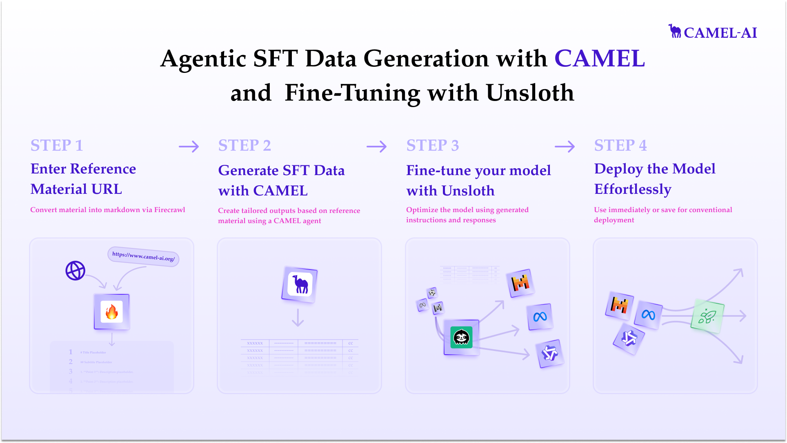

For more detailed usage information, please refer to our [cookbook](https://colab.research.google.com/drive/1fdBns2QA1XNwF_tsvG3Hc27QGdViHH3b?usp=sharing)

To run this, press **Runtime → Run all** on a **free** Tesla T4 Google Colab instance!

<div class="align-center">
  <div class="flex justify-center items-center gap-4 mb-8">
    <a href="https://www.camel-ai.org/">
      
    </a>
    <a href="https://discord.camel-ai.org">
      
    </a>
  </div>
  ⭐ <i>Star us on [*Github*](https://github.com/camel-ai/camel), join our [*Discord*](https://discord.camel-ai.org) or follow our [*X*](https://x.com/camelaiorg)</i>
</div>

CAMEL and Unsloth make an excellent pair. In this notebook we’ll combine them to train a model to be proficient at page‑based content.



```bash
%%capture
# Install Unsloth, CAMEL, and Firecrawl
pip install unsloth
pip install camel-ai==0.2.16
pip install --upgrade --no-deps \
  "unsloth[colab-new] @ git+https://github.com/unslothai/unsloth.git@0de54572525788d09a6a9ef1efc7611e65dd7547"
pip install firecrawl
```

## 1. Set API Keys

```python
from getpass import getpass
import os

openai_api_key = getpass('Enter your OpenAI API key: ')
os.environ["OPENAI_API_KEY"] = openai_api_key

firecrawl_api_key = getpass('Enter your Firecrawl API key: ')
os.environ["FIRECRAWL_API_KEY"] = firecrawl_api_key
```

## 2. Load & PEFT Meta Model

```python
from unsloth import FastLanguageModel
import torch

max_seq_length = 4096
dtype = None
load_in_4bit = True

model, tokenizer = FastLanguageModel.from_pretrained(
    model_name="unsloth/tinyllama-bnb-4bit",
    max_seq_length=max_seq_length,
    dtype=dtype,
    load_in_4bit=load_in_4bit,
)

model = FastLanguageModel.get_peft_model(
    model,
    r=32,
    target_modules=[
        "q_proj", "k_proj", "v_proj", "o_proj",
        "gate_proj", "up_proj", "down_proj",
        "embed_tokens", "lm_head"
    ],
    lora_alpha=32,
    use_gradient_checkpointing=False,  # set True if OOM
    random_state=3407,
    use_rslora=False,
    loftq_config=None,
)
```

## 3. Quick Inference Check

```python
from camel.messages.conversion import AlpacaItem

temp_model = FastLanguageModel.for_inference(model)
inputs = tokenizer(
    [AlpacaItem(
        instruction="Explain how I can stay up to date with the CAMEL community.",
        input="",
        output=""
    ).to_string()],
    return_tensors="pt"
).to("cuda")

outputs = temp_model.generate(**inputs, max_new_tokens=512, use_cache=True)
print(tokenizer.batch_decode(outputs))
```

## 4. Define Data Models

```python
from pydantic import BaseModel
from camel.messages.conversion import AlpacaItem

class NumberedAlpacaItem(BaseModel):
    number: int
    item: AlpacaItem

class AlpacaItemResponse(BaseModel):
    items: list[NumberedAlpacaItem]
```

## 5. Data Generation Function

```python
from typing import List
from camel.loaders import Firecrawl
from camel.models import ModelFactory
from camel.types import ModelPlatformType, ModelType
from camel.configs import ChatGPTConfig
from camel.agents import ChatAgent
import json

def generate_alpaca_items(content: str, n_items: int, start_num: int = 1,
                          examples: List[AlpacaItem] = None) -> List[AlpacaItem]:
    system_msg = """
You are an AI assistant generating precise AlpacaItems (instruction-input-response).
Generate exactly {n_items} items, numbered from {start_num}. Leave input blank and cite context verbatim.
""".strip()

    examples_str = ""
    if examples:
        examples_str = "\n\nExamples:\n" + "\n".join(ex.model_dump_json() for ex in examples)

    model = ModelFactory.create(
        model_platform=ModelPlatformType.OPENAI,
        model_type=ModelType.GPT_4O_MINI,
        model_config_dict=ChatGPTConfig(
            temperature=0.6,
            response_format=AlpacaItemResponse
        ).as_dict(),
    )

    agent = ChatAgent(system_message=system_msg, model=model)

    prompt = (
        f"Content reference:\n{content}{examples_str}\n\n"
        f"Generate {n_items} AlpacaItems numbered starting at {start_num}."
    )
    response = agent.step(prompt)
    parsed = AlpacaItemResponse.model_validate_json(response.msgs[0].content)
    return [entry.item for entry in parsed.items]

def save_json(data: List, filename: str):
    with open(filename, 'w', encoding='utf-8') as f:
        json.dump([item.model_dump() for item in data], f, indent=2, ensure_ascii=False)
```

### Few‑shot Example

```python
examples = [
    AlpacaItem(
        instruction="Describe the sprint planning process in CAMEL.",
        input="",
        output=(
            "1. **Sprint Duration**: Two-week development, one-week review.\n"
            "2. **Planning Meeting**: Founder sets goal; developers pick tasks.\n"
            "3. **Review Meeting**: Stakeholders give feedback."
        )
    )
]
```

## 6. Scrape + Batch Generation

```python
import random
from camel.loaders import Firecrawl

firecrawl = Firecrawl()
response = firecrawl.scrape(
    url="https://github.com/camel-ai/camel/blob/master/CONTRIBUTING.md"
)

alpaca_entries = []
for start in range(1, 301, 50):
    current_examples = (
        examples + random.sample(alpaca_entries, min(5, len(alpaca_entries)))
        if alpaca_entries else examples
    )

    batch = generate_alpaca_items(
        content=response["markdown"],
        n_items=50,
        start_num=start,
        examples=current_examples
    )
    print(f"Generated {len(batch)} items")
    alpaca_entries.extend(batch)

save_json(alpaca_entries, 'alpaca_format_data.json')
```

## 7. Prepare Dataset & Train

```python
from datasets import load_dataset
from transformers import TrainingArguments
from trl import SFTTrainer
from unsloth import is_bfloat16_supported

def formatting_prompts_func(batch):
    return {
        "text": [
            AlpacaItem(instruction=inst, input=inp, output=out)
            .to_string() + tokenizer.eos_token
            for inst, inp, out in zip(batch["instruction"], batch["input"], batch["output"])
        ]
    }

dataset = load_dataset("json", data_files="alpaca_format_data.json", split="train")
dataset = dataset.map(formatting_prompts_func, batched=True)

model = FastLanguageModel.for_training(model)

trainer = SFTTrainer(
    model=model,
    tokenizer=tokenizer,
    train_dataset=dataset,
    dataset_text_field="text",
    max_seq_length=512,
    packing=True,
    args=TrainingArguments(
        per_device_train_batch_size=2,
        gradient_accumulation_steps=4,
        warmup_ratio=0.1,
        num_train_epochs=40,
        learning_rate=2e-3,
        fp16=not is_bfloat16_supported(),
        bf16=is_bfloat16_supported(),
        logging_steps=1,
        optim="adamw_8bit",
        weight_decay=0.1,
        lr_scheduler_type="linear",
        seed=3407,
        output_dir="outputs",
        report_to="none",
    ),
)

stats = trainer.train()
print(stats)
```

## 8. Inference

```python
model = FastLanguageModel.for_inference(model)
inputs = tokenizer(
    [AlpacaItem(
        instruction="Explain how to stay up to date with the CAMEL community.",
        input="",
        output=""
    ).to_string()],
    return_tensors="pt"
).to("cuda")

outputs = model.generate(**inputs, max_new_tokens=512, use_cache=True)
print(tokenizer.batch_decode(outputs))
```

---

**Summary**  
- Generated Alpaca‑format data via CAMEL + Firecrawl  
- Fine‑tuned Meta‑tinyLlama with Unsloth’s PEFT  
- Achieved precise, context‑aware outputs  

Join us on [Discord](https://discord.camel-ai.org)!  
Explore other notebooks:  
1. First CAMEL Agent  
2. Graph RAG Cookbook  
3. Hackathon Judge Committee  
4. Firecrawl & CAMEL Ingestion  

Thanks from everyone at 🐫 CAMEL‑AI!  

<div class="align-center">
  <div class="flex justify-center items-center gap-4 mb-8">
    <a href="https://www.camel-ai.org/">
      
    </a>
    <a href="https://discord.camel-ai.org">
      
    </a>
  </div>
</div>
