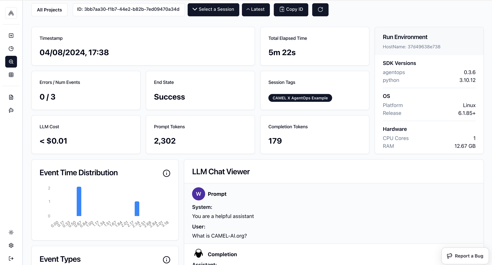
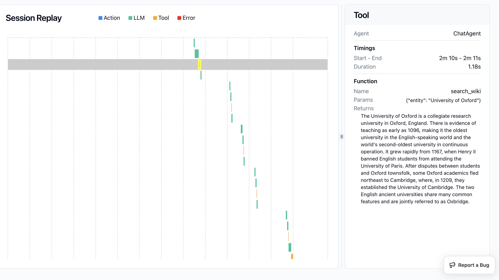

You can also check this cookbook in colab [here](https://colab.research.google.com/drive/1z1-c0zYuErO7Zh2EATPyDSgrlkrxGTFR?usp=sharing)

⭐ <i>Star us on [*Github*](https://github.com/camel-ai/camel), join our [*Discord*](https://discord.camel-ai.org) or follow our [*X*](https://x.com/camelaiorg)</i>

*Goal: Track and analysis the running of CAMEL Single Agent and Multiple Agents including LLMs and Tools usage*


## 📦 Installation

First, install the CAMEL and AgentOps package with all its dependencies:


```python
%pip install camel-ai[all]==0.2.16
%pip install agentops==0.3.10
```

## 🔑 Setting Up API Keys


```python
import agentops
import os
from getpass import getpass
```


```python
# Prompt for the OpenAI API key securely
openai_api_key = getpass('Enter your API key: ')
os.environ["OPENAI_API_KEY"] = openai_api_key
```

You can go to [here](https://app.agentops.ai/signin) to get **free** API Key from AgentOps


```python
# Prompt for the AgentOps API key securely
agentops_api_key = getpass('Enter your API key:')
os.environ["AGENTOPS_API_KEY"] = agentops_api_key
```

Alternatively, if running on Colab, you could save your API keys and tokens as **Colab Secrets**, and use them across notebooks.

To do so, **comment out** the above **manual** API key prompt code block(s), and **uncomment** the following codeblock.

⚠️ Don't forget granting access to the API key you would be using to the current notebook.


```python
# import os
# from google.colab import userdata

# os.environ["OPENAI_API_KEY"] = userdata.get("OPENAI_API_KEY")
# os.environ["AGENTOPS_API_KEY"] = userdata.get("AGENTOPS_API_KEY")
```

## 🤖 Run CAMEL Single Agent with Tool by using AgentOps to track the whole process!

Import required modules from CAMEL.


```python
from camel.agents import ChatAgent
from camel.configs import ChatGPTConfig
from camel.messages import BaseMessage
from camel.models import ModelFactory
from camel.types import ModelPlatformType, ModelType
```

Initialize AgentOps, you need to import toolkits after init of agentops so that the tool usage would be tracked.


```python
AGENTOPS_API_KEY = os.getenv("AGENTOPS_API_KEY")
agentops.init(AGENTOPS_API_KEY, default_tags=["CAMEL X AgentOps Single Agent with Tool Example"])

from camel.toolkits import SearchToolkit
```

Set one Agent with Search Tools


```python
# Define system message
sys_msg = BaseMessage.make_assistant_message(
    role_name='Tools calling opertor', content='You are a helpful assistant.'
)

# Set model config
tools = [*SearchToolkit().get_tools()]


model = ModelFactory.create(
    model_platform=ModelPlatformType.OPENAI,
    model_type=ModelType.GPT_4O_MINI,
)

# Set agent
camel_agent = ChatAgent(
    system_message=sys_msg,
    model=model,
    tools=tools,
)
```

Set user query and run the agent


```python
# Define a user message
usr_msg = 'What is CAMEL-AI.org?'

# Get response information
response = camel_agent.step(usr_msg)
print(response)


agentops.end_session("Success")
```

### 🎉  Go to the AgentOps link shown above, you will be able to see the detailed record for this running like below.



## 🤖🤖 Run CAMEL Multi-agent with Tool by using AgentOps to track the whole process!

Import required modules


```python
from typing import List

from colorama import Fore

from camel.agents.chat_agent import FunctionCallingRecord
from camel.configs import ChatGPTConfig
from camel.models import ModelFactory
from camel.societies import RolePlaying
from camel.types import ModelPlatformType, ModelType
from camel.utils import print_text_animated

import agentops
```

Initialize AgentOps, you need to import toolkits after init of agentops so that the tool usage would be tracked.


```python
agentops.start_session(tags=["CAMEL X AgentOps Multi-agent with Tools."])

from camel.toolkits import (
    SearchToolkit,
    MathToolkit,
)
```

Set your task prompt


```python
task_prompt = (
    "Assume now is 2024 in the Gregorian calendar, "
    "estimate the current age of University of Oxford "
    "and then add 10 more years to this age, "
    "and get the current weather of the city where "
    "the University is located."
)
```

Set tools for the assistant agent, we wish the agent would be able to do mathmatic calculation and search information from websites


```python
tools = [
    *MathToolkit().get_tools(),
    *SearchToolkit().get_tools(),
]
```

Set up Role Playing session


```python
role_play_session = RolePlaying(
    assistant_role_name="Searcher",
    user_role_name="Professor",
    assistant_agent_kwargs=dict(
        model=ModelFactory.create(
            model_platform=ModelPlatformType.OPENAI,
            model_type=ModelType.GPT_4O_MINI,
        ),
        tools=tools,
    ),
    user_agent_kwargs=dict(
        model=ModelFactory.create(
            model_platform=ModelPlatformType.OPENAI,
            model_type=ModelType.GPT_4O_MINI,
        ),
    ),
    task_prompt=task_prompt,
    with_task_specify=False,
)
```

Print the system message and task prompt


```python
print(
    Fore.GREEN
    + f"AI Assistant sys message:\n{role_play_session.assistant_sys_msg}\n"
)
print(Fore.BLUE + f"AI User sys message:\n{role_play_session.user_sys_msg}\n")

print(Fore.YELLOW + f"Original task prompt:\n{task_prompt}\n")
print(
    Fore.CYAN
    + "Specified task prompt:"
    + f"\n{role_play_session.specified_task_prompt}\n"
)
print(Fore.RED + f"Final task prompt:\n{role_play_session.task_prompt}\n")
```

Set terminate rule and print the chat message


```python
n = 0
input_msg = role_play_session.init_chat()
while n < 50:
    n += 1
    assistant_response, user_response = role_play_session.step(input_msg)

    if assistant_response.terminated:
        print(
            Fore.GREEN
            + (
                "AI Assistant terminated. Reason: "
                f"{assistant_response.info['termination_reasons']}."
            )
        )
        break
    if user_response.terminated:
        print(
            Fore.GREEN
            + (
                "AI User terminated. "
                f"Reason: {user_response.info['termination_reasons']}."
            )
        )
        break

    # Print output from the user
    print_text_animated(
        Fore.BLUE + f"AI User:\n\n{user_response.msg.content}\n"
    )

    # Print output from the assistant, including any function
    # execution information
    print_text_animated(Fore.GREEN + "AI Assistant:")
    tool_calls: List[FunctionCallingRecord] = assistant_response.info[
        'tool_calls'
    ]
    for func_record in tool_calls:
        print_text_animated(f"{func_record}")
    print_text_animated(f"{assistant_response.msg.content}\n")

    if "CAMEL_TASK_DONE" in user_response.msg.content:
        break

    input_msg = assistant_response.msg
```

End the AgentOps session


```python
agentops.end_session("Success")
```

### 🎉  Go to the AgentOps link shown above, you will be able to see the detailed record for the multi-agent running like below.


