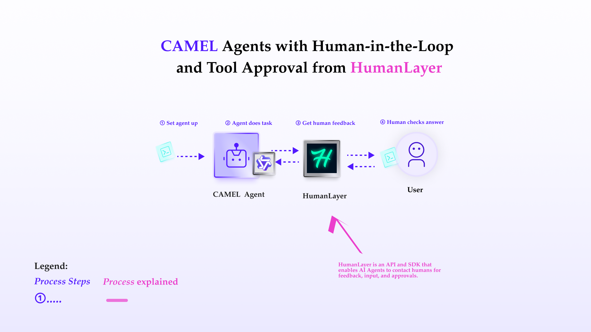
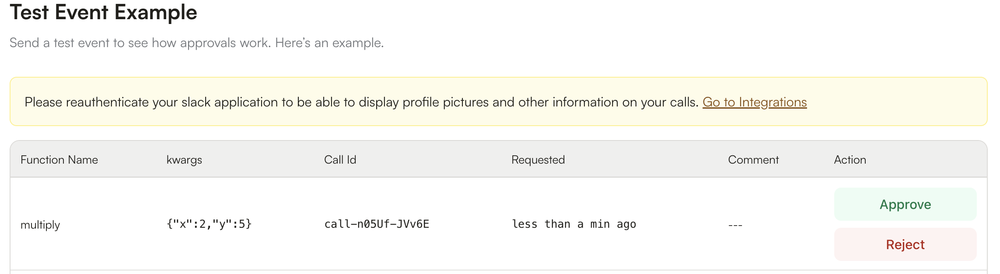

You can also check this cookbook in colab [here](https://colab.research.google.com/drive/1WF1Z6Ev6kTrifRLXXTTOZz6-QVRuj1uX?usp=sharing)

<div style={{ display: "flex", justifyContent: "center", alignItems: "center", gap: "1rem", marginBottom: "2rem" }}>
  <a href="https://www.camel-ai.org/">
    
  </a>
  <a href="https://discord.camel-ai.org">
    
  </a>
</div>  

⭐ *Star us on [GitHub](https://github.com/camel-ai/camel), join our [Discord](https://discord.camel-ai.org), or follow us on [X](https://x.com/camelaiorg)*

---

This notebook demonstrates how to set up and leverage CAMEL's ability to interact with user (for approval or comments) during the execution of the tasks.

In this notebook, you'll explore:

*   **CAMEL**: A powerful multi-agent framework that enables Retrieval-Augmented Generation and multi-agent role-playing scenarios, allowing for sophisticated AI-driven tasks.
*   **HumanLayer**: HumanLayer is an API and SDK that enables AI Agents to contact humans for feedback, input, and approvals.
*   **Human-in-loop**: The ability for agent to consult human during the execution of the task.
*   **Human approval**: The ability for agent ask approval to execute some tasks.

This cookbook demonstrates how to use **HumanLayer** functionality within CAMEL framework.



## 📦 Installation

First, install the CAMEL package with all its dependencies:


```python
!pip install "camel-ai[all]==0.2.16"
```

Next, install humanlayer python SDK:


```python
!pip install humanlayer
```

## 🔑 Setting Up API Keys

Your can go to [here](https://openai.com/index/openai-api/) to get API Key from OpenAI.


```python
# Prompt for the API key securely
import os
from getpass import getpass

qwen_api_key = getpass('Enter your API key: ')
os.environ["QWEN_API_KEY"] = qwen_api_key
```

Your can go to [here](https://app.humanlayer.dev/auth) to get API Key from HumanLayer.


```python
humanlayer_api_key = getpass('Enter your HumanLayer API key: ')
os.environ["HUMANLAYER_API_KEY"] = humanlayer_api_key
```

Alternatively, if running on Colab, you could save your API keys and tokens as **Colab Secrets**, and use them across notebooks.

To do so, **comment out** the above **manual** API key prompt code block(s), and **uncomment** the following codeblock.

⚠️ Don't forget granting access to the API key you would be using to the current notebook.


```python
# import os
# from google.colab import userdata

# os.environ["QWEN_API_KEY"] = userdata.get("QWEN_API_KEY")
# os.environ["HUMANLAYER_API_KEY"] = userdata.get("HUMANLAYER_API_KEY")
```

## 👨 Tools that requires human approval

In this section, we'll demonstrate how to define tools for Camel agent to use, and use **HumanLayer** to make some tools require human approval. First define two functions for agent to use, one of them requires human approval.


```python
from humanlayer.core.approval import HumanLayer
hl = HumanLayer(api_key=humanlayer_api_key, verbose=True)


# add can be called without approval
def add(x: int, y: int) -> int:
    """Add two numbers together."""
    return x + y


# but multiply must be approved by a human
@hl.require_approval()
def multiply(x: int, y: int) -> int:
    """multiply two numbers"""
    return x * y
```

Next we define the CAMEL agents, then run the computation commands. Here we will need to login HumanLayer cloud platform to approve for the agent to use the multiply function.




```python
from camel.toolkits import FunctionTool
from camel.agents import ChatAgent
from camel.models import ModelFactory
from camel.types import ModelPlatformType, ModelType

model = ModelFactory.create(
    model_platform=ModelPlatformType.QWEN,
    model_type=ModelType.QWEN_QWQ_32B,
)

tools = [FunctionTool(add), FunctionTool(multiply)]

agent_with_tools = ChatAgent(
    model = model,
    tools=tools
)

# Interact with the agent
response = agent_with_tools.step("multiply 2 and 5, then add 32 to the result")
print("\n\n----------Result----------\n\n")
print(response.msgs[0].content)

```

## 🤖 Human-in-loop interaction

Sometimes we want the agent to ask user during the working process, in this case, we can equip agent with human toolkits, and be able to ask human via console. This example demonstrates the human-in-loop function:


```python
from camel.toolkits import HumanToolkit
human_toolkit = HumanToolkit()

model = ModelFactory.create(
    model_platform=ModelPlatformType.QWEN,
    model_type=ModelType.QWEN_MAX,
)

agent = ChatAgent(
    system_message="You are a helpful assistant.",
    model=model,
    tools=[*human_toolkit.get_tools()],
)

response = agent.step(
    "Test me on the capital of some country, and comment on my answer."
)

print(response.msgs[0].content)
```

## 🌟 Highlights

This notebook has guided you through setting up chat agents with the ability of **Human-in-loop** and **Human approval**.

Key tools utilized in this notebook include:

*   **CAMEL**: A powerful multi-agent framework that enables Retrieval-Augmented Generation and multi-agent role-playing scenarios, allowing for sophisticated AI-driven tasks.
*   **HumanLayer**: HumanLayer is an API and SDK that enables AI Agents to contact humans for feedback, input, and approvals.
*   **Human-in-loop**: The ability for agent to consult human during the execution of the task.
*   **Human approval**: The ability for agent ask approval to execute some tasks.


That's everything: Got questions about 🐫 CAMEL-AI? Join us on [Discord](https://discord.camel-ai.org)! Whether you want to share feedback, explore the latest in multi-agent systems, get support, or connect with others on exciting projects, we’d love to have you in the community! 🤝

Check out some of our other work:

1. 🐫 Creating Your First CAMEL Agent [free Colab](https://docs.camel-ai.org/cookbooks/create_your_first_agent.html)

2.  Graph RAG Cookbook [free Colab](https://colab.research.google.com/drive/1uZKQSuu0qW6ukkuSv9TukLB9bVaS1H0U?usp=sharing)

3. 🧑‍⚖️ Create A Hackathon Judge Committee with Workforce [free Colab](https://colab.research.google.com/drive/18ajYUMfwDx3WyrjHow3EvUMpKQDcrLtr?usp=sharing)

4. 🔥 3 ways to ingest data from websites with Firecrawl & CAMEL [free Colab](https://colab.research.google.com/drive/1lOmM3VmgR1hLwDKdeLGFve_75RFW0R9I?usp=sharing)

5. 🦥 Agentic SFT Data Generation with CAMEL and Mistral Models, Fine-Tuned with Unsloth [free Colab](https://colab.research.google.com/drive/1lYgArBw7ARVPSpdwgKLYnp_NEXiNDOd-?usp=sharingg)

Thanks from everyone at 🐫 CAMEL-AI


<div style={{ display: "flex", justifyContent: "center", alignItems: "center", gap: "1rem", marginBottom: "2rem" }}>
  <a href="https://www.camel-ai.org/">
    
  </a>
  <a href="https://discord.camel-ai.org">
    
  </a>
</div>  

⭐ *Star us on [GitHub](https://github.com/camel-ai/camel), join our [Discord](https://discord.camel-ai.org), or follow us on [X](https://x.com/camelaiorg)*

---
