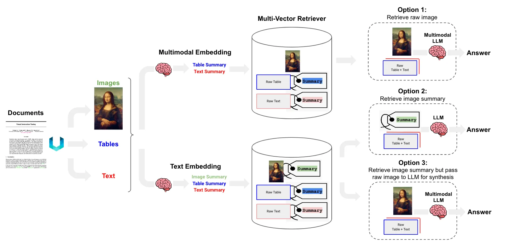

You can also check this cookbook in colab [here](https://colab.research.google.com/drive/1TGLCl7bUjwbBlFpwL4FiRraQYeax7RGm?usp=sharing)  (Use the colab share link)

<div style={{ display: "flex", justifyContent: "center", alignItems: "center", gap: "1rem", marginBottom: "2rem" }}>
  <a href="https://www.camel-ai.org/">
    
  </a>
  <a href="https://discord.camel-ai.org">
    
  </a>
</div>  

⭐ *Star us on [GitHub](https://github.com/camel-ai/camel), join our [Discord](https://discord.camel-ai.org), or follow us on [X](https://x.com/camelaiorg)*

---



# Introduction

In this notebook, we will implement a simple **Multimodal Retrieval-Augmented Generation (RAG)** pipeline. The core idea is to handle diverse data modalities—**text, images, tables, and even video**—by summarizing them into compact representations and storing those summaries in a vector store for efficient retrieval.

Specifically, we will:

- Extract relevant components (text, tables, images, etc.) from documents.
- Generate **multimodal embeddings and summaries** for these components using appropriate encoders.
- Store both raw data and their **textual summaries** in a **multi-vector retriever**.
- Demonstrate three retrieval strategies:
  1. **Option 1**: Retrieve raw content and use a multimodal LLM for answer generation.
  2. **Option 2**: Retrieve only the summaries and use a regular LLM for faster, lightweight inference.
  3. **Option 3**: Retrieve summaries but also pass raw multimodal data to the LLM for enhanced synthesis.

This approach enables **efficient, scalable retrieval and reasoning** over multimodal data, while balancing latency, cost, and quality.


## 📦 Installation

First, install the CAMEL package with all its dependencies:


```python
!pip install "git+https://github.com/camel-ai/camel.git@master#egg=camel-ai[all]"
```

## 🔑 Setting Up API Keys

You'll need to set up your API keys for ..... This ensures that the tools can interact with external services securely.


```python
import os
from getpass import getpass

gemini_api_key = getpass('Enter your API key: ')
os.environ["GEMINI_API_KEY"] = gemini_api_key

```

Your can go to [here](https://jina.ai/api-dashboard/) to get API Key from JINA AI with **free** credits.


```python
JINA_API_KEY=getpass("Enter your Jina API key")
os.environ["JINA_API_KEY"]=JINA_API_KEY
```

## 🌐 Preparing Data

For our example, we're going to build a **Paper Explainer** that leverages both **images and video** along with the paper's content.

We will:

- Extract key visual and textual elements from the paper (e.g., figures, tables, captions).
- Include a relevant **video** (e.g., a demo or presentation clip) for multimodal understanding.
- Generate concise **summaries** for each modality to store in the vector store.
- Use these summaries to retrieve and answer queries in a Retrieval-Augmented Generation (RAG) setting.

This setup helps simulate how a model can explain a paper's core ideas using rich multimodal context.


```python
import os
import requests
from camel.toolkits import VideoDownloaderToolkit
import fitz

# Download Attention All You Need Paper
os.makedirs('local_data', exist_ok=True)

url = "https://arxiv.org/pdf/1706.03762v7"
response = requests.get(url)
with open('local_data/camel_paper.pdf', 'wb') as file:
     file.write(response.content)
# Download Video From Youtube
video_downloader = VideoDownloaderToolkit("./download")
url="https://youtu.be/TQQlZhbC5ps?si=BQfS--FW-DJWBk8M"
video_downloader.download_video(url)

#Extract Image from the Paper
def extract_images(pdf_path, output_folder):
    doc = fitz.open(pdf_path)
    os.makedirs(output_folder, exist_ok=True)
    count = 0

    for i in range(len(doc)):
        for img in doc.get_page_images(i):
            xref = img[0]
            base_image = doc.extract_image(xref)
            image_bytes = base_image["image"]
            image_ext = base_image["ext"]
            image_filename = os.path.join(output_folder, f"image_{i+1}_{count+1}.{image_ext}")
            with open(image_filename, "wb") as f:
                f.write(image_bytes)
            count += 1
    print(f"Extracted {count} images to '{output_folder}'.")

output_dir="extracted_images"
pdf="/content/local_data/camel_paper.pdf"
extract_images(pdf,output_dir )

```


```python
from IPython.display import display, Video
from PIL import Image

#Helper Function to show image and video on notebook
def show_image(image_path):
    try:

        image = Image.open(image_path)
        # Calculate new dimensions while keeping aspect ratio
        width_percent = (500 / float(image.size[0]))
        height_size = int((float(image.size[1]) * float(width_percent)))

        # Resize the image
        image = image.resize((500, height_size), Image.Resampling.LANCZOS)

        display(image)  # Display the loaded image
    except IOError:
        print("Error: Could not open or display image.")


def show_video(video_path, width=500, height=300):  # Set default width and height
    try:
        video = Video(video_path, embed=True)
        video.width = width  # Set width
        video.height = height  # Set height
        display(video)
    except IOError:
        print("Error: Could not open or display video.")
```


```python
show_image("/content/extracted_images/image_3_1.png")
```


```python
show_video("/content/download/Transformer Neural Networks - EXPLAINED! (Attention is all you need).mp4")
```

### Setting Up Embedding Modal and Vector Storage

---


```python
from camel.embeddings import JinaEmbedding
from camel.types import EmbeddingModelType
from camel.storages import QdrantStorage
from camel.retrievers import VectorRetriever
from camel.models import ModelFactory
from camel.types import ModelType,ModelPlatformType
from camel.agents import ChatAgent
from camel.messages import BaseMessage

```


```python
embedding_instance = JinaEmbedding(model_type=EmbeddingModelType.JINA_EMBEDDINGS_V3,)

storage_instance = QdrantStorage(
    vector_dim=embedding_instance.get_output_dim(),
    path="local_data",
    collection_name="camel_paper",
)


vector_retriever = VectorRetriever(embedding_model=embedding_instance,
                                   storage=storage_instance)

model=ModelFactory.create(
    model_platform=ModelPlatformType.GEMINI,
    model_type=ModelType.GEMINI_2_0_FLASH,

)
summary_agent=ChatAgent(system_message="You are an assistant.",
    model=model,)
```

## 🧠 Multimodal Data Processing: Images and Videos

This section defines two key functions to **process images and videos** for a multimodal Retrieval-Augmented Generation (RAG) pipeline. Both functions generate a **summary** of the input media using an AI agent (`summary_agent`) and then pass that summary to a **vector retriever** (`vector_retriever`) for indexing and retrieval.


```python
def process_image(path:os.PathLike):
  sumary_msg=BaseMessage.make_user_message(
      role_name="summariser",
      content="Summarise the image,output only summaries text",
      image_list=[Image.open(path)]
  )
  summary_response=summary_agent.step(sumary_msg)
  vector_retriever.process(
      content=summary_response.msg.content,
      should_chunk=False,
      metadata_filename=path,
      extra_info={
          "format":"image",
          "path" : path
      },
  )

def process_video(path:os.PathLike):
  with open (path,"rb") as video:
    video_bytes=video.read()
  sumary_msg=BaseMessage.make_user_message(
      role_name="User",
      content="Summarise the video,output only summaries text",
      video_bytes=video_bytes
  )
  summary_response=summary_agent.step(sumary_msg)
  vector_retriever.process(
      content=summary_response.msg.content,
      should_chunk=False,
      metadata_filename=path,
      extra_info={
          "format":"video",
          "path" : path
      },
  )
```

## 📥 Indexing Text, Images, and Video into the Vector Store

In this section, we demonstrate how to index **multimodal content** — including a PDF, a set of extracted images, and a video — into our vector store using the `vector_retriever`.


```python
vector_retriever.process(
    content="/content/local_data/camel_paper.pdf"
)
for image in os.listdir(output_dir):
  process_image(os.path.join(output_dir,image))

process_video(r"/content/download/Transformer Neural Networks - EXPLAINED! (Attention is all you need).mp4")
```


```python
retrieved_info = vector_retriever.query(
    query="show video on explain transformer",
    top_k=1,
    similarity_threshold=0.5

)
print(retrieved_info)
```


```python
retrieved_info = vector_retriever.query(
    query="Transformer architecture image",
    top_k=3,
    similarity_threshold=0.6

)
print(retrieved_info)

```


```python
from camel.toolkits import FunctionTool
paper_agent= ModelFactory.create(
    model_platform=ModelPlatformType.GEMINI,
    model_type=ModelType.GEMINI_2_0_FLASH,
)
#Paper Explain Agent
paper_agent=ChatAgent(
    "Your are Paper agent which help user to understand the give paper input will be provided as Context: and query you need to answer",
    model=paper_agent,
    tools=[FunctionTool(show_image),FunctionTool(show_video)]

)

```

## ❓ Processing a Query with Multimodal Context

This function, `process_query(query: str)`, demonstrates how to perform a **multimodal retrieval-augmented generation (RAG)** query using the previously indexed text, image, and video summaries.

---


```python
def process_query(query:str):
  retrieved_info = vector_retriever.query(
      query=query,
      top_k=3,
      similarity_threshold=0.6

  )
  # print(retrieved_info)
  img=[]
  vid=None
  for info in retrieved_info:
    try:
      if info["extra_info"]["format"]=="image":
        # Use PIL.Image.open to open the image
        img.append(Image.open(info["extra_info"]["path"]))
      elif info["extra_info"]["format"]=="video":
        with open(info["extra_info"]["path"],"rb") as video:
          vid=video.read()
    except KeyError:
      continue


  user_msg=BaseMessage.make_user_message(
      role_name="User",
      content=f"Context:{retrieved_info},query:{query}",
      image_list=img,
      video_bytes=vid
  )
  response=paper_agent.step(user_msg)
  print(response.msg.content)
```


```python
process_query("show and explain the architecture in Transformer image")
```

## 🌟 Highlights


This notebook has guided you through setting up and running a simple **Multimodal Retrieval-Augmented Generation (RAG)** pipeline using CAMEL. We demonstrated how to extract and summarize content from **text (PDF)**, **images**, and **video**, then store it in a vector store for semantic retrieval and response generation.

---

### 🔧 Key Tools Utilized

- **CAMEL**: A powerful multi-agent framework enabling Retrieval-Augmented Generation and agent role-playing scenarios, which allows for sophisticated and highly adaptable AI workflows.
- **Vector Retriever**: For embedding and storing multimodal summaries (text, image, video) to support efficient semantic search.
- **BaseMessage**: For constructing rich, multimodal messages passed between agents.
- **PIL (Python Imaging Library)**: Used to load image content for processing and agent interaction.

---

### 🚀 What You Built

- Indexed a research paper and its figures (images) and supplementary explanation (video).
- Used CAMEL to summarize and structure this information.
- Queried the system with natural language questions and received answers grounded in multimodal context.

This comprehensive setup provides a strong baseline for adapting to various domains, including:

- **Academic Paper Explainers**
- **Multimedia Search Assistants**
- **Knowledge-Enhanced Chatbots**
- **Educational Tools**

---

### 🔄 Next Steps

**CAMEL also supports advanced capabilities such as GraphRAG.**  
To explore Graph-based Retrieval-Augmented Generation and more advanced use cases, check the following:

👉 [Explore CAMEL's GraphRAG Example](https://colab.research.google.com/drive/1meBf9w8KzZvQdQU2I1bCyOg9ehoGDK1u?authuser=1)


---

Thanks for following along!

That's everything: Got questions about 🐫 CAMEL-AI? Join us on [Discord](https://discord.camel-ai.org)! Whether you want to share feedback, explore the latest in multi-agent systems, get support, or connect with others on exciting projects, we’d love to have you in the community! 🤝

Check out some of our other work:

1. 🐫 Creating Your First CAMEL Agent [free Colab](https://docs.camel-ai.org/cookbooks/create_your_first_agent.html)

2.  Graph RAG Cookbook [free Colab](https://colab.research.google.com/drive/1uZKQSuu0qW6ukkuSv9TukLB9bVaS1H0U?usp=sharing)

3. 🧑‍⚖️ Create A Hackathon Judge Committee with Workforce [free Colab](https://colab.research.google.com/drive/18ajYUMfwDx3WyrjHow3EvUMpKQDcrLtr?usp=sharing)

4. 🔥 3 ways to ingest data from websites with Firecrawl & CAMEL [free Colab](https://colab.research.google.com/drive/1lOmM3VmgR1hLwDKdeLGFve_75RFW0R9I?usp=sharing)

5. 🦥 Agentic SFT Data Generation with CAMEL and Mistral Models, Fine-Tuned with Unsloth [free Colab](https://colab.research.google.com/drive/1lYgArBw7ARVPSpdwgKLYnp_NEXiNDOd-?usp=sharingg)

Thanks from everyone at 🐫 CAMEL-AI


<div style={{ display: "flex", justifyContent: "center", alignItems: "center", gap: "1rem", marginBottom: "2rem" }}>
  <a href="https://www.camel-ai.org/">
    
  </a>
  <a href="https://discord.camel-ai.org">
    
  </a>
</div>  

⭐ *Star us on [GitHub](https://github.com/camel-ai/camel), join our [Discord](https://discord.camel-ai.org), or follow us on [X](https://x.com/camelaiorg)*

---

