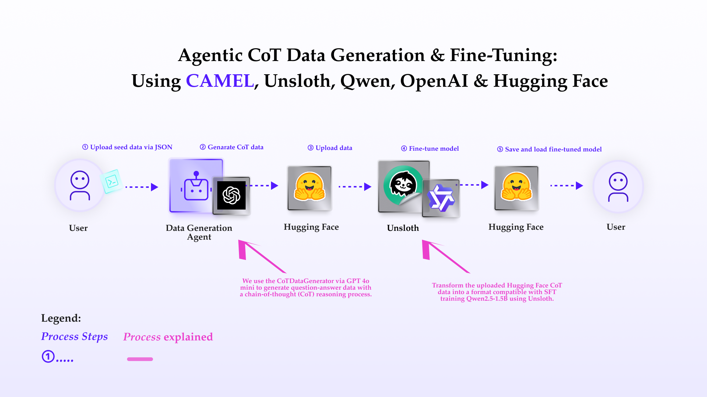
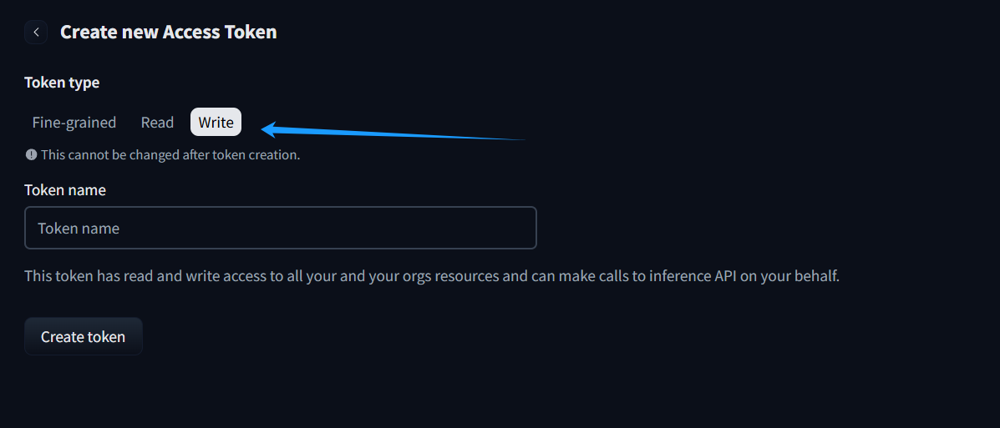
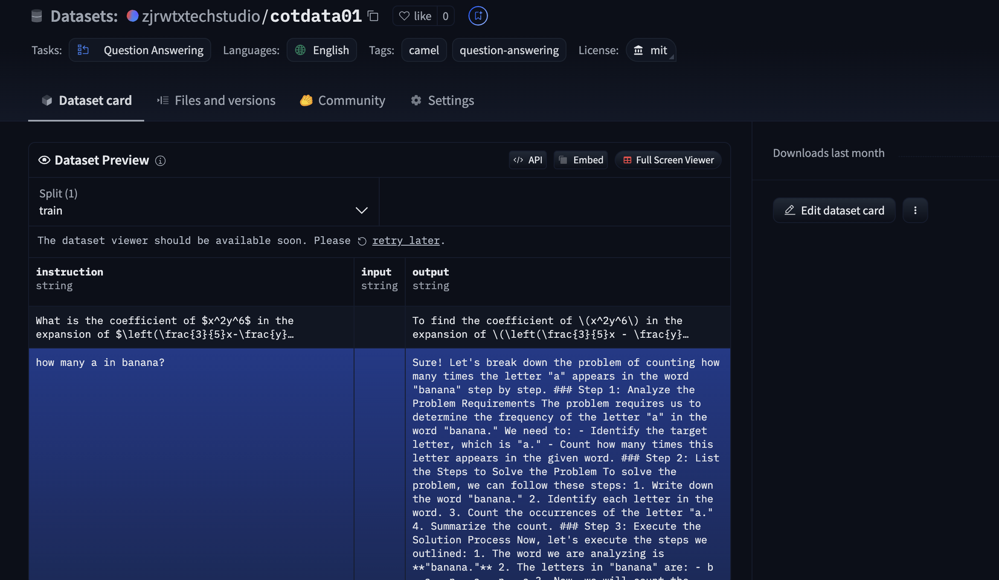
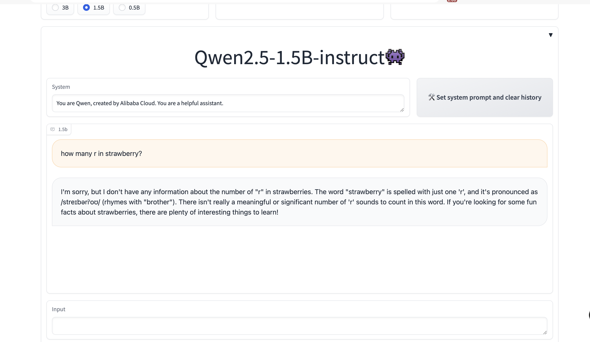

You can also check this cookbook in colab [here](https://colab.research.google.com/drive/1fBBeD8iSHuRf5Vfv1QzFn_X7ygbc73Rj?usp=sharing)

To run this, press "*Runtime*" and press "*Run all*" on a **free** Tesla T4 Google Colab instance!
<div style={{ display: "flex", justifyContent: "center", alignItems: "center", gap: "1rem", marginBottom: "2rem" }}>
  <a href="https://www.camel-ai.org/">
    
  </a>
  <a href="https://discord.camel-ai.org">
    
  </a>
</div>  

⭐ *Star us on [GitHub](https://github.com/camel-ai/camel), join our [Discord](https://discord.camel-ai.org), or follow us on [X](https://x.com/camelaiorg)*

---


This notebook demonstrates how to set up and leverage CAMEL's **CoTDataGenerator** for generating high-quality question-answer pairs like o1 thinking data, fine-tuning a language model using Unsloth, and uploading the results to Hugging Face.

In this notebook, you'll explore:

- **CAMEL**: A powerful multi-agent framework that enables SFT data generation and multi-agent role-playing scenarios, allowing for sophisticated AI-driven tasks.
- **CoTDataGenerator**: A tool for generating like o1 thinking data.
- **Unsloth**: An efficient library for fine-tuning large language models with LoRA (Low-Rank Adaptation) and other optimization techniques.
- **Hugging Face Integration**: Uploading datasets and fine-tuned models to the Hugging Face platform for sharing.




## 📦 Installation


```python
%%capture
!pip install camel-ai==0.2.16
```

Unsloth require GPU environment, To install Unsloth on your own computer, follow the installation instructions  [here](https://github.com/unslothai/unsloth?tab=readme-ov-file#-installation-instructions).


```python
%%capture
!pip install unsloth
# Also get the latest nightly Unsloth!
!pip uninstall unsloth -y && pip install --upgrade --no-cache-dir --no-deps git+https://github.com/unslothai/unsloth.git
```


```python
import os
from datetime import datetime
import json
from camel.datagen.cotdatagen import CoTDataGenerator
```

## 🔑 Setting Up API Keys

First we will set the OPENAI_API_KEY that will be used to generate the data.


```python
from getpass import getpass
```


```python
openai_api_key = getpass('Enter your OpenAI API key: ')
os.environ["OPENAI_API_KEY"] = openai_api_key
```

Alternatively, if running on Colab, you could save your API keys and tokens as **Colab Secrets**, and use them across notebooks.

To do so, **comment out** the above **manual** API key prompt code block(s), and **uncomment** the following codeblock.

⚠️ Don't forget granting access to the API key you would be using to the current notebook.


```python
# import os
# from google.colab import userdata

# os.environ["OPENAI_API_KEY"] = userdata.get("OPENAI_API_KEY")
```

## Set ChatAgent

Create a system message to define agent's default role and behaviors.


```python
sys_msg = 'You are a genius at slow-thinking data and code'
```

Use ModelFactory to set up the backend model for agent

CAMEL supports many other models. See [here](https://docs.camel-ai.org/key_modules/models.html) for a list.


```python
from camel.models import ModelFactory
from camel.types import ModelPlatformType, ModelType
from camel.configs import ChatGPTConfig
```


```python
# Define the model, here in this case we use gpt-4o-mini
model = ModelFactory.create(
    model_platform=ModelPlatformType.OPENAI,
    model_type=ModelType.GPT_4O_MINI,
    model_config_dict=ChatGPTConfig().as_dict(), # [Optional] the config for model
)
```


```python
from camel.agents import ChatAgent
chat_agent = ChatAgent(
    system_message=sys_msg,
    model=model,
    message_window_size=10,
)
```

## Load Q&A data from a JSON file

### please prepare the qa data like below in json file:

```json
{
    "question1": "answer1",
    "question2": "answer2",
    ...
}
```

The script fetches a example JSON file containing question-answer pairs from a GitHub repository and saves it locally. The JSON file is then loaded into the qa_data variable.


```python
#get example json data

import requests
import json

# URL of the JSON file
url = 'https://raw.githubusercontent.com/zjrwtx/alldata/refs/heads/main/qa_data.json'

# Send a GET request to fetch the JSON file
response = requests.get(url)

# Check if the request was successful
if response.status_code == 200:
    # Parse the response content as JSON
    json_data = response.json()

    # Specify the file path to save the JSON data
    file_path = 'qa_data.json'

    # Write the JSON data to the file
    with open(file_path, 'w', encoding='utf-8') as json_file:
        json.dump(json_data, json_file, ensure_ascii=False, indent=4)

    print(f"JSON data successfully saved to {file_path}")
else:
    print(f"Failed to retrieve JSON file. Status code: {response.status_code}")
```


```python
with open(file_path, 'r', encoding='utf-8') as f:
    qa_data = json.load(f)
```

## Create an instance of CoTDataGenerator


```python
# Create an instance of CoTDataGenerator
testo1 = CoTDataGenerator(chat_agent, golden_answers=qa_data)
```


```python
# Record generated answers
generated_answers = {}
```

### Test Q&A

The script iterates through the questions, generates answers, and verifies their correctness.  The generated answers are stored in a dictionary


```python
# Test Q&A
for question in qa_data.keys():
    print(f"Question: {question}")

    # Get AI's thought process and answer
    answer = testo1.get_answer(question)
    generated_answers[question] = answer
    print(f"AI's thought process and answer:\n{answer}")

    # Verify the answer
    is_correct = testo1.verify_answer(question, answer)
    print(f"Answer verification result: {'Correct' if is_correct else 'Incorrect'}")
    print("-" * 50)
    print()  # Add a new line at the end of each iteration
```

### Export the generated answers to a JSON file and transform these to Alpaca traing data format


```python
simplified_output = {
    'timestamp': datetime.now().isoformat(),
    'qa_pairs': generated_answers
}
simplified_file = f'generated_answers_{datetime.now().strftime("%Y%m%d_%H%M%S")}.json'
with open(simplified_file, 'w', encoding='utf-8') as f:
    json.dump(simplified_output, f, ensure_ascii=False, indent=2)
print(f"The generated answers have been exported to: {simplified_file}")
```

The script transforms the Q&A data into the Alpaca training data format, which is suitable for supervised fine-tuning (SFT). The transformed data is saved to a new JSON file.


```python
import json
from datetime import datetime

def transform_qa_format(input_file):
    # Read the input JSON file
    with open(input_file, 'r', encoding='utf-8') as f:
        data = json.load(f)

    # Transform the data
    transformed_data = []
    for question, answer in data['qa_pairs'].items():
        transformed_pair = {
            "instruction": question,
            "input": "",
            "output": answer
        }
        transformed_data.append(transformed_pair)

    # Generate output filename with timestamp
    timestamp = datetime.now().strftime("%Y%m%d_%H%M%S")
    output_file = f'transformed_qa_{timestamp}.json'

    # Write the transformed data
    with open(output_file, 'w', encoding='utf-8') as f:
        json.dump(transformed_data, f, ensure_ascii=False, indent=2)

    return output_file, transformed_data
```


```python
output_file, transformed_data = transform_qa_format(simplified_file)
print(f"Transformation complete. Output saved to: {output_file}")
```

## Upload the Data to Huggingface

This defines a function upload_to_huggingface that uploads a dataset to Hugging Face. The script is modular, with helper functions handling specific tasks such as dataset name generation, dataset creation, metadata card creation, and record addition


```python
# Import necessary modules and classes
from camel.datahubs.huggingface import HuggingFaceDatasetManager  # Manages interactions with Hugging Face datasets
from camel.datahubs.models import Record  # Represents a single record in the dataset
from datetime import datetime  # Handles date and time operations

# Main function: Upload dataset to Hugging Face
def upload_to_huggingface(transformed_data, username, dataset_name=None):
    r"""Uploads transformed data to the Hugging Face dataset platform.

    Args:
        transformed_data (list): Transformed data, typically a list of dictionaries.
        username (str): Hugging Face username.
        dataset_name (str, optional): Custom dataset name.

    Returns:
        str: URL of the uploaded dataset.
    """
    # Initialize HuggingFaceDatasetManager to interact with Hugging Face datasets
    manager = HuggingFaceDatasetManager()

    # Generate or validate the dataset name
    dataset_name = generate_or_validate_dataset_name(username, dataset_name)

    # Create the dataset on Hugging Face and get the dataset URL
    dataset_url = create_dataset(manager, dataset_name)

    # Create a dataset card to add metadata
    create_dataset_card(manager, dataset_name, username)

    # Convert the transformed data into a list of Record objects
    records = create_records(transformed_data)

    # Add the Record objects to the dataset
    add_records_to_dataset(manager, dataset_name, records)

    # Return the dataset URL
    return dataset_url

# Generate or validate the dataset name
def generate_or_validate_dataset_name(username, dataset_name):
    r"""Generates a default dataset name or validates and formats a user-provided name.

    Args:
        username (str): Hugging Face username.
        dataset_name (str, optional): User-provided custom dataset name.

    Returns:
        str: Formatted dataset name.
    """
    if dataset_name is None:
        # If no dataset name is provided, generate a default name with the username and current date
        dataset_name = f"{username}/qa-dataset-{datetime.now().strftime('%Y%m%d')}"
    else:
        # If a dataset name is provided, format it to include the username
        dataset_name = f"{username}/{dataset_name}"
    return dataset_name

# Create a dataset on Hugging Face
def create_dataset(manager, dataset_name):
    r"""Creates a new dataset on Hugging Face and returns the dataset URL.

    Args:
        manager (HuggingFaceDatasetManager): Instance of HuggingFaceDatasetManager.
        dataset_name (str): Name of the dataset.

    Returns:
        str: URL of the created dataset.
    """
    print(f"Creating dataset: {dataset_name}")
    # Use HuggingFaceDatasetManager to create the dataset
    dataset_url = manager.create_dataset(name=dataset_name)
    print(f"Dataset created: {dataset_url}")
    return dataset_url

# Create a dataset card with metadata
def create_dataset_card(manager, dataset_name, username):
    r"""Creates a dataset card to add metadata

    Args:
        manager (HuggingFaceDatasetManager): Instance of HuggingFaceDatasetManager.
        dataset_name (str): Name of the dataset.
        username (str): Hugging Face username.
    """
    print("Creating dataset card...")
    # Use HuggingFaceDatasetManager to create the dataset card
    manager.create_dataset_card(
        dataset_name=dataset_name,
        description="Question-Answer dataset generated by CAMEL CoTDataGenerator",  # Dataset description
        license="mit",  # Dataset license
        language=["en"],  # Dataset language
        size_category="<1MB",  # Dataset size category
        version="0.1.0",  # Dataset version
        tags=["camel", "question-answering"],  # Dataset tags
        task_categories=["question-answering"],  # Dataset task categories
        authors=[username]  # Dataset authors
    )
    print("Dataset card created successfully.")

# Convert transformed data into Record objects
def create_records(transformed_data):
    r"""Converts transformed data into a list of Record objects.

    Args:
        transformed_data (list): Transformed data, typically a list of dictionaries.

    Returns:
        list: List of Record objects.
    """
    records = []
    # Iterate through the transformed data and convert each dictionary into a Record object
    for item in transformed_data:
        record = Record(**item)  # Use the dictionary key-value pairs to create a Record object
        records.append(record)
    return records

# Add Record objects to the dataset
def add_records_to_dataset(manager, dataset_name, records):
    r"""Adds a list of Record objects to the dataset.

    Args:
        manager (HuggingFaceDatasetManager): Instance of HuggingFaceDatasetManager.
        dataset_name (str): Name of the dataset.
        records (list): List of Record objects.
    """
    print("Adding records to the dataset...")
    # Use HuggingFaceDatasetManager to add the records to the dataset
    manager.add_records(dataset_name=dataset_name, records=records)
    print("Records added successfully.")
```

# Config Access Token of Huggingface

You can go to [here](https://huggingface.co/settings/tokens/new?tokenType=write) to get API Key from Huggingface




```python
HUGGING_FACE_TOKEN = getpass('Enter your HUGGING_FACE_TOKEN: ')
os.environ["HUGGING_FACE_TOKEN"] = HUGGING_FACE_TOKEN
```


```python
# import os
# from google.colab import userdata

# os.environ["HUGGING_FACE_TOKEN"] = userdata.get("HUGGING_FACE_TOKEN")
```


```python
# Set your personal huggingface config, then upload to HuggingFace
username = input("Enter your HuggingFace username: ")
dataset_name = input("Enter dataset name (press Enter to use default): ").strip()
if not dataset_name:
    dataset_name = None

try:
    dataset_url = upload_to_huggingface(transformed_data, username, dataset_name)
    print(f"\nData successfully uploaded to HuggingFace!")
    print(f"Dataset URL: {dataset_url}")
except Exception as e:
    print(f"Error uploading to HuggingFace: {str(e)}")

```

### final example preview



## Configure the Unsloth environment

### choose the base model


```python
from unsloth import FastLanguageModel
import torch
max_seq_length = 2048 # Choose any! We auto support RoPE Scaling internally!
dtype = None # None for auto detection. Float16 for Tesla T4, V100, Bfloat16 for Ampere+
load_in_4bit = True # Use 4bit quantization to reduce memory usage. Can be False.

# 4bit pre quantized models we support for 4x faster downloading + no OOMs.
fourbit_models = [
    "unsloth/Meta-Llama-3.1-8B-bnb-4bit",      # Llama-3.1 15 trillion tokens model 2x faster!
    "unsloth/Meta-Llama-3.1-8B-Instruct-bnb-4bit",
    "unsloth/Meta-Llama-3.1-70B-bnb-4bit",
    "unsloth/Meta-Llama-3.1-405B-bnb-4bit",    # We also uploaded 4bit for 405b!
    "unsloth/Mistral-Nemo-Base-2407-bnb-4bit", # New Mistral 12b 2x faster!
    "unsloth/Mistral-Nemo-Instruct-2407-bnb-4bit",
    "unsloth/mistral-7b-v0.3-bnb-4bit",        # Mistral v3 2x faster!
    "unsloth/mistral-7b-instruct-v0.3-bnb-4bit",
    "unsloth/Phi-3.5-mini-instruct",           # Phi-3.5 2x faster!
    "unsloth/Phi-3-medium-4k-instruct",
    "unsloth/gemma-2-9b-bnb-4bit",
    "unsloth/gemma-2-27b-bnb-4bit",            # Gemma 2x faster!
] # More models at https://huggingface.co/unsloth

model, tokenizer = FastLanguageModel.from_pretrained(
    # Can select any from the below:
    # "unsloth/Qwen2.5-0.5B", "unsloth/Qwen2.5-1.5B", "unsloth/Qwen2.5-3B"
    # "unsloth/Qwen2.5-14B",  "unsloth/Qwen2.5-32B",  "unsloth/Qwen2.5-72B",
    # And also all Instruct versions and Math. Coding versions!
    model_name = "unsloth/Qwen2.5-1.5B",
    max_seq_length = max_seq_length,
    dtype = dtype,
    load_in_4bit = load_in_4bit,
    # token = "hf_...", # use one if using gated models like meta-llama/Llama-2-7b-hf
)
```

### We now add LoRA adapters so we only need to update 1 to 10% of all parameters!


```python
model = FastLanguageModel.get_peft_model(
    model,
    r = 16, # Choose any number > 0 ! Suggested 8, 16, 32, 64, 128
    target_modules = ["q_proj", "k_proj", "v_proj", "o_proj",
                      "gate_proj", "up_proj", "down_proj",],
    lora_alpha = 16,
    lora_dropout = 0, # Supports any, but = 0 is optimized
    bias = "none",    # Supports any, but = "none" is optimized
    # [NEW] "unsloth" uses 30% less VRAM, fits 2x larger batch sizes!
    use_gradient_checkpointing = "unsloth", # True or "unsloth" for very long context
    random_state = 3407,
    use_rslora = False,  # We support rank stabilized LoRA
    loftq_config = None, # And LoftQ
)
```

### Convert CoT data into an SFT-compliant training data format


```python
alpaca_prompt = """Below is an instruction that describes a task, paired with an input that provides further context. Write a response that appropriately completes the request.

### Instruction:
{}

### Input:
{}

### Response:
{}"""

EOS_TOKEN = tokenizer.eos_token # Must add EOS_TOKEN
def formatting_prompts_func(examples):
    instructions = examples["instruction"]
    inputs       = examples["input"]
    outputs      = examples["output"]
    texts = []
    for instruction, input, output in zip(instructions, inputs, outputs):
        # Must add EOS_TOKEN, otherwise your generation will go on forever!
        text = alpaca_prompt.format(instruction, input, output) + EOS_TOKEN
        texts.append(text)
    return { "text" : texts, }
pass

from datasets import load_dataset
dataset = load_dataset("zjrwtxtechstudio/o1data06", split = "train")
dataset = dataset.map(formatting_prompts_func, batched = True,)
```

<a name="Train"></a>
### Train the model
Now let's use Huggingface TRL's `SFTTrainer`! More docs here: [TRL SFT docs](https://huggingface.co/docs/trl/sft_trainer). We do 60 steps to speed things up, but you can set `num_train_epochs=1` for a full run, and turn off `max_steps=None`. We also support TRL's `DPOTrainer`!


```python
from trl import SFTTrainer
from transformers import TrainingArguments
from unsloth import is_bfloat16_supported

trainer = SFTTrainer(
    model = model,
    tokenizer = tokenizer,
    train_dataset = dataset,
    dataset_text_field = "text",
    max_seq_length = max_seq_length,
    dataset_num_proc = 2,
    packing = False, # Can make training 5x faster for short sequences.
    args = TrainingArguments(
        per_device_train_batch_size = 2,
        gradient_accumulation_steps = 4,
        warmup_steps = 5,
        # num_train_epochs = 1, # Set this for 1 full training run.
        max_steps = 60,
        learning_rate = 2e-4,
        fp16 = not is_bfloat16_supported(),
        bf16 = is_bfloat16_supported(),
        logging_steps = 1,
        optim = "adamw_8bit",
        weight_decay = 0.01,
        lr_scheduler_type = "linear",
        seed = 3407,
        output_dir = "outputs",
        report_to = "none", # Use this for WandB etc
    ),
)
```


```python
#@title Show current memory stats
gpu_stats = torch.cuda.get_device_properties(0)
start_gpu_memory = round(torch.cuda.max_memory_reserved() / 1024 / 1024 / 1024, 3)
max_memory = round(gpu_stats.total_memory / 1024 / 1024 / 1024, 3)
print(f"GPU = {gpu_stats.name}. Max memory = {max_memory} GB.")
print(f"{start_gpu_memory} GB of memory reserved.")
```

# Start model training


```python
trainer_stats = trainer.train()
```


```python
#@title Show final memory and time stats
used_memory = round(torch.cuda.max_memory_reserved() / 1024 / 1024 / 1024, 3)
used_memory_for_lora = round(used_memory - start_gpu_memory, 3)
used_percentage = round(used_memory         /max_memory*100, 3)
lora_percentage = round(used_memory_for_lora/max_memory*100, 3)
print(f"{trainer_stats.metrics['train_runtime']} seconds used for training.")
print(f"{round(trainer_stats.metrics['train_runtime']/60, 2)} minutes used for training.")
print(f"Peak reserved memory = {used_memory} GB.")
print(f"Peak reserved memory for training = {used_memory_for_lora} GB.")
print(f"Peak reserved memory % of max memory = {used_percentage} %.")
print(f"Peak reserved memory for training % of max memory = {lora_percentage} %.")
```

### Inference
Let's run the model! You can change the instruction and input - leave the output blank!


```python
# alpaca_prompt is copied from above
FastLanguageModel.for_inference(model)  # Enable native 2x faster inference

# Prepare the input for inference
inputs = tokenizer(
    [
        alpaca_prompt.format(
            "how many r in strawberry？",  # Instruction
            "",  # Input (empty for this example)
            "",  # Output (leave blank for generation)
        )
    ],
    return_tensors="pt"
).to("cuda")

# Generate the output
outputs = model.generate(
    **inputs,
    max_new_tokens=4096,  # Maximum number of tokens to generate
    use_cache=True        # Use cache for faster inference
)

# Decode the generated output and clean it
decoded_outputs = tokenizer.batch_decode(outputs, skip_special_tokens=True)

# Print the cleaned output
print(decoded_outputs[0])  # Print the first (and only) output
```

Here are the results of the official Qwen2.5-1.5b-instruct demo answering the same question:[Qwen2.5-1.5b-instruct-demo](https://huggingface.co/spaces/Qwen/Qwen2.5)



<a name="Save"></a>
### Saving, loading finetuned models
To save the final model as LoRA adapters, either use Huggingface's `push_to_hub` for an online save or `save_pretrained` for a local save.

**[NOTE]** This ONLY saves the LoRA adapters, and not the full model.


```python
model.save_pretrained("lora_model") # Local saving
tokenizer.save_pretrained("lora_model")
model.push_to_hub("zjrwtxtechstudio/qwen2.5-1.5b-cot", token = "  ") # Online saving
tokenizer.push_to_hub("zjrwtxtechstudio/qwen2.5-1.5b-cot", token = "  ") # Online saving
```

Now if you want to load the LoRA adapters we just saved for inference, set `False` to `True`:


```python
if True:
    from unsloth import FastLanguageModel
    model, tokenizer = FastLanguageModel.from_pretrained(
        model_name = "zjrwtxtechstudio/qwen2.5-1.5b-cot", # YOUR MODEL YOU USED FOR TRAINING
        max_seq_length = max_seq_length,
        dtype = dtype,
        load_in_4bit = load_in_4bit,
    )
    FastLanguageModel.for_inference(model) # Enable native 2x faster inference

# alpaca_prompt = You MUST copy from above!

inputs = tokenizer(
[
    alpaca_prompt.format(
        "which one is bigger between 9.11 and 9.9？", # instruction
        "", # input
        "", # output - leave this blank for generation!
    )
], return_tensors = "pt").to("cuda")

from transformers import TextStreamer
text_streamer = TextStreamer(tokenizer)
_ = model.generate(**inputs, streamer = text_streamer, max_new_tokens = 4098)
```

## 🌟 Highlights


Through this notebook demonstration, we showcased how to use the CoTDataGenerator from the CAMEL framework to generate high-quality question-answer data and efficiently fine-tune language models using the Unsloth library. The entire process covers the end-to-end workflow from data generation, model fine-tuning, to model deployment, demonstrating how to leverage modern AI tools and platforms to build and optimize question-answering systems.

## Key Takeaways:
Data Generation: Using CoTDataGenerator from CAMEL, we were able to generate high-quality question-answer data similar to o1 thinking. This data can be used for training and evaluating question-answering systems.

Model Fine-Tuning: With the Unsloth library, we were able to fine-tune large language models with minimal computational resources. By leveraging LoRA (Low-Rank Adaptation) technology, we only needed to update a small portion of the model parameters, significantly reducing the resources required for training.

Data and Model Upload: We uploaded the generated data and fine-tuned models to the Hugging Face platform for easy sharing and deployment. Hugging Face provides powerful dataset management and model hosting capabilities, making the entire process more efficient and convenient.

Inference and Deployment: After fine-tuning the model, we used it for inference to generate high-quality answers. By saving and loading LoRA adapters, we can easily deploy and use the fine-tuned model in different environments.

That's everything: Got questions about 🐫 CAMEL-AI? Join us on [Discord](https://discord.camel-ai.org)! Whether you want to share feedback, explore the latest in multi-agent systems, get support, or connect with others on exciting projects, we’d love to have you in the community! 🤝

Check out some of our other work:
1. 🐫 Creating Your First CAMEL Agent [free Colab](https://docs.camel-ai.org/cookbooks/create_your_first_agent.html)
2.  Graph RAG Cookbook [free Colab](https://colab.research.google.com/drive/1uZKQSuu0qW6ukkuSv9TukLB9bVaS1H0U?usp=sharing)
3. 🧑‍⚖️ Create A Hackathon Judge Committee with Workforce [free Colab](https://colab.research.google.com/drive/18ajYUMfwDx3WyrjHow3EvUMpKQDcrLtr?usp=sharing)
4. 🔥 3 ways to ingest data from websites with Firecrawl & CAMEL [free Colab](https://colab.research.google.com/drive/1lOmM3VmgR1hLwDKdeLGFve_75RFW0R9I?usp=sharing)
5. 🦥 Agentic SFT Data Generation with CAMEL and Mistral Models, Fine-Tuned with Unsloth [free Colab](https://colab.research.google.com/drive/1lYgArBw7ARVPSpdwgKLYnp_NEXiNDOd-?usp=sharingg)

Thanks from everyone at 🐫 CAMEL-AI


<div style={{ display: "flex", justifyContent: "center", alignItems: "center", gap: "1rem", marginBottom: "2rem" }}>
  <a href="https://www.camel-ai.org/">
    
  </a>
  <a href="https://discord.camel-ai.org">
    
  </a>
</div>  

⭐ *Star us on [GitHub](https://github.com/camel-ai/camel), join our [Discord](https://discord.camel-ai.org), or follow us on [X](https://x.com/camelaiorg)*


