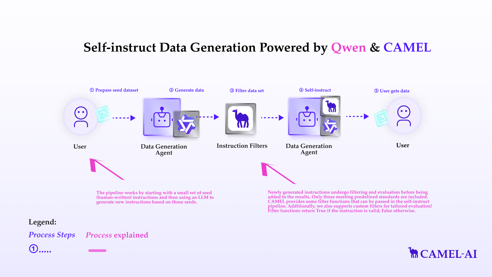

You can also check this cookbook in colab [here](https://colab.research.google.com/drive/1tNRrC3u6TjdHz_vG3VicYz6Q7DV_E1cq?usp=sharing)

<div style={{ display: "flex", justifyContent: "center", alignItems: "center", gap: "1rem", marginBottom: "2rem" }}>
  <a href="https://www.camel-ai.org/">
    
  </a>
  <a href="https://discord.camel-ai.org">
    
  </a>
</div>  

⭐ *Star us on [GitHub](https://github.com/camel-ai/camel), join our [Discord](https://discord.camel-ai.org), or follow us on [X](https://x.com/camelaiorg)*

---


The self-instruct pipeline is a technique for automatically generating instructions for large language models (LLMs). Manually creating these datasets can be time-consuming and expensive. The self-instruct pipeline provides a way to automate this process and generate large numbers of instructions quickly and efficiently.

In this notebook, you'll explore:
- **CAMEL-AI**:  A versatile multi-agent framework that facilitates the creation and execution of complex data tasks.
- **Qwen**: A large language model by Alibaba Cloud, used for instruction generation.
- **Self-Instruct Pipeline**: A technique for automating instruction dataset creation.
- **Instruction Filters**: A set of filters that is used to filter a dataset.





## Installation and Setup
First, install the CAMEL package with all its dependencies


```python
!pip install "camel-ai[all]==0.2.18"
```

If you don’t have a Qwen API key, you can obtain one by following these steps:

Visit the Alibaba Cloud Model Studio Console (https://www.alibabacloud.com/en?_p_lc=1) and follow the on-screen instructions to activate the model services.

In the upper-right corner of the console, click on your account name and select API-KEY.

On the API Key management page, click on the Create API Key button to generate a new key.


```python
import os
from getpass import getpass

qwen_api_key = getpass('Enter your Qwen API key: ')
os.environ["QWEN_API_KEY"] = qwen_api_key
```

Alternatively, if running on Colab, you could save your API keys and tokens as **Colab Secrets**, and use them across notebooks.

To do so, **comment out** the above **manual** API key prompt code block(s), and **uncomment** the following codeblock.

⚠️ Don't forget granting access to the API key you would be using to the current notebook.


```python
# import os
# from google.colab import userdata

# os.environ["QWEN_API_KEY"] = userdata.get("QWEN_API_KEY")
```


```python
from camel.configs import QwenConfig
from camel.models import ModelFactory
from camel.types import ModelPlatformType, ModelType
from camel.agents import ChatAgent
from camel.messages import BaseMessage

qwen_model = ModelFactory.create(
    model_platform=ModelPlatformType.QWEN,
    model_type=ModelType.QWEN_TURBO,
    model_config_dict=QwenConfig(temperature=0.2).as_dict(),
)
```

## Basic Agent Setup


```python
from camel.agents import ChatAgent
from camel.datagen.self_instruct import SelfInstructPipeline

agent = ChatAgent(
    model=qwen_model,
)
```

## Basic Pipeline Setup


The pipeline works by starting with a small set of seed (human-written) instructions and then using an LLM to generate new instructions based on those seeds.

- The seed instructions are typically stored in a JSON Lines (JSONL) file. Each line in the file represents a single instruction in JSON format.

- Like the seed file, the output is also stored in JSONL format, making it easy to parse and use for further tasks, such as training or fine-tuning language models.


Please replace `seed_path` with the path to your seed file, and replace `data_output_path` with your desired output location.


```python
import os
import requests

# Create directory for local data
os.makedirs('local_data', exist_ok=True)

# Update the URL to the raw file content
url = "https://raw.githubusercontent.com/camel-ai/camel/master/examples/datagen/self_instruct/seed_tasks.jsonl"

# Fetch the raw file
response = requests.get(url)

with open('local_data/seed_tasks.jsonl', 'wb') as file:
    file.write(response.content)

```


```python
seed_path = 'local_data/seed_tasks.jsonl'
data_output_path = 'data_output.json'
```

The cell below shows some example instructions in the seed file. All seed files should follow this format.


```python
with open('local_data/seed_tasks.jsonl', 'r') as file:
        for i, line in enumerate(file):
            print(line.strip())
            if i >= 9:
                break
```

The self-instruct pipeline works iteratively. In each round:

1. It selects a certain number of human-written instructions (`num_human_sample`) from the `seed_path`.
2. It selects a certain number of machine-generated instructions (`num_machine_sample`) from previous rounds.
3. It uses these selected instructions to guide the language model in generating new instructions.
4. These new instructions are added to the pool of machine-generated instructions, and the process repeats until the desired number of instructions is generated.

The `human_to_machine_ratio` helps control the balance between human guidance and the model's creativity throughout this process. By adjusting this ratio, you can influence the quality and diversity of the generated instructions.

Feel free to alter `num_human_sample` and `num_machine_sample`, which both will be passed into `human_to_machine_ratio` later


```python
num_human_sample = 6
num_machine_sample = 2
```

Please replace `target_num_instructions` with the number of machine instructions you want to generate


```python
target_num_instructions = 3
```

Pass everything to our pipeline.


```python
pipeline = SelfInstructPipeline(
    agent=agent,
    seed=seed_path,
    num_machine_instructions=target_num_instructions,
    data_output_path=data_output_path,
    human_to_machine_ratio=(num_human_sample, num_machine_sample),
)
```

Try generating it! You will see the generated data file being created at your desired location!


```python
pipeline.generate()
```

Pretty print the generated data content


```python
import json

with open(data_output_path, 'r') as file:
    data = json.load(file)
    print(json.dumps(data, indent=4))
```

## Filter functions

Newly generated instructions undergo filtering and evaluation before being added to the results. Only those meeting predefined standards are included. CAMEL provides some filter functions that can be passed in the self-instruct pipeline. Additionally, we also supports custom filters for tailored evaluation! Filter functions return `True` if the instruction is valid, `False` otherwise.

### Length Filter

`LengthFilter` filters out all the instructions which has a length less than `min_len` or greater than `max_len`.


```python
from camel.datagen.self_instruct import LengthFilter

length_filter = LengthFilter(min_len=5, max_len=50)

instructions = [
    "Sort the numbers in ascending order.",
    "Calculate the sum.",
    "Create a report that details the monthly expenses and savings in a spreadsheet."
]

filtered_instructions = [instr for instr in instructions if length_filter.apply(instr)]
print(filtered_instructions)
```

### Keyword Filter

`KeywordFilter` filters instructions that contain specific undesirable keyword.


```python
from camel.datagen.self_instruct import KeywordFilter

keyword_filter = KeywordFilter(keywords=["ban", "prohibit", "forbid"])

instructions = [
    "Ban the use of plastic bags.",
    "Encourage recycling programs.",
    "Prohibit smoking in public areas."
]

filtered_instructions = [instr for instr in instructions if keyword_filter.apply(instr)]
print(filtered_instructions)
```

### Punctuation Filter

`PunctuationFilter` filters instructions that begin with a non-alphanumeric character.


```python
from camel.datagen.self_instruct import PunctuationFilter

punctuation_filter = PunctuationFilter()

instructions = [
    "Sort the data by category.",
    "#Analyze the trends over time.",
    "*Create a summary of results."
]

filtered_instructions = [instr for instr in instructions if punctuation_filter.apply(instr)]
print(filtered_instructions)
```

### Non-English Filter

`NonEnglishFilter` filters instructions that do not begin with English letters.


```python
from camel.datagen.self_instruct import NonEnglishFilter

non_english_filter = NonEnglishFilter()

instructions = [
    "Analyze the performance metrics.",
    "计算结果的统计数据.",
    "Test the new algorithm."
]

filtered_instructions = [instr for instr in instructions if non_english_filter.apply(instr)]
print(filtered_instructions)
```

### ROUGE Similarity Filter

`RougeSimilarityFilter` filters instructions that are too similar to existing instructions based on ROUGE scores.


```python
from camel.datagen.self_instruct import RougeSimilarityFilter

existing_instructions = [
    "Summarize the article.",
    "Write a brief overview of the text."
]

similarity_filter = RougeSimilarityFilter(existing_instructions, threshold=0.5)

instructions = [
    "Summarize the content.",
    "Create a summary for the text.",
    "Provide an analysis of the text."
]

filtered_instructions = [instr for instr in instructions if similarity_filter.apply(instr)]
print(filtered_instructions)
```

### Custom Filter Function

Additionally, you could implement your own filter function.


```python
from camel.datagen.self_instruct import FilterFunction

class CustomFilter(FilterFunction):

    def apply(self, instruction: str) -> bool:
        # apply your logic here
        logic = ...
        return logic
```

## Instruction Filter

`InstructionFilter` manages all filter functions. And we can use a custom InstructionFilter to initialize the pipeline

Start by adding filter functions you want and configure them.


```python
filter_config = {
  "length": {"min_len": 5, "max_len": 100},
  "keyword": {"keywords": ["image", "video"]},
  "non_english": {},
  "rouge_similarity": {
      "existing_instructions": ["Some existing instructions"],
      "threshold": 0.6
  }
}
```

Then, initialize an `InstructionFilter`


```python
from camel.datagen.self_instruct import InstructionFilter
filters = InstructionFilter(filter_config)
```

## Pipeline Setup with Custom `InstructionFilter`
CAMEL has some default filter functions inside the pipeline, but you can also choose your own!


```python
pipeline = SelfInstructPipeline(
    agent=agent,
    seed=seed_path,
    num_machine_instructions=target_num_instructions,
    data_output_path=data_output_path,
    human_to_machine_ratio=(num_human_sample, num_machine_sample),
    instruction_filter=filters,    # pass in your InstructionFilter
)
```

Or if you want to use the default function filters, but different configuration, you can also just pass in the filter configuration

Finally, generate!


```python
pipeline.generate()
```

Pretty print the generated data content


```python
import json

with open(data_output_path, 'r') as file:
    data = json.load(file)
    print(json.dumps(data, indent=4))
```

That's everything: Got questions about 🐫 CAMEL-AI? Join us on [Discord](https://discord.camel-ai.org)! Whether you want to share feedback, explore the latest in multi-agent systems, get support, or connect with others on exciting projects, we’d love to have you in the community! 🤝

Check out some of our other work:

1. 🐫 Creating Your First CAMEL Agent [free Colab](https://docs.camel-ai.org/cookbooks/create_your_first_agent.html)

2.  Graph RAG Cookbook [free Colab](https://colab.research.google.com/drive/1uZKQSuu0qW6ukkuSv9TukLB9bVaS1H0U?usp=sharing)

3. 🧑‍⚖️ Create A Hackathon Judge Committee with Workforce [free Colab](https://colab.research.google.com/drive/18ajYUMfwDx3WyrjHow3EvUMpKQDcrLtr?usp=sharing)

4. 🔥 3 ways to ingest data from websites with Firecrawl & CAMEL [free Colab](https://colab.research.google.com/drive/1lOmM3VmgR1hLwDKdeLGFve_75RFW0R9I?usp=sharing)

5. 🦥 Agentic SFT Data Generation with CAMEL and Mistral Models, Fine-Tuned with Unsloth [free Colab](https://colab.research.google.com/drive/1lYgArBw7ARVPSpdwgKLYnp_NEXiNDOd-?usp=sharingg)

Thanks from everyone at 🐫 CAMEL-AI


<div style={{ display: "flex", justifyContent: "center", alignItems: "center", gap: "1rem", marginBottom: "2rem" }}>
  <a href="https://www.camel-ai.org/">
    
  </a>
  <a href="https://discord.camel-ai.org">
    
  </a>
</div>  

⭐ *Star us on [GitHub](https://github.com/camel-ai/camel), join our [Discord](https://discord.camel-ai.org), or follow us on [X](https://x.com/camelaiorg)*

---

