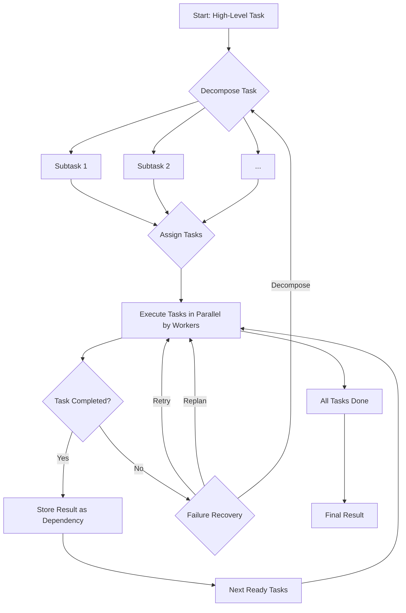

<Card title="Concept" icon="users">
Workforce is CAMEL-AI’s powerful multi-agent collaboration engine. It enables you to assemble, manage, and scale teams of AI agents to tackle complex tasks that are beyond the capabilities of a single agent. By creating a "workforce" of specialized agents, you can automate intricate workflows, foster parallel execution, and achieve more robust and intelligent solutions.
</Card>

## Core Components Deep Dive

<Card title="The Workforce Class" icon="layer-group">
The `Workforce` class is the central orchestrator. It manages the entire lifecycle of a multi-agent task.

```python title="Workforce Initialization"
class Workforce(BaseNode):
    def __init__(
        self,
        description: str,
        children: Optional[List[BaseNode]] = None,
        coordinator_agent: Optional[ChatAgent] = None,
        task_agent: Optional[ChatAgent] = None,
        new_worker_agent: Optional[ChatAgent] = None,
        graceful_shutdown_timeout: float = 15.0,
        task_timeout_seconds: Optional[float] = None,
        share_memory: bool = False,
        use_structured_output_handler: bool = True,
        callbacks: Optional[List[WorkforceCallback]] = None,
    ) -> None:
    # ...
```

**Key Parameters:**

-   `description`: A high-level description of the workforce's purpose.
-   `children`: A list of initial worker nodes.
-   `coordinator_agent`: A `ChatAgent` for assigning tasks.
-   `task_agent`: A `ChatAgent` for decomposing tasks.
-   `new_worker_agent`: A template `ChatAgent` for creating new workers.
-   `task_timeout_seconds`: Optional per-workforce task timeout in seconds.
-   `share_memory`: If `True`, `SingleAgentWorker` instances will share memory.
-   `use_structured_output_handler`: Defaults to `True`. Enables structured output handling so models without native JSON + tool-calling can still interop reliably.
-   `callbacks`: Optional A list of callback handlers to observe and record workforce lifecycle events and metrics.
</Card>

<Card title="Worker Types" icon="users-gear">
The Workforce can be composed of different types of workers, each suited for different kinds of tasks.
<CardGroup cols={2}>
    <Card title="SingleAgentWorker" icon="user">
        The most common type of worker. It consists of a single `ChatAgent` configured with specific tools and a system prompt. For efficiency, it uses an `AgentPool` to reuse agent instances.
    </Card>
    <Card title="RolePlayingWorker" icon="users">
        This worker uses a `RolePlaying` session between two agents (an assistant and a user) to accomplish a task. It's useful for brainstorming, debate, or exploring a topic from multiple perspectives.
    </Card>
</CardGroup>
</Card>

## Creating and Adding Workers

<Card title="SingleAgentWorker Examples" icon="user">
Here are detailed examples of how to create and add `SingleAgentWorker` instances to your workforce.
<Tabs>
<Tab title="Simple Worker">
```python
from camel.societies.workforce import Workforce
from camel.agents import ChatAgent

workforce = Workforce("My Research Team")

# Create a general-purpose agent
general_agent = ChatAgent(system_message="You are a helpful research assistant.")

# Add the worker
workforce.add_single_agent_worker(
    description="A worker for general research tasks",
    worker=general_agent,
)
```
</Tab>
<Tab title="Worker with Tools">
```python
from camel.societies.workforce import Workforce
from camel.agents import ChatAgent
from camel.toolkits import SearchToolkit

workforce = Workforce("Web Research Team")

# Create a search agent with a web search tool
search_agent = ChatAgent(
    system_message="A research assistant that can search the web.",
    tools=[SearchToolkit().search_duckduckgo]
)

# Add the worker
workforce.add_single_agent_worker(
    description="A worker that can perform web searches",
    worker=search_agent,
)
```
</Tab>
<Tab title="Worker with a Specific Model">
```python
from camel.societies.workforce import Workforce
from camel.agents import ChatAgent
from camel.models import ModelFactory
from camel.types import ModelType

workforce = Workforce("Creative Writing Team")

# Create an agent with a specific model for creative tasks
creative_model = ModelFactory.create(model_type=ModelType.GPT_5_MINI)
creative_agent = ChatAgent(
    system_message="A creative writer for generating stories.",
    model=creative_model
)

# Add the worker
workforce.add_single_agent_worker(
    description="A worker for creative writing",
    worker=creative_agent,
)
```
</Tab>
</Tabs>
</Card>

<Card title="RolePlayingWorker Example" icon="users">
This example sets up a role-playing session between a "solution architect" and a "software developer" to design a system.

```python title="role_playing_example.py"
from camel.societies.workforce import Workforce

workforce = Workforce("System Design Team")

workforce.add_role_playing_worker(
    description="A role-playing session for system design.",
    assistant_role_name="Software Developer",
    user_role_name="Solution Architect",
    assistant_agent_kwargs=dict(
        system_message="You are a software developer responsible for implementing the system."
    ),
    user_agent_kwargs=dict(
        system_message="You are a solution architect responsible for the high-level design."
    ),
    chat_turn_limit=5,
)

# ... process a task with this workforce ...
```
</Card>

<Card title="Task Lifecycle and Management" icon="diagram-project">
The `Workforce` manages a sophisticated task lifecycle.



1.  **Decomposition**: The `task_agent` breaks the main task into smaller, self-contained subtasks.
2.  **Assignment**: The `coordinator_agent` assigns each subtask to the most suitable worker.
3.  **Execution**: Workers execute their assigned tasks, often in parallel.
4.  **Completion**: A task's result is stored and can be used as a dependency for other tasks.
5.  **Failure Handling**: If a task fails, the `Workforce` initiates its recovery protocols.
</Card>

<Card title="Advanced Usage: Human-in-the-Loop (HITL)" icon="hand">
To enable HITL inside a Workforce, equip the agents (coordinator, task agent, or workers) with the `HumanToolkit`. Agents can then call a human during execution (e.g., to clarify requirements, approve actions, or unblock errors).

```python title="hitl_with_human_toolkit.py"
from camel.societies.workforce import Workforce
from camel.agents import ChatAgent
from camel.toolkits import HumanToolkit

# 1) Create the workforce
workforce = Workforce("Interactive Workforce")

# 2) Prepare human-in-the-loop tools
human_toolkit = HumanToolkit()
human_tools = human_toolkit.get_tools()  # includes ask_human_via_console, send_message_to_user, ...

# 3) Attach HumanToolkit to any agents that may need human help
coordinator = ChatAgent(
    system_message="You coordinate tasks and may ask a human for help when needed.",
    tools=human_tools,
)

worker = ChatAgent(
    system_message="You execute tasks and can ask the human for clarification.",
    tools=[human_toolkit.ask_human_via_console],  # or use `human_tools`
)

# 4) Register agents into the workforce
workforce = Workforce(
    description="Interactive Workforce",
    coordinator_agent=coordinator,
    task_agent=None,
)
workforce.add_single_agent_worker(description="Worker", worker=worker)

# 5) Run tasks as usual. When an agent invokes a human tool, it will prompt via console.
# workforce.process_task(Task(content="Build a quick demo and confirm requirements with the human."))
```

Notes:
- No special threading is required. Agents prompt the user when they call a `HumanToolkit` tool.
- If you need async control, `process_task_async` is available, but it is not required for HITL.
</Card>

<Card title="Key Data Structures" icon="database">
The `workforce` module uses several Pydantic models to ensure structured data exchange.

-   **`WorkerConf`**: Defines the configuration for a new worker.
-   **`TaskResult`**: Represents the output of a completed task.
-   **`TaskAssignment`**: A single task-to-worker assignment, including dependencies.
-   **`TaskAssignResult`**: A list of `TaskAssignment` objects.
-   **`RecoveryDecision`**: The output of the failure analysis process, dictating the recovery strategy.

Understanding these models is key to interpreting the workforce's internal state and logs.
</Card>

<CardGroup cols={2}>
  <Card
    title="Cookbook: Hackathon Judge Committee"
    icon="bookmark"
    href="https://colab.research.google.com/drive/18ajYUMfwDx3WyrjHow3EvUMpKQDcrLtr?usp=sharing"
  >
    See a real-world multi-agent workflow with Workforce.
  </Card>
  <Card
    title="API Reference"
    icon="book"
    href="/reference/#societies.workforce"
  >
    Full documentation for advanced usage and configuration.
  </Card>
</CardGroup>
