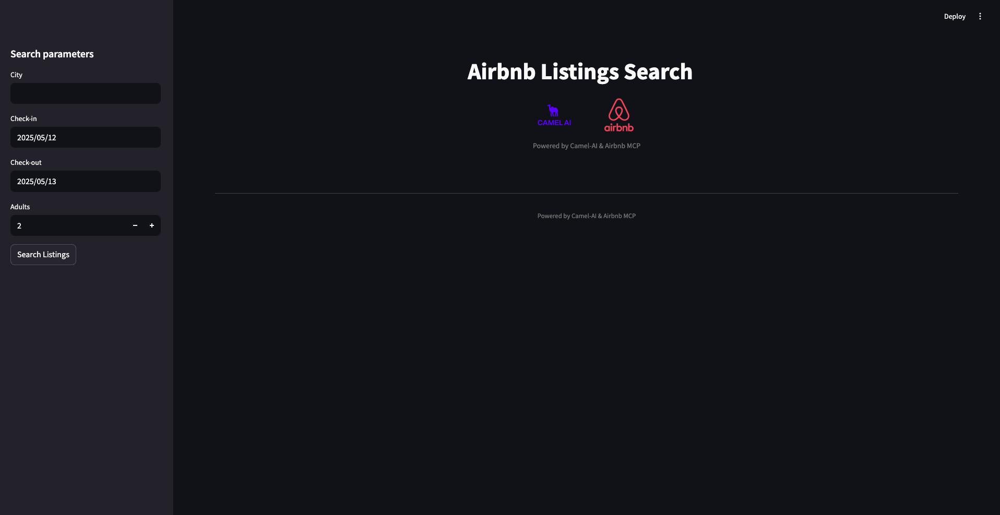

# 🏡 Airbnb Listings Search (Streamlit + CAMEL-AI + MCP)

A Streamlit app that leverages the [CAMEL-AI OWL framework](https://github.com/camel-ai/owl) and **MCP (Model Context Protocol)** to automatically search Airbnb listings via a custom MCP server. The app displays search parameters and returns the top 5 listings in a clean, responsive card-grid UI.

---

## ✨ Features

- **Interactive UI**: Sidebar for entering city, check-in/out dates and number of adults.
- **Session state**: Remembers your last chosen dates.
- **Agent-driven search**: Uses a CAMEL-AI `ChatAgent` + MCPToolkit to query Airbnb via `@openbnb/mcp-server-airbnb`.
- **Responsive cards**: Displays each listing in its own styled card.

---

## 📋 Prerequisites

- Python >=3.10,<3.13
- Node.js & npm (for the MCP server plugin)
- A valid OpenAI API key set in your environment:
  ```bash
  export OPENAI_API_KEY="your_api_key_here"
  ```

---

## 🛠️ Setup

1. **Clone the repo**

   ```bash
   git clone https://github.com/your-org/your-repo.git
   cd your-repo/owl/community_usecase/Airbnb-MCP
   ```

2. **Create a virtual environment**

   ```bash
   python -m venv venv
   source venv/bin/activate      # macOS/Linux
   venv\\Scripts\\activate     # Windows
   ```

3. **Install Python dependencies**

   ```bash
   pip install -r requirements.txt
   ```

---

## ⚙️ Configuration

1. **Environment variables**  
   Create a `.env` file in the project root with:
   ```ini
   OPENAI_API_KEY=your_openai_key_here
   ```

2. **MCP Server config**  
   Ensure `mcp_servers_config.json` (next to `app.py`) contains:
   ```json
   {
     "mcpServers": {
       "airbnb": {
         "command": "npx",
         "args": ["-y", "@openbnb/mcp-server-airbnb", "--ignore-robots-txt"]
       }
     }
   }
   ```

---

## 🚀 Running the App

From the `Airbnb-MCP` folder, run:

```bash
streamlit run app.py
```

This will launch the Streamlit UI in your browser. Use the sidebar to choose your city, dates and number of guests, then click **Search Listings**.

---

## 🔧 Customization

- **Prompt**: Edit the search prompt inside `app.py` if you want to tweak wording or number of results.
- **Styling**: Modify the CSS in the header section of `app.py` to change colors, fonts or card layout.
- **Logging**: Change `set_log_level("DEBUG")` to `INFO` in production.

---

## 📂 Project Structure

```
Airbnb-MCP/
├── assets/
│   ├── logo_camel_ai.png
│   └── logo_airbnb_mcp.png
├── mcp_servers_config.json
├── app.py              # Main Streamlit application
├── requirements.txt    # Python deps
└── .env                # Env file with OPENAI_API_KEY
```

---

## 📚 References

- [CAMEL-AI OWL Framework](https://github.com/camel-ai/owl)
- [Anthropic MCP Docs](https://docs.anthropic.com/en/docs/agents-and-tools/mcp)
- [@openbnb/mcp-server-airbnb (npm)](https://www.npmjs.com/package/@openbnb/mcp-server-airbnb)

---

*Happy listing searches!*
