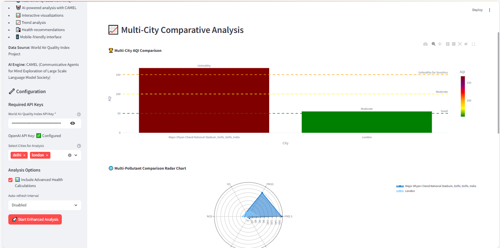

# 🌍 AQI Monitoring System with CAMEL-AI

An intelligent Streamlit-based application that provides real-time air quality monitoring and analysis powered by the [CAMEL-AI](https://www.camel-ai.org/) framework. This system offers comprehensive environmental health insights with AI-powered analysis of air quality data from around the world.


## 🚀 Key Features

- **Real-time AQI Data**: Fetch current air quality information from the World Air Quality Index API
- **AI-Powered Analysis**: Leverage CAMEL-AI's advanced environmental analysis capabilities
- **Multi-City Comparison**: Compare air quality across multiple locations simultaneously
- **Health Risk Assessment**: Get population-specific health recommendations
- **Interactive Visualizations**: Dynamic charts and graphs for data exploration
- **Comprehensive Reports**: Detailed environmental health analysis

## 🧰 Technology Stack

- **Backend**: 
  - Python 3.9+
  - Streamlit for web interface
  - CAMEL-AI framework for advanced analysis
  - OpenAI GPT models (via CAMEL)

- **Data Sources**:
  - World Air Quality Index API (real-time data)
  - WHO guidelines integration

- **Visualization**:
  - Plotly for interactive charts
  - Streamlit components for UI

## 🛠️ Installation & Setup

### Prerequisites
- Python 3.9 or later
- OpenAI API key
- WAQI API key (free tier available)

### Installation Steps

1. **Clone the repository** (if applicable):
   ```bash
   git clone https://github.com/camel-ai/camel.git
   cd camel/examples/usecases/aqi_monitoring_system
   ```

2. **Create and activate virtual environment**:
   ```bash
   python -m venv venv
   source venv/bin/activate  # On Windows: venv\Scripts\activate
   ```

3. **Install dependencies**:
   ```bash
   pip install -r requirements.txt
   ```

4. **Configure environment variables**:
   Create a `.env` file with your API keys:
   ```env
   OPENAI_API_KEY=your_openai_key
   WAQI_API_KEY=your_waqi_key
   ```

## ▶️ Running the Application

Start the Streamlit server:
```bash
streamlit run app.py
```

The application will launch in your default browser at `http://localhost:8501`.

## 📊 Using the Dashboard

1. **Configure API Keys** in the sidebar
2. **Select Cities** for analysis
3. **Choose Analysis Options**:
   - Enable/disable health calculations
   - Set auto-refresh interval
4. **Explore the Tabs**:
   - 📊 Real-time Status: Current AQI and pollutant levels
   - 🤖 AI Analysis: Comprehensive environmental reports
   - 📈 Comparative Analysis: Multi-city comparisons
   - 🏥 Health Assessment: Population-specific recommendations

## 📂 Project Structure

```
aqi-monitoring/
├── app.py                # Main application file
├── .env                  # Environment variables
├── requirements.txt      # Python dependencies
├── README.md             # Project documentation
└── assets/               # Static files 
```

## 🌐 Data Sources

- Primary AQI data: [World Air Quality Index Project](https://aqicn.org/api/)
- Health guidelines: WHO air quality standards
- AI analysis: CAMEL-AI framework with OpenAI models

## 🤝 Contributing

Contributions are welcome! Please open an issue or submit a pull request for any improvements.


## 🧠 Powered By

- [CAMEL-AI](https://github.com/camel-ai/camel)
- [Streamlit](https://streamlit.io/)
- [OpenAI](https://openai.com/)
- [WAQI](https://aqicn.org/api/)