# HybridBrowserToolkit Architecture Overview

This document provides a comprehensive comparison between the legacy BrowserToolkit and the new HybridBrowserToolkit, highlighting the architectural improvements, new features, and enhanced capabilities.

## Table of Contents
- [Architecture Evolution](#architecture-evolution)
- [Core Architectural Improvements](#core-architectural-improvements)
- [Feature Comparison](#feature-comparison)
- [Technical Enhancements](#technical-enhancements)
- [Performance and Efficiency](#performance-and-efficiency)
- [Migration Guide](#migration-guide)

## Architecture Evolution

### Legacy BrowserToolkit Architecture

The original BrowserToolkit follows a monolithic Python-based architecture:

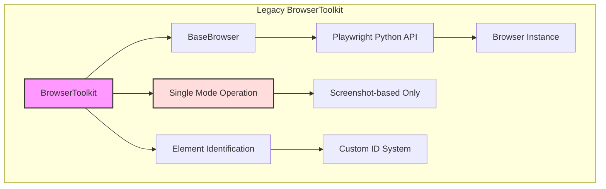

**Key Characteristics:**
- Single operational mode (visual/screenshot-based)
- Direct Playwright Python API usage
- Custom element ID injection system
- Limited to standard browser launch
- Synchronous operation model

### New HybridBrowserToolkit Architecture

The HybridBrowserToolkit introduces a modular, multi-layer architecture:

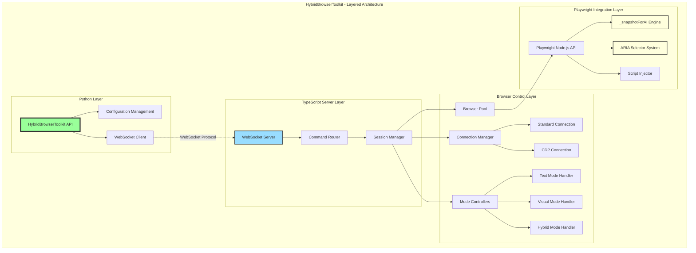

## Core Architectural Improvements

### 1. Multi-Mode Operation System

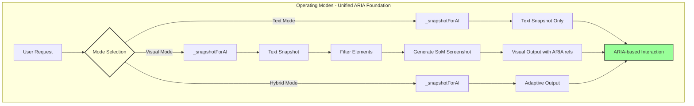

**Legacy BrowserToolkit:**
- Fixed screenshot-based approach
- Always generates visual markers
- Limited flexibility

**HybridBrowserToolkit:**
- **Text Mode**: Pure textual snapshot from _snapshotForAI
- **Visual Mode**: Text snapshot filtered and visualized as SoM screenshot
- **Hybrid Mode**: Intelligent switching between text and visual outputs
- **Unified Foundation**: All modes use ARIA-based element identification

### 2. TypeScript Framework Integration

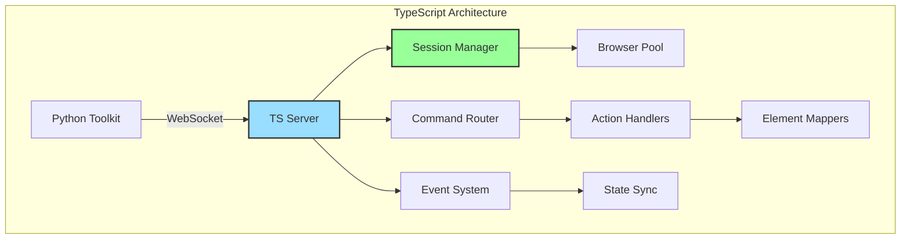

**Benefits:**
- Asynchronous operation handling
- Better browser API integration
- Enhanced performance through native Playwright features
- Real-time event handling

### 3. Enhanced Element Identification

#### Legacy System:
```python
# Custom ID injection
page.evaluate("__elementId = '123'")
target = page.locator("[__elementId='123']")
```

#### New ARIA Mapping System:
```typescript
// Native Playwright ARIA selectors
await page.locator('[aria-label="Submit"]').click()
await page.getByRole('button', { name: 'Submit' }).click()

// _snapshotForAI integration
const snapshot = await page._snapshotForAI();
// Returns structured element data with ref mappings
```

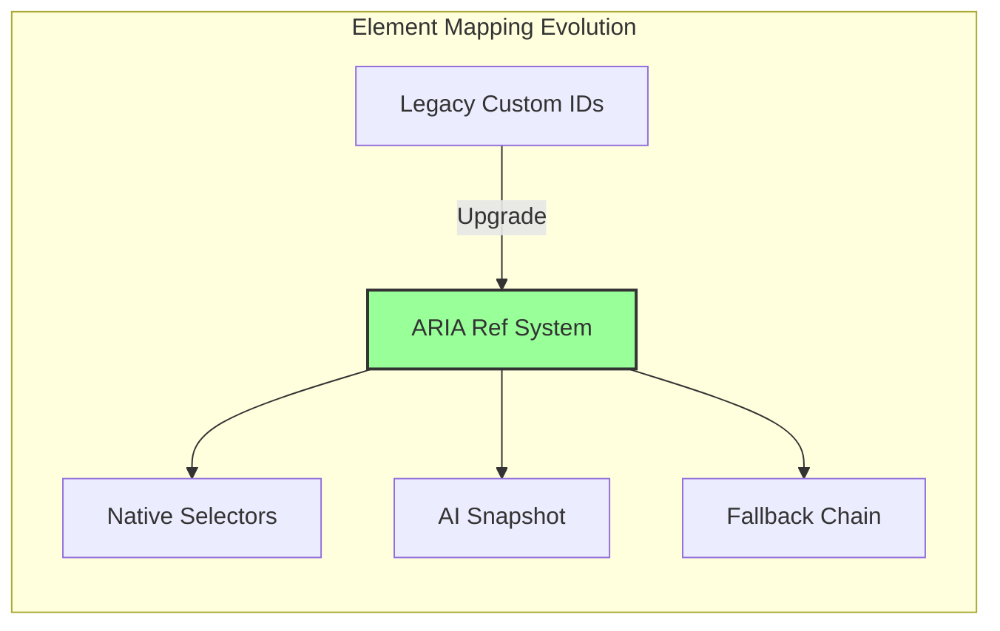

### 4. _snapshotForAI and ARIA Mapping Mechanism

```mermaid
graph TB
    subgraph "_snapshotForAI Integration with ARIA Mapping"
        A[Browser Page] --> B[_snapshotForAI Engine]
        
        B --> C[DOM Tree Analysis]
        C --> D[Interactive Elements Detection]
        D --> E[ARIA Properties Extraction]
        
        E --> F[Element Classification]
        F --> G{Element Type}
        
        G -->|Button| H[role='button']
        G -->|Link| I[role='link']
        G -->|Input| J[role='textbox']
        G -->|Select| K[role='combobox']
        
        H --> L[Generate Ref ID]
        I --> L
        J --> L
        K --> L
        
        L --> M[Build Mapping Table]
        M --> N[Ref → ARIA Selector Map]
        
        N --> O[Text Snapshot Output]
        N --> P[Visual Processing]
        
        O --> Q[Text Mode Result]
        P --> R[Filter by Viewport]
        R --> S[Inject SoM Markers]
        S --> T[Visual Mode Result]
        
        style B fill:#ffd,stroke:#333,stroke-width:3px
        style N fill:#9f9,stroke:#333,stroke-width:2px
        style L fill:#9df,stroke:#333,stroke-width:2px
    end
```

This diagram shows how:
- **_snapshotForAI** analyzes the DOM and extracts ARIA properties
- Elements are classified by their semantic roles
- A unified ref ID system maps to ARIA selectors
- The same foundation serves both text and visual modes
- Visual mode is built on top of the text snapshot by filtering and adding markers

### 5. Enhanced Stealth Mechanism

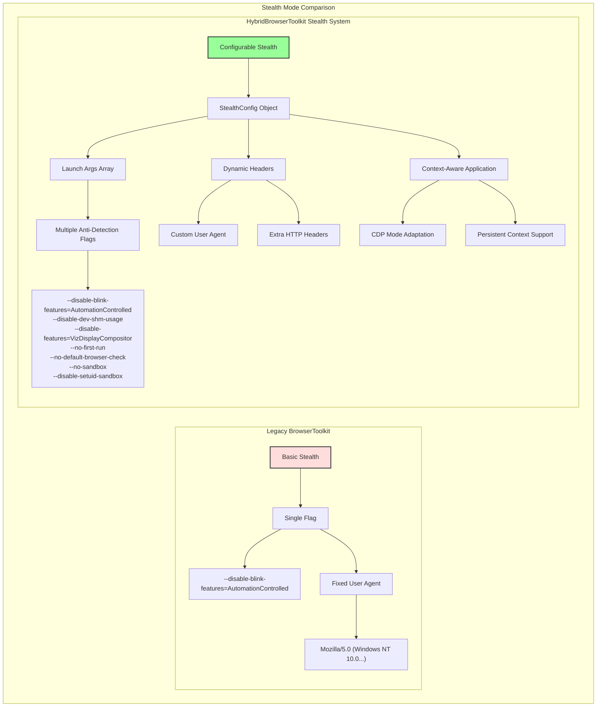

**Key Stealth Enhancements:**

1. **Legacy Approach:**
   - Single `--disable-blink-features=AutomationControlled` flag
   - Hardcoded user agent string
   - Applied only during browser launch
   - No flexibility for different contexts

2. **HybridBrowserToolkit Approach:**
   - **Comprehensive Flag Set**: Multiple anti-detection browser arguments
   - **Configurable System**: StealthConfig object allows customization
   - **Context Adaptation**: Different behavior for CDP vs standard launch
   - **Dynamic Headers**: Can set custom HTTP headers and user agents
   - **Persistent Context Support**: Maintains stealth across sessions

**Stealth Configuration Example:**

```typescript
// TypeScript StealthConfig
interface StealthConfig {
  enabled: boolean;
  args: string[];                    // Browser launch arguments
  userAgent?: string;                // Custom user agent
  extraHTTPHeaders?: {[key: string]: string};  // Additional headers
}
```

### 6. Tool Registration and Screenshot Handling

```mermaid
graph TB
    subgraph "RegisteredAgentToolkit Pattern for Screenshots"
        A[ChatAgent] -->|toolkits_to_register_agent| B[HybridBrowserToolkit]
        B -->|register_agent(agent)| C[self.agent = agent]
        
        D[User Request] --> E[browser_get_som_screenshot]
        E --> F{read_image?}
        
        F -->|False| G[Generate Screenshot]
        G --> H[Save to Disk]
        H --> I[Return Path Info]
        I --> J["Text: 'Screenshot saved to: /path/file.png'"]
        
        F -->|True| K[Generate Screenshot]
        K --> L[Save to Disk]
        L --> M[Load Image from Path]
        M --> N[Create Message with Image]
        
        C -.->|Stored Agent Reference| O[self.agent.astep(message)]
        N --> O
        O --> P[Agent Analysis Result]
        P --> Q["Text: 'Screenshot saved... Agent analysis: ...'"]
        
        style A fill:#9df,stroke:#333,stroke-width:2px
        style B fill:#9f9,stroke:#333,stroke-width:2px
        style C fill:#dfd,stroke:#333,stroke-width:2px
        style O fill:#ffd,stroke:#333,stroke-width:2px
    end
```

**Key Differences from Legacy:**
- **Legacy**: Screenshot stored in memory, passed as object
- **Hybrid**: Screenshot saved to disk, agent accesses via file path
- **Memory Efficiency**: Only file path in memory, not entire image
- **Agent Integration**: Uses registered agent pattern for clean separation

## Feature Comparison

### Connection Methods

| Feature | Legacy BrowserToolkit | HybridBrowserToolkit |
|---------|----------------------|---------------------|
| Standard Launch | ✅ | ✅ |
| CDP Connection | ❌ | ✅ |
| Remote Browser | ❌ | ✅ |
| Session Persistence | Limited | Full Support |
| Multi-Tab Support | Basic | Advanced |

### CDP Connection Architecture

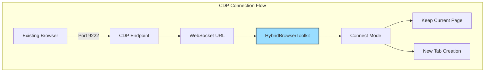

### Element Interaction

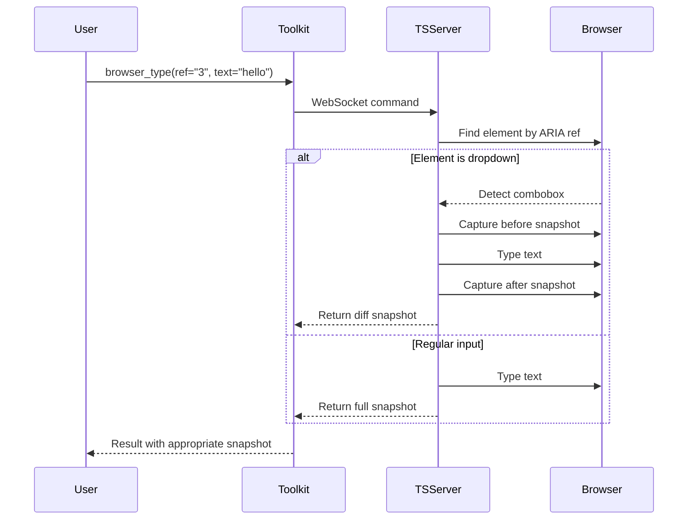

## Technical Enhancements

### 1. Injected SoM Screenshot

**Legacy Approach:**
- Server-side screenshot processing
- Image stored in memory for agent access
- Fixed resolution handling
- Basic overlap detection

**New Injected Script Approach:**
```javascript
// Injected directly into browser context
window.__generateSoMScreenshot = function() {
    // Advanced overlap detection
    const overlaps = detectElementOverlaps();
    
    // Parent-child fusion
    const fusedElements = fuseRelatedElements();
    
    // Adaptive positioning
    const positions = calculateAdaptivePositions();
    
    // Generate optimized markers
    return generateOptimizedMarkers(positions);
}
```

**Key Improvements:**
- Browser-native overlap detection
- Resolution-independent rendering
- Parent-child element fusion
- **Tool Registration Pattern**: Returns text description with file path instead of storing image in memory
- Screenshot saved to disk with structured naming
- Agent can analyze via registered toolkit method

### 2. Form Filling Optimization

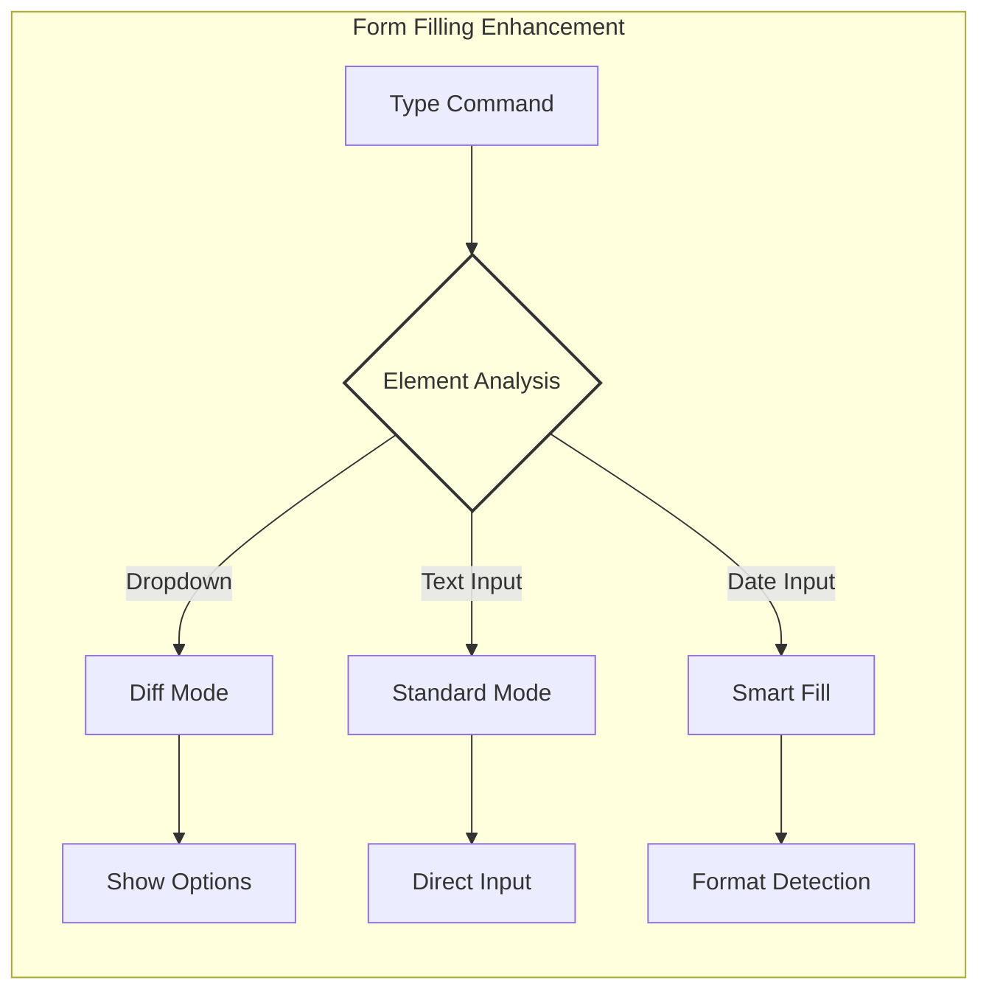

**New Features:**
- Multi-input support in single command
- Intelligent dropdown detection
- Diff snapshot for dynamic content
- Error recovery mechanisms

### 3. Snapshot Quality Enhancement

**_snapshotForAI Integration:**
```typescript
// Playwright's native AI-optimized snapshot
const snapshot = await page._snapshotForAI({
    interestingOnly: true,    // Filter noise
    includeMarkers: true,      // Add interaction points
    viewportOnly: optional     // Configurable scope
});
```

**Comparison:**
| Aspect | Legacy | Hybrid |
|--------|---------|---------|
| Snapshot Source | Custom JavaScript | Native Playwright |
| Element Detection | Manual parsing | AI-optimized |
| Algorithm Complexity | Higher complexity | Lower complexity |

## Performance and Efficiency

### Architectural Performance Gains

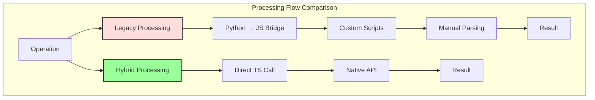

### Memory and Resource Efficiency

**Legacy:**
- Full page screenshot for every action
- Image stored in memory for agent processing
- Higher memory footprint
- Direct image object passing

**Hybrid:**
- Selective snapshot generation (only when requested)
- File-based screenshot storage with path reference
- Significantly reduced memory usage in text mode
- **RegisteredAgentToolkit Pattern**: Agent analyzes images via registered toolkit methods rather than in-memory objects

## Advanced Features Deep Dive

### Stealth Mode Implementation Details

The HybridBrowserToolkit's stealth mechanism is significantly more sophisticated than the legacy implementation:

**Legacy Implementation:**
```python
# browser_toolkit.py
browser_launch_args = [
    "--disable-blink-features=AutomationControlled",  # Basic stealth
]
user_agent_string = (
    "Mozilla/5.0 (Windows NT 10.0; Win64; x64) "
    "AppleWebKit/537.36 (KHTML, like Gecko) "
    "Chrome/91.0.4472.124 Safari/537.36"
)
```

**HybridBrowserToolkit Implementation:**
```python
# Usage
toolkit = HybridBrowserToolkit(
    stealth=True,  # Enables comprehensive stealth configuration
    # Or with custom configuration
    stealth={
        "enabled": True,
        "userAgent": "Custom User Agent String",
        "extraHTTPHeaders": {
            "Accept-Language": "en-US,en;q=0.9",
            "Accept-Encoding": "gzip, deflate, br"
        }
    }
)
```

**Stealth Application Strategy:**

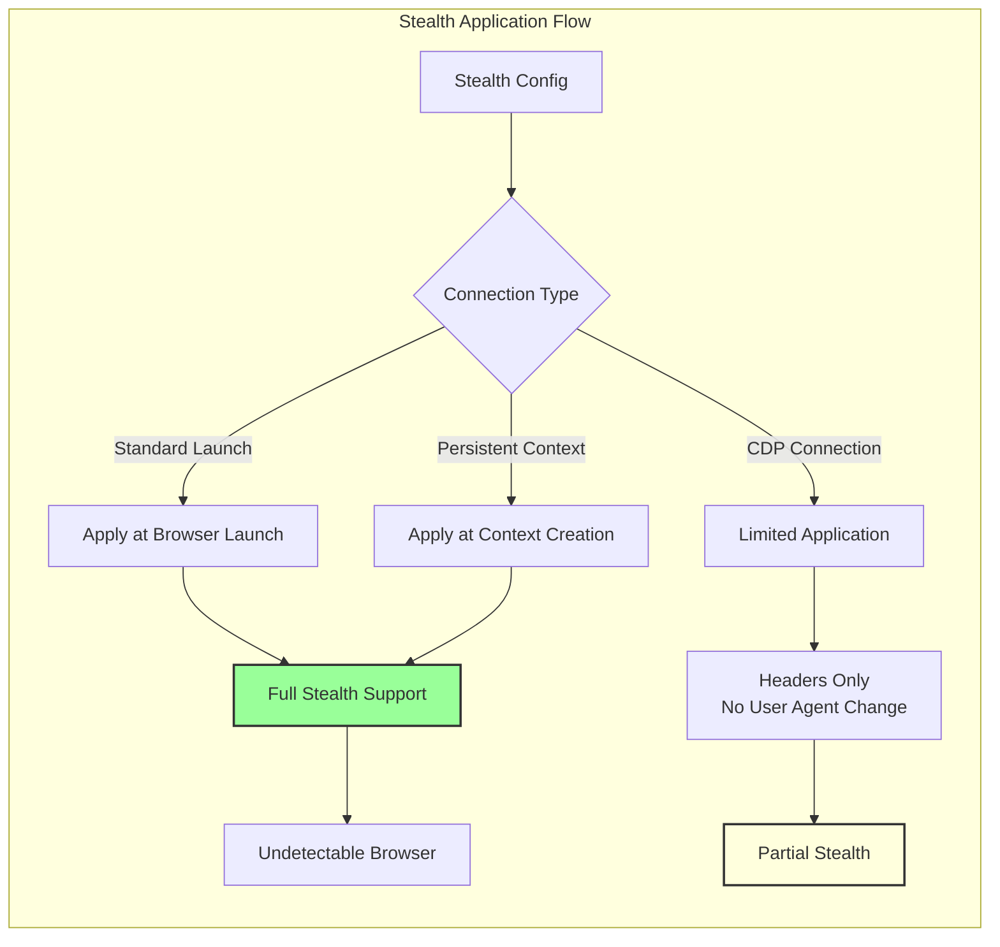

**Anti-Detection Features:**
1. **Browser Fingerprint Masking**: Removes automation indicators
2. **WebDriver Property**: Hidden from JavaScript detection
3. **Chrome DevTools Protocol**: Masked automation flags
4. **Navigator Properties**: Normalized to match real browsers
5. **Plugin Array**: Simulates real browser plugins
6. **Permission Queries**: Handles like non-automated browser

## Migration Guide

### Code Migration Examples

**Legacy Code:**
```python
# Old BrowserToolkit
toolkit = BrowserToolkit(headless=True)
agent = ChatAgent(toolkits=[toolkit])
await agent.run("Go to example.com and click login")
```

**New HybridBrowserToolkit:**
```python
# Option 1: Drop-in replacement
toolkit = HybridBrowserToolkit(headless=True)

# Option 2: Utilize new features
toolkit = HybridBrowserToolkit(
    headless=True,
    full_visual_mode=False,    # Enable text mode
    viewport_limit=True,        # Optimize performance
    connect_over_cdp=False,     # Standard connection
    stealth=True               # Enhanced stealth
)

# Option 3: CDP connection
toolkit = HybridBrowserToolkit(
    connect_over_cdp=True,
    cdp_url="ws://localhost:9222/devtools/browser/...",
    cdp_keep_current_page=True
)
```

### Feature Mapping

| Legacy Method | Hybrid Equivalent | Enhancement |
|--------------|-------------------|-------------|
| `browse_url()` | `browser_visit_page()` | Returns snapshot |
| `click_id()` | `browser_click()` | ARIA-based selection |
| `fill_input_id()` | `browser_type()` | Multi-input support |
| Custom screenshots | `browser_get_som_screenshot()` | AI analysis option |

### Best Practices

1. **Start with Text Mode** for better performance
2. **Use Visual Mode** only when necessary
3. **Leverage CDP** for debugging and development
4. **Enable viewport_limit** for large pages
5. **Utilize diff snapshots** for dynamic content

## Conclusion

The HybridBrowserToolkit represents a significant architectural evolution, offering:

- **Flexibility**: Multiple operation modes and connection types
- **Performance**: Significantly faster operations in text mode
- **Reliability**: Native Playwright features and ARIA standards
- **Scalability**: TypeScript server architecture
- **Compatibility**: Backward compatible with enhanced features

The modular architecture ensures easy extensibility while maintaining robust performance across diverse automation scenarios.