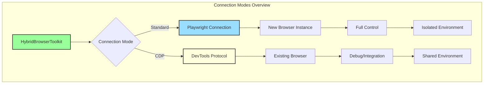
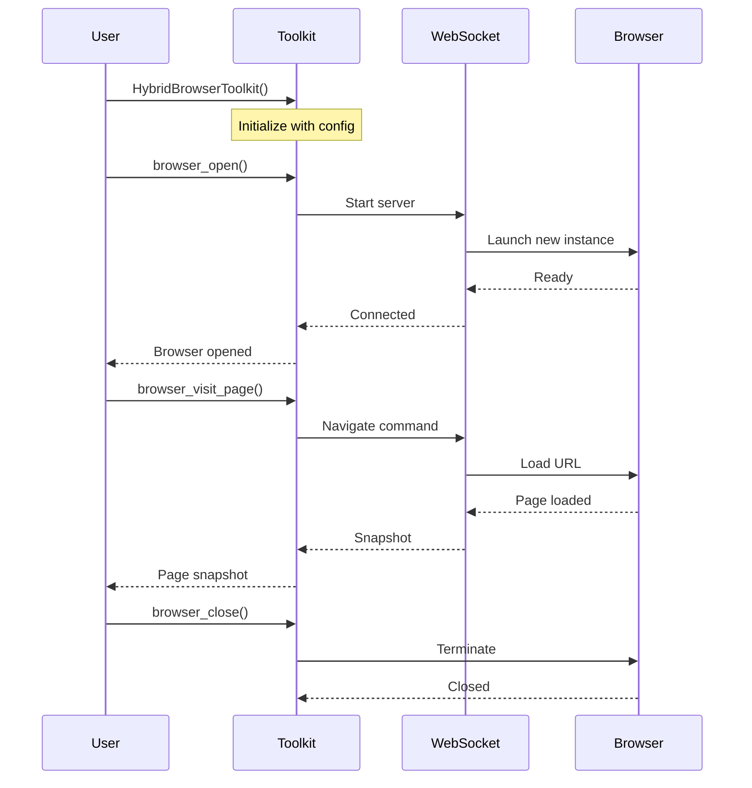
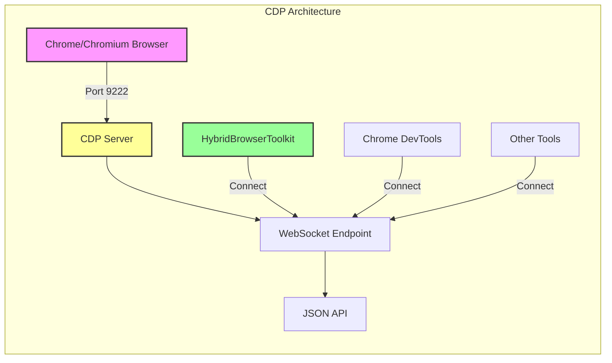
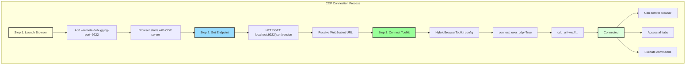
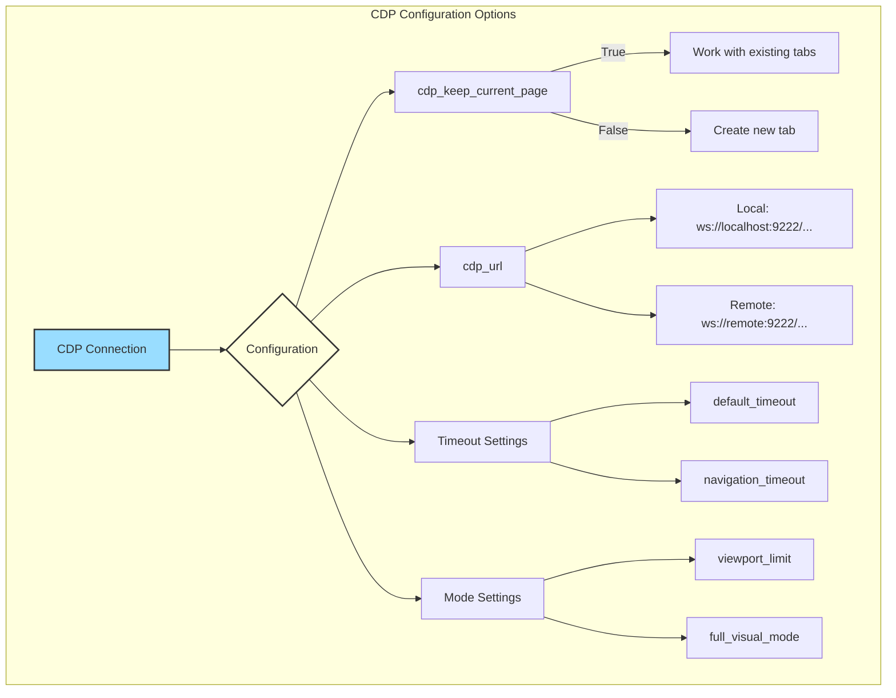
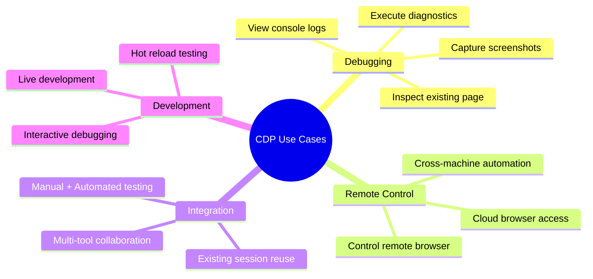
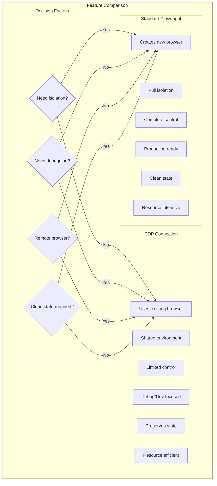
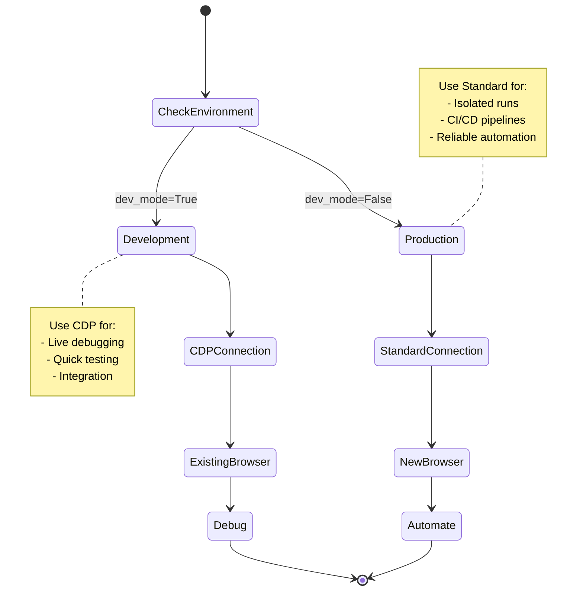

# HybridBrowserToolkit Connection Modes

This document describes the different connection modes available in HybridBrowserToolkit, including standard Playwright connection and Chrome DevTools Protocol (CDP) connection.

## Table of Contents
- [Overview](#overview)
- [Standard Playwright Connection](#standard-playwright-connection)
  - [Basic Setup](#basic-setup)
  - [Configuration Options](#configuration-options)
  - [Use Cases](#standard-use-cases)
- [CDP Connection Mode](#cdp-connection-mode)
  - [What is CDP?](#what-is-cdp)
  - [Connecting to Existing Browser](#connecting-to-existing-browser)
  - [CDP Configuration](#cdp-configuration)
  - [Use Cases](#cdp-use-cases)
- [Connection Mode Comparison](#connection-mode-comparison)
- [Advanced Scenarios](#advanced-scenarios)
- [Troubleshooting](#troubleshooting)

## Overview

HybridBrowserToolkit supports two primary connection modes:

1. **Standard Playwright Connection**: Creates and manages its own browser instance
2. **CDP Connection**: Connects to an existing browser instance via Chrome DevTools Protocol

Each mode serves different purposes and offers unique advantages for various automation scenarios.



[Architectural details about the connection system are provided in hybrid_browser_toolkit_architecture.md]

## Standard Playwright Connection

The standard mode creates a new browser instance managed entirely by the toolkit. This is the default and most common usage pattern.



### Basic Setup

```python
from camel.toolkits import HybridBrowserToolkit

# Basic initialization - creates new browser instance
toolkit = HybridBrowserToolkit()

# Open browser
await toolkit.browser_open()

# Perform actions
await toolkit.browser_visit_page("https://example.com")
await toolkit.browser_click(ref="1")

# Close browser when done
await toolkit.browser_close()
```

### Configuration Options

#### Headless vs Headed Mode

```python
# Headless mode (default) - no visible browser window
toolkit_headless = HybridBrowserToolkit(
    headless=True
)

# Headed mode - visible browser window
toolkit_headed = HybridBrowserToolkit(
    headless=False
)

# Headed mode with specific window size
toolkit_sized = HybridBrowserToolkit(
    headless=False,
    # Additional viewport configuration can be set via browser launch args
)
```

#### User Data Persistence

```python
# Persist browser data (cookies, localStorage, etc.)
toolkit_persistent = HybridBrowserToolkit(
    user_data_dir="/path/to/user/data"
)

# Example: Login once, reuse session
async def persistent_session_example():
    # First run - perform login
    toolkit = HybridBrowserToolkit(
        user_data_dir="./browser_sessions/user1",
        headless=False
    )
    
    await toolkit.browser_open()
    await toolkit.browser_visit_page("https://example.com/login")
    # ... perform login ...
    await toolkit.browser_close()
    
    # Subsequent runs - already logged in
    toolkit_reuse = HybridBrowserToolkit(
        user_data_dir="./browser_sessions/user1"
    )
    await toolkit_reuse.browser_open()
    await toolkit_reuse.browser_visit_page("https://example.com/dashboard")
    # Already authenticated!
```

#### Stealth Mode

[Comprehensive stealth mode details and implementation are described in hybrid_browser_toolkit_architecture.md]

#### Timeout Configuration

```python
# Comprehensive timeout configuration
toolkit_custom_timeouts = HybridBrowserToolkit(
    default_timeout=30000,           # 30 seconds default
    navigation_timeout=60000,        # 60 seconds for page loads
    network_idle_timeout=5000,       # 5 seconds for network idle
    screenshot_timeout=10000,        # 10 seconds for screenshots
    page_stability_timeout=2000,     # 2 seconds for page stability
    dom_content_loaded_timeout=30000 # 30 seconds for DOM ready
)
```

### Standard Use Cases

#### 1. Testing and Development

```python
# Development setup with logging
toolkit_dev = HybridBrowserToolkit(
    headless=False,
    browser_log_to_file=True,
    log_dir="./test_logs",
    session_id="test_run_001"
)

# All browser actions will be logged
await toolkit_dev.browser_open()
await toolkit_dev.browser_visit_page("http://localhost:3000")
# Logs include timing, inputs, outputs, and errors
```

#### 2. Multi-Session Automation

```python
# Create multiple independent browser sessions
async def multi_session_example():
    # Create base toolkit
    base_toolkit = HybridBrowserToolkit(
        headless=True,
        cache_dir="./base_cache"
    )
    
    # Clone for parallel sessions
    session1 = base_toolkit.clone_for_new_session("user_1")
    session2 = base_toolkit.clone_for_new_session("user_2")
    
    # Run parallel automations
    await asyncio.gather(
        automate_user_flow(session1),
        automate_user_flow(session2)
    )
```

#### 3. Long-Running Automation

```python
# Configuration for long-running tasks
toolkit_long = HybridBrowserToolkit(
    headless=True,
    user_data_dir="./long_running_session",
    default_timeout=60000,  # Longer timeouts
    navigation_timeout=120000
)

async def monitor_website():
    await toolkit_long.browser_open()
    
    while True:
        try:
            await toolkit_long.browser_visit_page("https://status.example.com")
            snapshot = await toolkit_long.browser_get_page_snapshot()
            
            # Check status
            if "All Systems Operational" not in snapshot:
                send_alert()
            
            await asyncio.sleep(300)  # Check every 5 minutes
            
        except Exception as e:
            logger.error(f"Monitoring error: {e}")
            # Reconnect on error
            await toolkit_long.browser_close()
            await toolkit_long.browser_open()
```

## CDP Connection Mode

Chrome DevTools Protocol (CDP) connection allows the toolkit to connect to an already running browser instance. This is particularly useful for debugging, connecting to remote browsers, or integrating with existing browser sessions.

### What is CDP?

CDP (Chrome DevTools Protocol) is a protocol that allows tools to instrument, inspect, debug, and profile Chrome/Chromium browsers. The toolkit can connect to any browser that exposes a CDP endpoint.



### Connecting to Existing Browser



#### Step 1: Launch Browser with Remote Debugging

```bash
# Launch Chrome with remote debugging port
# macOS
/Applications/Google\ Chrome.app/Contents/MacOS/Google\ Chrome \
    --remote-debugging-port=9222 \
    --user-data-dir=/tmp/chrome-debug

# Windows
"C:\Program Files\Google\Chrome\Application\chrome.exe" \
    --remote-debugging-port=9222 \
    --user-data-dir=C:\temp\chrome-debug

# Linux
google-chrome \
    --remote-debugging-port=9222 \
    --user-data-dir=/tmp/chrome-debug
```

#### Step 2: Get WebSocket Endpoint

```python
import requests

# Get browser WebSocket endpoint
response = requests.get('http://localhost:9222/json/version')
ws_endpoint = response.json()['webSocketDebuggerUrl']
print(f"WebSocket endpoint: {ws_endpoint}")
# Example: ws://localhost:9222/devtools/browser/abc123...
```

#### Step 3: Connect via CDP

```python
# Connect to existing browser
toolkit_cdp = HybridBrowserToolkit(
    connect_over_cdp=True,
    cdp_url="ws://localhost:9222/devtools/browser/abc123..."
)

# The browser is already running, so we don't call browser_open()
# We can immediately start interacting with it

# Get current tab info
tab_info = await toolkit_cdp.browser_get_tab_info()
print(f"Connected to {tab_info['total_tabs']} tabs")

# Work with existing tabs
await toolkit_cdp.browser_switch_tab(tab_info['tabs'][0]['id'])
snapshot = await toolkit_cdp.browser_get_page_snapshot()
```

### CDP Configuration



#### Keep Current Page Mode

```python
# Connect without creating new tabs
toolkit_keep_page = HybridBrowserToolkit(
    connect_over_cdp=True,
    cdp_url=ws_endpoint,
    cdp_keep_current_page=True  # Don't create new tabs
)

# Work with the existing page
current_snapshot = await toolkit_keep_page.browser_get_page_snapshot()
await toolkit_keep_page.browser_click(ref="1")
```

#### CDP with Custom Configuration

```python
# CDP connection with full configuration
toolkit_cdp_custom = HybridBrowserToolkit(
    connect_over_cdp=True,
    cdp_url=ws_endpoint,
    cdp_keep_current_page=False,    # Create new tab on connection
    headless=False,                  # Ignored in CDP mode
    default_timeout=30000,           # Still applies to operations
    viewport_limit=True,             # Limit to viewport elements
    full_visual_mode=False          # Return snapshots normally
)
```

### CDP Use Cases



#### 1. Debugging Existing Sessions

```python
async def debug_existing_session():
    # Developer has browser open with problematic page
    toolkit = HybridBrowserToolkit(
        connect_over_cdp=True,
        cdp_url=get_ws_endpoint(),
        cdp_keep_current_page=True
    )
    
    # Inspect current state
    snapshot = await toolkit.browser_get_page_snapshot()
    console_logs = await toolkit.browser_console_view()
    
    # Take screenshot for debugging
    await toolkit.browser_get_som_screenshot()
    
    # Execute diagnostic JavaScript
    result = await toolkit.browser_console_exec("""
        console.log('Page URL:', window.location.href);
        console.log('Local Storage:', {...localStorage});
        return document.readyState;
    """)
    
    print(f"Page state: {result}")
```

#### 2. Remote Browser Control

```python
# Connect to browser running on different machine
remote_toolkit = HybridBrowserToolkit(
    connect_over_cdp=True,
    cdp_url="ws://remote-host:9222/devtools/browser/xyz789..."
)

# Control remote browser
await remote_toolkit.browser_visit_page("https://internal.company.com")
await remote_toolkit.browser_get_som_screenshot()
```

#### 3. Integration with Manual Testing

```python
async def assist_manual_testing():
    """Helper for manual QA testing"""
    
    toolkit = HybridBrowserToolkit(
        connect_over_cdp=True,
        cdp_url=get_ws_endpoint(),
        cdp_keep_current_page=True
    )
    
    print("Connected to your browser. Perform manual steps...")
    print("Press Enter when ready for automation to take over...")
    
    await toolkit.browser_wait_user()
    
    # Automated verification after manual setup
    snapshot = await toolkit.browser_get_page_snapshot()
    
    # Perform automated checks
    test_results = {
        'form_present': 'form' in snapshot,
        'submit_button': '[ref=' in snapshot and 'submit' in snapshot.lower(),
        'error_messages': 'error' in snapshot.lower()
    }
    
    return test_results
```

## Connection Mode Comparison



| Feature | Standard Playwright | CDP Connection |
|---------|-------------------|----------------|
| Browser Management | Toolkit creates and manages browser | Connects to existing browser |
| Startup Time | Slower (launches browser) | Faster (already running) |
| Isolation | Complete isolation | Shares with other tools/users |
| Configuration | Full control over browser settings | Limited to connection settings |
| Use Case | Production automation | Debugging, development, integration |
| Browser Close | Closes browser completely | Disconnects only |
| Multiple Instances | Easy with cloning | Requires multiple browsers |
| Remote Control | Not supported | Supported |

## Advanced Scenarios



### Hybrid Usage - Development to Production

```python
class BrowserAutomation:
    def __init__(self, development_mode=False):
        if development_mode:
            # Development: Connect to existing browser for debugging
            self.toolkit = HybridBrowserToolkit(
                connect_over_cdp=True,
                cdp_url=self._get_dev_browser_endpoint(),
                cdp_keep_current_page=True
            )
        else:
            # Production: Create isolated browser instance
            self.toolkit = HybridBrowserToolkit(
                headless=True,
                stealth=True,
                user_data_dir="./prod_sessions"
            )
    
    def _get_dev_browser_endpoint(self):
        try:
            response = requests.get('http://localhost:9222/json/version')
            return response.json()['webSocketDebuggerUrl']
        except:
            raise Exception("No debug browser found. Launch with --remote-debugging-port=9222")
```

### Connection Resilience

```python
class ResilientBrowser:
    def __init__(self, connection_mode='standard'):
        self.connection_mode = connection_mode
        self.toolkit = None
        
    async def ensure_connected(self):
        """Ensure browser connection is active"""
        if self.connection_mode == 'cdp':
            try:
                # Check if CDP connection is alive
                if self.toolkit:
                    await self.toolkit.browser_get_tab_info()
            except:
                # Reconnect
                self.toolkit = HybridBrowserToolkit(
                    connect_over_cdp=True,
                    cdp_url=self._get_cdp_endpoint()
                )
        else:
            # Standard mode - recreate if needed
            if not self.toolkit:
                self.toolkit = HybridBrowserToolkit()
                await self.toolkit.browser_open()
    
    async def safe_action(self, action_fn, *args, **kwargs):
        """Execute action with automatic reconnection"""
        max_retries = 3
        for attempt in range(max_retries):
            try:
                await self.ensure_connected()
                return await action_fn(*args, **kwargs)
            except Exception as e:
                if attempt == max_retries - 1:
                    raise
                print(f"Action failed, retrying... ({e})")
                await asyncio.sleep(2)
```

### Multi-Mode Testing Framework

```python
async def test_with_both_modes(test_function):
    """Run same test in both connection modes"""
    
    # Test with standard connection
    print("Testing with standard Playwright connection...")
    toolkit_standard = HybridBrowserToolkit(headless=True)
    await toolkit_standard.browser_open()
    
    try:
        result_standard = await test_function(toolkit_standard)
        print(f"Standard mode result: {result_standard}")
    finally:
        await toolkit_standard.browser_close()
    
    # Test with CDP connection
    print("\nTesting with CDP connection...")
    # Assume browser is already running with debugging
    toolkit_cdp = HybridBrowserToolkit(
        connect_over_cdp=True,
        cdp_url="ws://localhost:9222/devtools/browser/..."
    )
    
    try:
        result_cdp = await test_function(toolkit_cdp)
        print(f"CDP mode result: {result_cdp}")
    finally:
        await toolkit_cdp.disconnect_websocket()
    
    return result_standard, result_cdp
```

## Troubleshooting

### Common Issues and Solutions

#### 1. CDP Connection Refused

```python
# Problem: Cannot connect to CDP endpoint
# Solution: Verify browser is running with debugging enabled

def verify_cdp_endpoint():
    try:
        response = requests.get('http://localhost:9222/json/version')
        data = response.json()
        print(f"Browser: {data['Browser']}")
        print(f"Protocol Version: {data['Protocol-Version']}")
        print(f"WebSocket URL: {data['webSocketDebuggerUrl']}")
        return True
    except Exception as e:
        print(f"CDP not available: {e}")
        print("Launch browser with: --remote-debugging-port=9222")
        return False
```

#### 2. Browser Already in Use

```python
# Problem: Standard mode fails because port is in use
# Solution: Use different user data directory or CDP mode

async def handle_browser_conflicts():
    try:
        # Try standard connection
        toolkit = HybridBrowserToolkit()
        await toolkit.browser_open()
    except Exception as e:
        if "already in use" in str(e):
            print("Browser already running, switching to CDP mode...")
            # Fallback to CDP
            toolkit = HybridBrowserToolkit(
                connect_over_cdp=True,
                cdp_url=get_cdp_endpoint()
            )
    
    return toolkit
```

#### 3. Connection Timeout

```python
# Configure longer timeouts for slow connections
toolkit_slow_network = HybridBrowserToolkit(
    default_timeout=60000,         # 60 seconds
    navigation_timeout=120000,     # 2 minutes
    network_idle_timeout=10000     # 10 seconds
)

# For CDP connections with remote browsers
toolkit_remote = HybridBrowserToolkit(
    connect_over_cdp=True,
    cdp_url="ws://remote:9222/...",
    default_timeout=60000  # Account for network latency
)
```

Choose the appropriate connection mode based on your specific use case. Standard Playwright connection offers the most control and isolation, while CDP connection provides flexibility for debugging and integration scenarios.