# HybridBrowserToolkit Tools Reference

This document provides a comprehensive reference for all tools available in the HybridBrowserToolkit. Each tool is designed for specific browser automation tasks, from basic navigation to complex interactions.

## Architecture Overview

[Architecture details including multi-layer design and ARIA foundation are described in hybrid_browser_toolkit_architecture.md]

```mermaid
flowchart TD
    subgraph "Tool Categories & Data Flow"
        direction TB
        
        A[User Code] --> B{Tool Category}
        
        B --> C[Session Management]
        C --> C1[browser_open<br/>browser_close]
        
        B --> D[Navigation]
        D --> D1[browser_visit_page<br/>browser_back<br/>browser_forward]
        
        B --> E[Information Retrieval]
        E --> E1[browser_get_page_snapshot<br/>browser_get_som_screenshot<br/>browser_get_tab_info]
        
        B --> F[Interaction]
        F --> F1[browser_click<br/>browser_type<br/>browser_select<br/>browser_enter]
        
        B --> G[Page Control]
        G --> G1[browser_scroll<br/>browser_mouse_control<br/>browser_mouse_drag<br/>browser_press_key]
        
        B --> H[Tab Management]
        H --> H1[browser_switch_tab<br/>browser_close_tab]
        
        B --> I[Developer Tools]
        I --> I1[browser_console_view<br/>browser_console_exec]
        
        B --> J[Special Tools]
        J --> J1[browser_wait_user]
    end
    
    subgraph "Operating Modes"
        K[Text Mode - Default] --> K1[Auto snapshots on actions<br/>Lightweight & fast]
        L[Visual Mode] --> L1[SoM screenshots<br/>AI analysis capable]
        M[Full Visual Mode] --> M1[No auto snapshots<br/>Maximum performance]
    end
    
    [Detailed mode descriptions and usage patterns are available in hybrid_browser_toolkit_modes.md]
    
    subgraph "Smart Features"
        N[Intelligent Dropdown Detection] --> N1[Returns only new options<br/>via diffSnapshot]
        O[Child Element Discovery] --> O1[Finds input fields<br/>in containers]
        P[Parent-Child Fusion] --> P1[Merges related elements<br/>in screenshots]
        Q[Occlusion Detection] --> Q1[Handles overlapping<br/>elements correctly]
    end
```

## Table of Contents

- [Browser Session Management](#browser-session-management)
  - [browser_open](#browser_open)
  - [browser_close](#browser_close)
- [Navigation Tools](#navigation-tools)
  - [browser_visit_page](#browser_visit_page)
  - [browser_back](#browser_back)
  - [browser_forward](#browser_forward)
- [Information Retrieval Tools](#information-retrieval-tools)
  - [browser_get_page_snapshot](#browser_get_page_snapshot)
  - [browser_get_som_screenshot](#browser_get_som_screenshot)
  - [browser_get_tab_info](#browser_get_tab_info)
- [Interaction Tools](#interaction-tools)
  - [browser_click](#browser_click)
  - [browser_type](#browser_type)
  - [browser_select](#browser_select)
  - [browser_enter](#browser_enter)
- [Page Control Tools](#page-control-tools)
  - [browser_scroll](#browser_scroll)
  - [browser_mouse_control](#browser_mouse_control)
  - [browser_mouse_drag](#browser_mouse_drag)
  - [browser_press_key](#browser_press_key)
- [Tab Management Tools](#tab-management-tools)
  - [browser_switch_tab](#browser_switch_tab)
  - [browser_close_tab](#browser_close_tab)
- [Developer Tools](#developer-tools)
  - [browser_console_view](#browser_console_view)
  - [browser_console_exec](#browser_console_exec)
- [Special Tools](#special-tools)
  - [browser_wait_user](#browser_wait_user)

## Browser Session Management

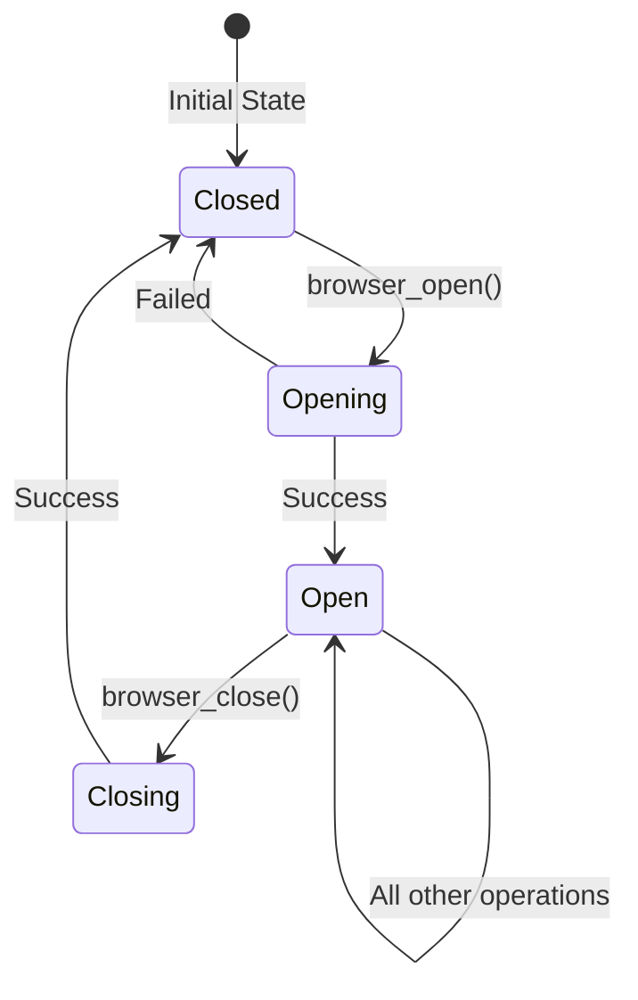

### browser_open

Opens a new browser session. This must be the first browser action before any other operations.

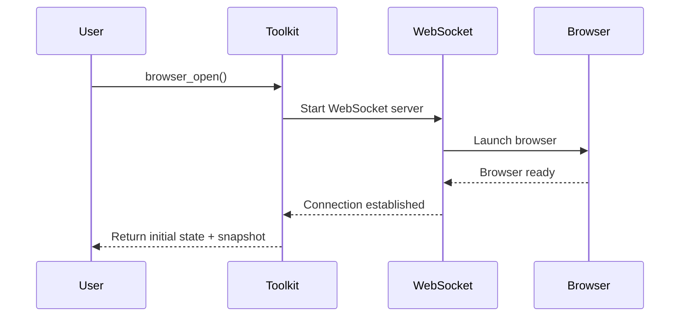

**Parameters:**
- None

**Returns:**
- `result` (str): Confirmation message
- `snapshot` (str): Initial page snapshot (unless in full_visual_mode)
- `tabs` (List[Dict]): Information about all open tabs
- `current_tab` (int): Index of the active tab
- `total_tabs` (int): Total number of open tabs

**Example:**

```python
# Basic browser opening
toolkit = HybridBrowserToolkit(headless=False)
result = await toolkit.browser_open()

print(f"Browser opened: {result['result']}")
print(f"Initial page snapshot: {result['snapshot']}")
print(f"Total tabs: {result['total_tabs']}")

# With default URL configuration
toolkit = HybridBrowserToolkit(
    default_start_url="https://www.google.com"
)
result = await toolkit.browser_open()
# Browser opens directly to Google
```

### browser_close

Closes the browser session and releases all resources. Should be called at the end of automation tasks.

**Parameters:**
- None

**Returns:**
- (str): Confirmation message

**Example:**

```python
# Always close the browser when done
try:
    await toolkit.browser_open()
    # ... perform automation tasks ...
finally:
    result = await toolkit.browser_close()
    print(result)  # "Browser session closed."
```

## Navigation Tools

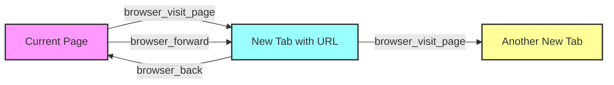

### browser_visit_page

Opens a URL in a new browser tab and switches to it. Creates a new tab each time it's called.

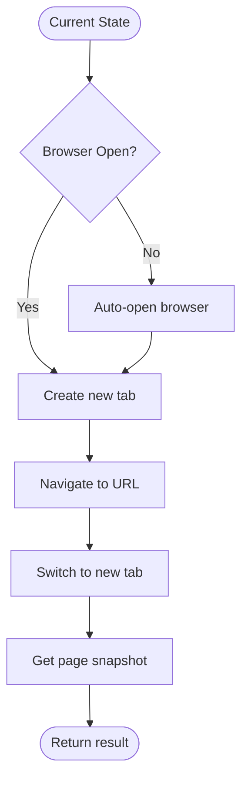

**Parameters:**
- `url` (str): The web address to load

**Returns:**
- `result` (str): Confirmation message
- `snapshot` (str): Page snapshot after navigation
- `tabs` (List[Dict]): Updated tab information
- `current_tab` (int): Index of the new active tab
- `total_tabs` (int): Updated total number of tabs

**Example:**

```python
# Visit a single page
result = await toolkit.browser_visit_page("https://example.com")
print(f"Navigated to: {result['result']}")
print(f"Page elements: {result['snapshot']}")

# Visit multiple pages (creates multiple tabs)
sites = ["https://github.com", "https://google.com", "https://stackoverflow.com"]
for site in sites:
    result = await toolkit.browser_visit_page(site)
    print(f"Tab {result['current_tab']}: {site}")
print(f"Total tabs open: {result['total_tabs']}")
```

### browser_back

Navigates back to the previous page in browser history for the current tab.

**Parameters:**
- None

**Returns:**
- `result` (str): Confirmation message
- `snapshot` (str): Snapshot of the previous page
- `tabs` (List[Dict]): Current tab information
- `current_tab` (int): Index of active tab
- `total_tabs` (int): Total number of tabs

**Example:**

```python
# Navigate through history
await toolkit.browser_visit_page("https://example.com")
await toolkit.browser_visit_page("https://example.com/about")

# Go back
result = await toolkit.browser_back()
print(f"Navigated back to: {result['result']}")
```

### browser_forward

Navigates forward to the next page in browser history for the current tab.

**Parameters:**
- None

**Returns:**
- Same as `browser_back`

**Example:**

```python
# Navigate forward after going back
await toolkit.browser_visit_page("https://example.com")
await toolkit.browser_visit_page("https://example.com/products")
await toolkit.browser_back()  # Back to homepage

# Go forward again
result = await toolkit.browser_forward()
print(f"Navigated forward to: {result['result']}")
```

## Information Retrieval Tools

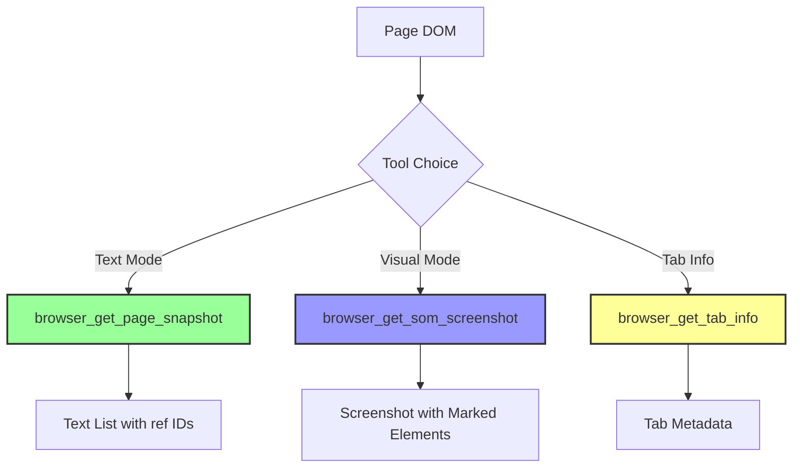

### browser_get_page_snapshot

**Note:** This is a passive tool that must be explicitly called to retrieve page information. It does not trigger any page actions.

Gets a textual snapshot of all interactive elements on the current page. Each element is assigned a unique ref ID for interaction.

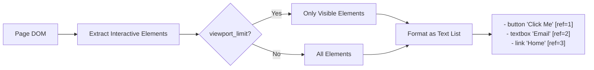

**Parameters:**
- None (uses viewport_limit setting from toolkit initialization)

**Returns:**
- (str): Formatted string listing all interactive elements with their ref IDs

**Example:**

```python
# Get full page snapshot
snapshot = await toolkit.browser_get_page_snapshot()
print(snapshot)
# Output:
# - link "Home" [ref=1]
# - button "Sign In" [ref=2]
# - textbox "Search" [ref=3]
# - link "Products" [ref=4]

# With viewport limiting
toolkit_limited = HybridBrowserToolkit(viewport_limit=True)
visible_snapshot = await toolkit_limited.browser_get_page_snapshot()
# Only returns elements currently visible in viewport
```

### browser_get_som_screenshot

Captures a screenshot with interactive elements highlighted and marked with ref IDs (Set of Marks). This tool uses an advanced injection-based approach with browser-side optimizations for accurate element detection.

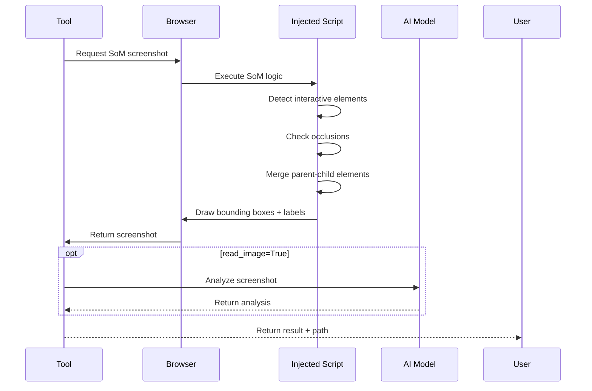

**Technical Features:**
1. **Injection-based Implementation**: The SoM (Set of Marks) functionality is injected directly into the browser context, ensuring accurate element detection and positioning
2. **Efficient Occlusion Detection**: Browser-side algorithms detect when elements are hidden behind other elements, preventing false positives
3. **Parent-Child Element Fusion**: Intelligently merges parent and child elements when they represent the same interactive component (e.g., a button containing an icon and text)
4. **Smart Label Positioning**: Automatically finds optimal positions for ref ID labels to avoid overlapping with page content

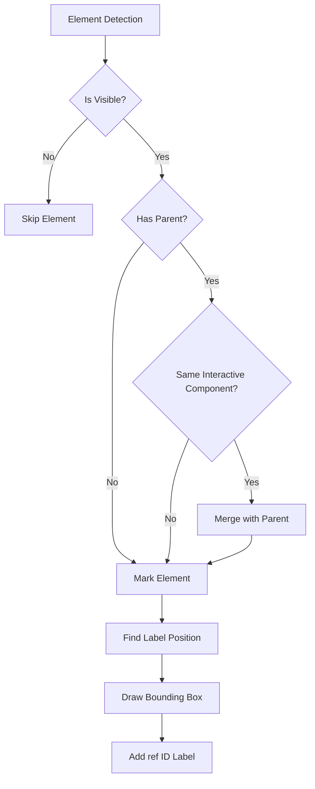

**Parameters:**
- `read_image` (bool, optional): If True, uses AI to analyze the screenshot. Default: True
- `instruction` (str, optional): Specific guidance for AI analysis

**Returns:**
- (str): Confirmation message with file path and optional AI analysis

**Example:**

```python
# Basic screenshot capture
result = await toolkit.browser_get_som_screenshot(read_image=False)
print(result)  
# "Screenshot captured with 42 interactive elements marked (saved to: ./screenshots/page_123456_som.png)"

# With AI analysis
result = await toolkit.browser_get_som_screenshot(
    read_image=True,
    instruction="Find all form input fields"
)
# "Screenshot captured... Agent analysis: Found 5 form fields: username [ref=3], password [ref=4], email [ref=5], phone [ref=6], submit button [ref=7]"

# For visual verification
result = await toolkit.browser_get_som_screenshot(
    read_image=True,
    instruction="Verify the login button is visible and properly styled"
)

# Complex UI with overlapping elements
result = await toolkit.browser_get_som_screenshot(read_image=False)
# The tool automatically handles:
# - Dropdown menus that overlay other content
# - Modal dialogs
# - Nested interactive elements
# - Elements with transparency

# Parent-child fusion example
# A button containing an icon and text will be marked as one element, not three
# <button [ref=5]>
#   <i class="icon"></i>
#   <span>Submit</span>
# </button>
# Will appear as single "button Submit [ref=5]" instead of separate elements
```

### browser_get_tab_info

**Note:** This is a passive information retrieval tool that provides current tab state without modifying anything.

Gets information about all open browser tabs including titles, URLs, and which tab is active.

**Parameters:**
- None

**Returns:**
- `tabs` (List[Dict]): List of tab information, each containing:
  - `id` (str): Unique tab identifier
  - `title` (str): Page title
  - `url` (str): Current URL
  - `is_current` (bool): Whether this is the active tab
- `current_tab` (int): Index of the active tab
- `total_tabs` (int): Total number of open tabs

**Example:**

```python
# Check all open tabs
tab_info = await toolkit.browser_get_tab_info()

print(f"Total tabs: {tab_info['total_tabs']}")
print(f"Active tab index: {tab_info['current_tab']}")

for i, tab in enumerate(tab_info['tabs']):
    status = "ACTIVE" if tab['is_current'] else ""
    print(f"Tab {i}: {tab['title']} - {tab['url']} {status}")
    
# Find a specific tab
github_tab = next(
    (tab for tab in tab_info['tabs'] if 'github.com' in tab['url']), 
    None
)
if github_tab:
    await toolkit.browser_switch_tab(tab_id=github_tab['id'])
```

## Interaction Tools

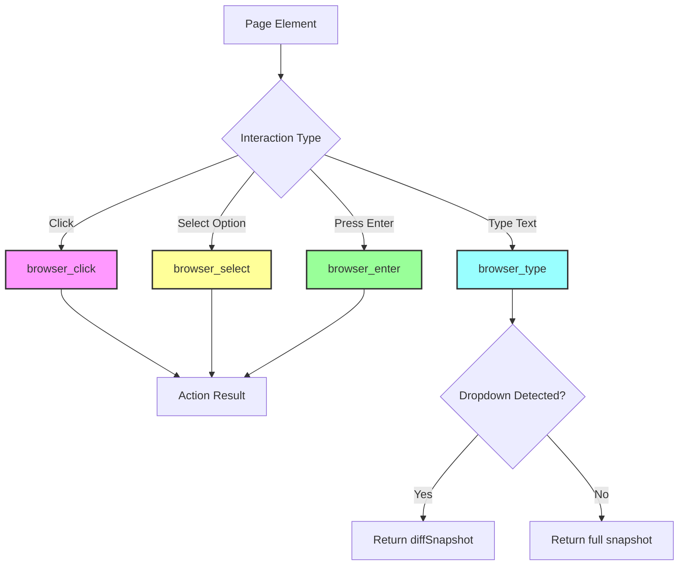

### browser_click

Performs a click action on an element identified by its ref ID.

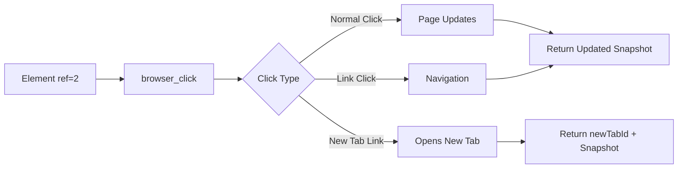

**Parameters:**
- `ref` (str): The ref ID of the element to click

**Returns:**
- `result` (str): Confirmation of the action
- `snapshot` (str): Updated page snapshot after click
- `tabs` (List[Dict]): Current tab information
- `current_tab` (int): Index of active tab
- `total_tabs` (int): Total number of tabs
- `newTabId` (str, optional): ID of newly opened tab if click opened a new tab

**Example:**

```python
# Simple click
result = await toolkit.browser_click(ref="2")
print(f"Clicked: {result['result']}")

# Click that opens new tab
result = await toolkit.browser_click(ref="external-link")
if 'newTabId' in result:
    print(f"New tab opened with ID: {result['newTabId']}")
    # Switch to the new tab
    await toolkit.browser_switch_tab(tab_id=result['newTabId'])

# Click with error handling
try:
    result = await toolkit.browser_click(ref="submit-button")
except Exception as e:
    print(f"Click failed: {e}")
```

### browser_type

Types text into input elements. Supports both single and multiple inputs with intelligent dropdown detection and automatic child element discovery.

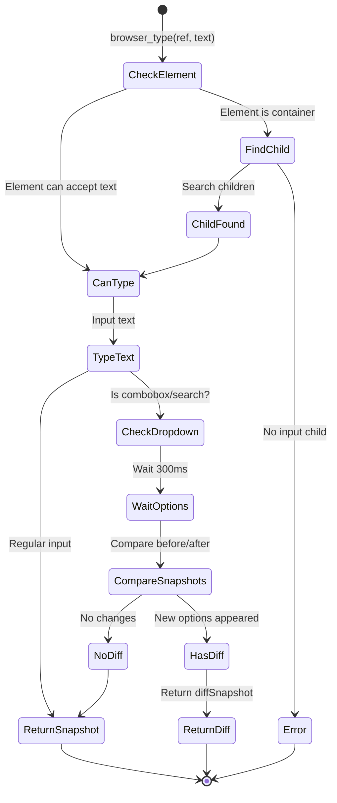

**Special Features:**

1. **Intelligent Dropdown Detection:**
   - When typing into elements that might trigger dropdown options (such as combobox, search fields, or autocomplete inputs), the tool automatically:
     - Detects if new options appear after typing
     - Returns only the newly appeared options via `diffSnapshot` instead of the full page snapshot
     - This optimization reduces noise and makes it easier to interact with dynamic dropdowns

2. **Automatic Child Element Discovery:**
   - If the specified ref ID points to a container element that cannot accept text input directly, the tool automatically:
     - Searches through child elements to find an input field
     - Attempts to type into the first suitable child input element found
     - This is particularly useful for complex UI components where the visible element is a wrapper around the actual input

**Parameters (Single Input):**
- `ref` (str): The ref ID of the input element (or container with input child)
- `text` (str): The text to type

**Parameters (Multiple Inputs):**
- `inputs` (List[Dict[str, str]]): List of dictionaries with 'ref' and 'text' keys

**Returns:**
- `result` (str): Confirmation message
- `snapshot` (str): Updated page snapshot (full snapshot for regular inputs)
- `diffSnapshot` (str, optional): For dropdowns, shows only newly appeared options
- `details` (Dict, optional): For multiple inputs, success/error status for each
- Tab information fields

**Example:**

```python
# Single input
result = await toolkit.browser_type(ref="3", text="john.doe@example.com")

# Handle dropdown/autocomplete with intelligent detection
result = await toolkit.browser_type(ref="search", text="laptop")
if 'diffSnapshot' in result:
    print("Dropdown options appeared:")
    print(result['diffSnapshot'])
    # Example output:
    # - option "Laptop Computers" [ref=45]
    # - option "Laptop Bags" [ref=46]
    # - option "Laptop Accessories" [ref=47]
    
    # Click on one of the options
    await toolkit.browser_click(ref="45")
else:
    # No dropdown appeared, continue with regular snapshot
    print("Page snapshot:", result['snapshot'])

# Autocomplete example with diff detection
result = await toolkit.browser_type(ref="city-input", text="San")
if 'diffSnapshot' in result:
    # Only shows newly appeared suggestions
    print("City suggestions:")
    print(result['diffSnapshot'])
    # - option "San Francisco" [ref=23]
    # - option "San Diego" [ref=24]
    # - option "San Antonio" [ref=25]

# Multiple inputs at once
inputs = [
    {'ref': '3', 'text': 'username123'},
    {'ref': '4', 'text': 'SecurePass123!'},
    {'ref': '5', 'text': 'john.doe@example.com'}
]
result = await toolkit.browser_type(inputs=inputs)
print(result['details'])  # Success/failure for each input

# Clear and type
await toolkit.browser_click(ref="3")  # Focus
await toolkit.browser_press_key(keys=["Control+a"])  # Select all
await toolkit.browser_type(ref="3", text="new_value")  # Replaces content

# Working with combobox elements
async def handle_searchable_dropdown():
    # Type to search/filter options
    result = await toolkit.browser_type(ref="country-select", text="United")
    
    if 'diffSnapshot' in result:
        # Shows only countries containing "United"
        print("Filtered countries:", result['diffSnapshot'])
        # - option "United States" [ref=87]
        # - option "United Kingdom" [ref=88]
        # - option "United Arab Emirates" [ref=89]
        
        # Select one of the filtered options
        await toolkit.browser_click(ref="87")

# Automatic child element discovery
# When the ref points to a container, browser_type finds the input child
result = await toolkit.browser_type(ref="search-container", text="product name")
# Even though ref="search-container" might be a <div>, the tool will find
# and type into the actual <input> element inside it

# Complex UI component example
# The visible element might be a styled wrapper
result = await toolkit.browser_type(ref="styled-date-picker", text="2024-03-15")
# Tool automatically finds the actual input field within the date picker component
```

### browser_select

Selects an option in a dropdown (`<select>`) element.

**Parameters:**
- `ref` (str): The ref ID of the select element
- `value` (str): The value attribute of the option to select (not the visible text)

**Returns:**
- Standard action response with snapshot and tab information

**Example:**

```python
# Select by value attribute
result = await toolkit.browser_select(ref="country-select", value="US")

# Common pattern: type to filter, then select
await toolkit.browser_type(ref="5", text="Uni")  # Type to filter
# Snapshot shows filtered options
result = await toolkit.browser_select(ref="5", value="united-states")
```

### browser_enter

Simulates pressing the Enter key on the currently focused element. Useful for form submission.

**Parameters:**
- None

**Returns:**
- Standard action response with potentially new page snapshot

**Example:**

```python
# Submit search form
await toolkit.browser_type(ref="search-box", text="Python tutorials")
result = await toolkit.browser_enter()
# Page navigates to search results

# Submit login form
await toolkit.browser_type(ref="username", text="user123")
await toolkit.browser_type(ref="password", text="pass123")
await toolkit.browser_enter()  # Submits the form
```

## Page Control Tools

### browser_scroll

Scrolls the current page window in the specified direction.

**Parameters:**
- `direction` (str): Either "up" or "down"
- `amount` (int, optional): Number of pixels to scroll. Default: 500

**Returns:**
- Standard action response with updated snapshot showing newly visible elements

**Example:**

```python
# Basic scrolling
await toolkit.browser_scroll(direction="down", amount=500)
await toolkit.browser_scroll(direction="up", amount=300)

# Scroll to load more content
async def scroll_to_bottom():
    """Scroll until no new content loads"""
    previous_snapshot = ""
    while True:
        result = await toolkit.browser_scroll(direction="down", amount=1000)
        if result['snapshot'] == previous_snapshot:
            break  # No new content loaded
        previous_snapshot = result['snapshot']
        await asyncio.sleep(1)  # Wait for content to load

# Paginated scrolling
for i in range(5):
    await toolkit.browser_scroll(direction="down", amount=800)
    snapshot = await toolkit.browser_get_page_snapshot()
    print(f"Page {i+1} content loaded")
```

### browser_mouse_control

Controls mouse actions at specific coordinates.

**Parameters:**
- `control` (str): Action type - "click", "right_click", or "dblclick"
- `x` (float): X-coordinate
- `y` (float): Y-coordinate

**Returns:**
- Standard action response

**Example:**

```python
# Click at specific coordinates
await toolkit.browser_mouse_control(control="click", x=350.5, y=200)

# Right-click for context menu
await toolkit.browser_mouse_control(control="right_click", x=400, y=300)

# Double-click to select text
await toolkit.browser_mouse_control(control="dblclick", x=250, y=150)

# Click on canvas or image maps
canvas_result = await toolkit.browser_mouse_control(
    control="click", 
    x=523.5, 
    y=412.3
)
```

### browser_mouse_drag

Performs drag and drop operations between elements.

**Parameters:**
- `from_ref` (str): Source element ref ID
- `to_ref` (str): Target element ref ID

**Returns:**
- Standard action response

**Example:**

```python
# Drag item to trash
await toolkit.browser_mouse_drag(from_ref="item-5", to_ref="trash-bin")

# Reorder list items
await toolkit.browser_mouse_drag(from_ref="task-3", to_ref="task-1")

# Move file to folder
result = await toolkit.browser_mouse_drag(
    from_ref="file-report.pdf", 
    to_ref="folder-documents"
)
print(f"Drag result: {result['result']}")
```

### browser_press_key

Presses keyboard keys or key combinations.

**Parameters:**
- `keys` (List[str]): List of keys to press (can include modifiers)

**Returns:**
- Standard action response

**Example:**

```python
# Single key press
await toolkit.browser_press_key(keys=["Tab"])
await toolkit.browser_press_key(keys=["Escape"])

# Key combinations
await toolkit.browser_press_key(keys=["Control+a"])  # Select all
await toolkit.browser_press_key(keys=["Control+c"])  # Copy
await toolkit.browser_press_key(keys=["Control+v"])  # Paste

# Navigation shortcuts
await toolkit.browser_press_key(keys=["Control+t"])  # New tab
await toolkit.browser_press_key(keys=["Control+w"])  # Close tab
await toolkit.browser_press_key(keys=["Alt+Left"])   # Back

# Function keys
await toolkit.browser_press_key(keys=["F5"])         # Refresh
await toolkit.browser_press_key(keys=["F11"])        # Fullscreen
```

## Tab Management Tools

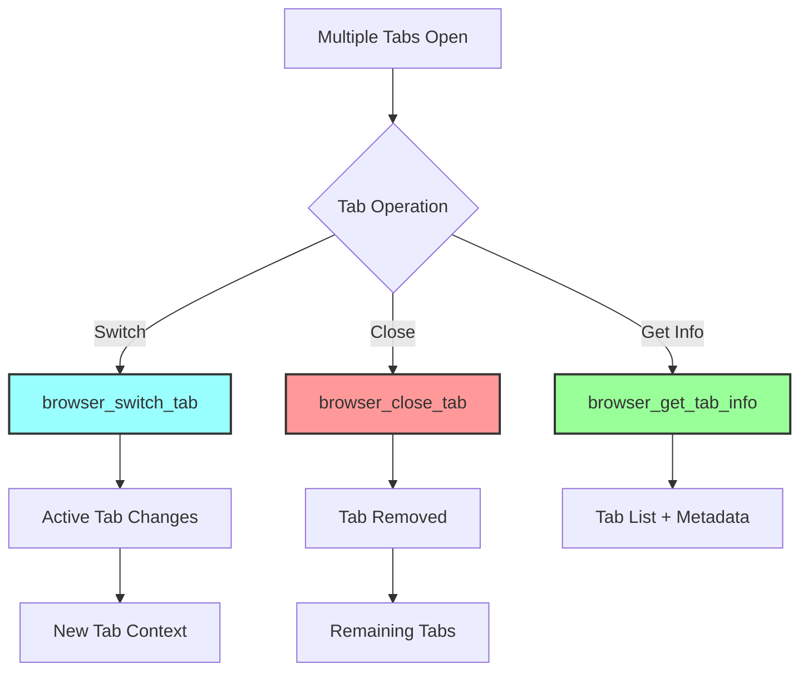

### browser_switch_tab

Switches to a different browser tab using its ID.

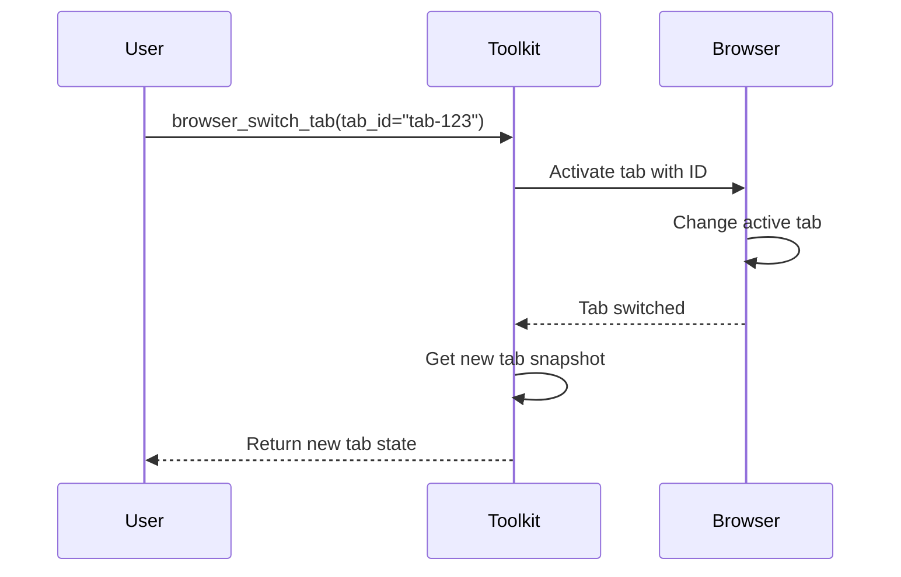

**Parameters:**
- `tab_id` (str): The ID of the tab to activate

**Returns:**
- Standard action response with snapshot of the newly active tab

**Example:**

```python
# Get current tabs and switch
tab_info = await toolkit.browser_get_tab_info()
tabs = tab_info['tabs']

# Switch to the second tab
if len(tabs) > 1:
    await toolkit.browser_switch_tab(tab_id=tabs[1]['id'])

# Switch back to first tab
await toolkit.browser_switch_tab(tab_id=tabs[0]['id'])

# Pattern: Open link in new tab and switch
result = await toolkit.browser_click(ref="external-link")
if 'newTabId' in result:
    await toolkit.browser_switch_tab(tab_id=result['newTabId'])
```

### browser_close_tab

Closes a specific browser tab.

**Parameters:**
- `tab_id` (str): The ID of the tab to close

**Returns:**
- Standard action response with information about remaining tabs

**Example:**

```python
# Close current tab
tab_info = await toolkit.browser_get_tab_info()
current_tab_id = None
for tab in tab_info['tabs']:
    if tab['is_current']:
        current_tab_id = tab['id']
        break

if current_tab_id:
    await toolkit.browser_close_tab(tab_id=current_tab_id)

# Close all tabs except the first
tab_info = await toolkit.browser_get_tab_info()
for i, tab in enumerate(tab_info['tabs']):
    if i > 0:  # Keep first tab
        await toolkit.browser_close_tab(tab_id=tab['id'])
```

## Developer Tools

### browser_console_view

Views console logs from the current page.

**Parameters:**
- None

**Returns:**
- `console_messages` (List[Dict]): List of console messages with:
  - `type` (str): Message type (log, warn, error, info)
  - `text` (str): Message content
  - `timestamp` (str): When the message was logged

**Example:**

```python
# Check for JavaScript errors
console_info = await toolkit.browser_console_view()

errors = [
    msg for msg in console_info['console_messages'] 
    if msg['type'] == 'error'
]

if errors:
    print("Page has JavaScript errors:")
    for error in errors:
        print(f"- {error['text']}")

# Monitor console during interaction
await toolkit.browser_click(ref="dynamic-button")
console_info = await toolkit.browser_console_view()
print(f"Console messages after click: {len(console_info['console_messages'])}")
```

### browser_console_exec

Executes JavaScript code in the browser console.

**Parameters:**
- `code` (str): JavaScript code to execute

**Returns:**
- Standard action response with execution result

**Example:**

```python
# Get page information
result = await toolkit.browser_console_exec(
    "document.title + ' - ' + window.location.href"
)

# Modify page elements
await toolkit.browser_console_exec("""
    document.querySelector('#message').innerText = 'Updated by automation';
    document.querySelector('#message').style.color = 'red';
""")

# Extract data
result = await toolkit.browser_console_exec("""
    Array.from(document.querySelectorAll('.product')).map(p => ({
        name: p.querySelector('.name').textContent,
        price: p.querySelector('.price').textContent
    }))
""")

# Trigger custom events
await toolkit.browser_console_exec("""
    const event = new CustomEvent('customAction', { detail: { action: 'refresh' } });
    document.dispatchEvent(event);
""")

# Check element states
is_visible = await toolkit.browser_console_exec("""
    const elem = document.querySelector('#submit-button');
    elem && !elem.disabled && elem.offsetParent !== null
""")
```

## Special Tools

### browser_wait_user

Pauses execution and waits for human intervention. Useful for manual steps like CAPTCHA solving.

**Parameters:**
- `timeout_sec` (float, optional): Maximum seconds to wait. None for indefinite wait.

**Returns:**
- `result` (str): How the wait ended (user resumed or timeout)
- `snapshot` (str): Page snapshot after the wait
- Standard tab information

**Example:**

```python
# Wait for CAPTCHA solving
print("Please solve the CAPTCHA in the browser window...")
result = await toolkit.browser_wait_user(timeout_sec=120)

if "Timeout" in result['result']:
    print("User didn't complete CAPTCHA in time")
else:
    print("User completed the action, continuing...")
    await toolkit.browser_click(ref="submit")

# Indefinite wait for complex manual steps
print("Please complete the payment process manually.")
print("Press Enter when done...")
await toolkit.browser_wait_user()  # No timeout

# Wait with instructions
async def handle_manual_verification():
    await toolkit.browser_get_som_screenshot()  # Show current state
    print("\nManual steps required:")
    print("1. Complete the identity verification")
    print("2. Upload required documents")
    print("3. Press Enter when finished")
    
    result = await toolkit.browser_wait_user(timeout_sec=300)
    return "User resumed" in result['result']
```

## Complete Automation Example

```python
async def complete_web_automation():
    """Example combining multiple tools for a complete workflow"""
    
    toolkit = HybridBrowserToolkit(
        headless=False,
        viewport_limit=True
    )
    
    try:
        # Start browser
        await toolkit.browser_open()
        
        # Navigate to site
        await toolkit.browser_visit_page("https://example-shop.com")
        
        # Check page loaded
        snapshot = await toolkit.browser_get_page_snapshot()
        
        # Search for product
        await toolkit.browser_type(ref="search", text="laptop")
        await toolkit.browser_enter()
        
        # Scroll through results
        await toolkit.browser_scroll(direction="down", amount=800)
        
        # Take screenshot for verification
        await toolkit.browser_get_som_screenshot(
            read_image=True,
            instruction="Find laptops under $1000"
        )
        
        # Click on product
        await toolkit.browser_click(ref="product-1")
        
        # Check multiple tabs
        tab_info = await toolkit.browser_get_tab_info()
        print(f"Tabs open: {tab_info['total_tabs']}")
        
        # Add to cart and checkout
        await toolkit.browser_click(ref="add-to-cart")
        await toolkit.browser_click(ref="checkout")
        
        # Fill checkout form
        inputs = [
            {'ref': 'name', 'text': 'John Doe'},
            {'ref': 'email', 'text': 'john@example.com'},
            {'ref': 'address', 'text': '123 Main St'}
        ]
        await toolkit.browser_type(inputs=inputs)
        
        # Select shipping
        await toolkit.browser_select(ref="shipping", value="standard")
        
        # Execute custom validation
        await toolkit.browser_console_exec(
            "document.querySelector('form').checkValidity()"
        )
        
        # Submit order
        await toolkit.browser_click(ref="place-order")
        
    finally:
        # Always close browser
        await toolkit.browser_close()
```

This comprehensive reference covers all available tools in the HybridBrowserToolkit, providing you with the complete set of browser automation capabilities.